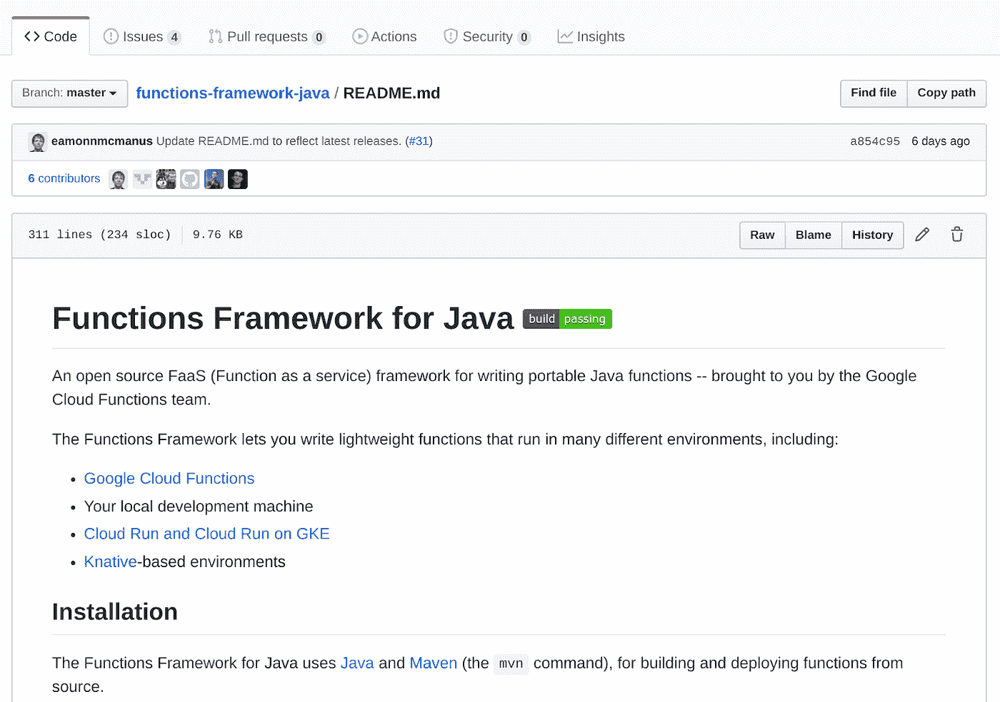

# TWiGCP —“将云功能升级到 Java 11、面向 ML 分析的企业笔记本和 BigQuery 成本控制”

> 原文：<https://medium.com/google-cloud/twigcp-turning-cloud-functions-up-to-java-11-enterprise-notebooks-for-ml-analytics-and-fdeb8a33f069?source=collection_archive---------1----------------------->

以下是谷歌云视频系列 本周最新 [**的链接:**](http://gtech.run/ju4em)

*   [Java 11 来云功能](http://gtech.run/74eaj)
*   [数据分析平台 10 周年](http://gtech.run/d3txw)
*   [云数据仓库成本和定价模型](http://gtech.run/v89pa)
*   [什么是 BigQuery？— BigQuery Spotlight](http://gtech.run/6xhkz)

过去一周 GCP 的其他头条新闻包括:

*   [谷歌云为人工智能平台笔记本添加智能分析框架](http://gtech.run/v8uct)(谷歌博客)
*   [在谷歌云中备份 SAP 系统的 9 种方法](http://gtech.run/958p6)(谷歌博客)

来自“BigQuery，所有成本控制”部门:

*   [在 BigQuery 点播和统一费率定价之间做出选择](http://gtech.run/yl9vm)(谷歌博客)
*   [有效地使用 BigQuery Reservations](http://gtech.run/tw69v) (谷歌博客)
*   [利用弹性插槽优化 BigQuery 成本](http://gtech.run/cdjv6)(谷歌博客)

来自“云端大数据与人工智能”部门:

*   [将 Apache Hadoop 集群迁移到谷歌云](http://gtech.run/zkvnh)(谷歌博客)
*   [使用带有 Apache Beam 和 BigtableIO 的 Bigtable 仿真器](http://gtech.run/sd4wm)(medium.com)
*   [将 Apache Spark 和 AI 平台笔记本的强大功能与 Dataproc Hub 结合起来](http://gtech.run/szq3u)(谷歌博客)
*   [使用人工智能平台笔记本在 GCP 进行动手大数据分析](http://gtech.run/4r3ca)(medium.com)

来自“可能是第二天，但对某些人来说可能是第一天”部门:

*   [谷歌 Kubernetes 引擎上调试应用的工具](http://gtech.run/ls8e2)(谷歌博客)
*   [Redis 的 Memorystore 性能调优最佳实践](http://gtech.run/zccyp)(谷歌博客)
*   混合部署的谷歌云装甲(cloud.google.com)
*   [用 SRE 原则迎接可靠性挑战](http://gtech.run/8lvj2)(谷歌博客)

来自“开源 FTW”部门:

*   【medium.com】Firestore/Datastore:在 Go 中解锁查询过滤器功能

来自“其他人是如何做到的”部分:

*   使用云构建和 Firebase 管道以极快的速度部署 Hugo 网站(medium.com)
*   [medium.com GCP:应用引擎、云构建和 GitHub 投入生产](http://gtech.run/u7vqj)
*   [使用云函数和云发布/订阅解决 API 超时问题](http://gtech.run/dwspe)(开发到)

来自“全新彻底地审视谷歌云”部门:

*   [我加入谷歌云的原因和你应该成为客户的原因一样](http://gtech.run/xfj6u)(seroter.com)

来自“人工智能处理繁琐工作”部门:

*   [🎞️通过机器学习模型和无服务器管道自动生成视频摘要🐍](http://gtech.run/dya5c)(开发到)

来自我最喜欢的“客户和合作伙伴对 GCP 的最佳评价”部分:

*   [ka ggle 如何使用 AutoML](http://gtech.run/cwwv6) 在 8 天内构建并部署垃圾邮件过滤器(Google 博客)
*   [Theta Labs 欢迎 Google Cloud 作为企业验证工具，发布 Mainnet 2.0](http://gtech.run/e2ezs)(chainbulletin.com)
*   [“内置 App 引擎和 Firestore。从创意到生产使用 14 天。# broad institute "【twitter.com ](http://gtech.run/4adl6)
*   通过转向谷歌云存储，我们削减了 45%的预算(medium.com)

来自“**万物多媒体**”部门:

*   [【截屏】Java 11 云功能介绍](http://gtech.run/vzaxg)(youtube.com)
*   [【视频】提问，运行查询—big query spot light](http://gtech.run/8huvq)(youtube.com)
*   [播客] Kubernetes 播客[第 105 集《云铸造》，有 Chip Childers](http://gtech.run/cx48d)(kubernetespodcast.com)
*   [播客]gcppodcast.com GCP 播客[第 222 集——埃利奥特·亚伯拉罕和杰森·比森的安全行动](http://gtech.run/uvwhz)

从“**贝塔，嘎，还是什么？**"部门:

*   [GA] [云 SDK 294.0.0](http://gtech.run/wfg8w)
*   [GA] [为计算引擎 4.10 迁移](http://gtech.run/csarg)
*   [GA][Anthos 入口](http://gtech.run/rkm2a)
*   [GA] [VPC 服务控制—服务过滤器](http://gtech.run/3q8z9)
*   [GA] [IAP 启用外部身份](http://gtech.run/mv3dg)
*   VPC 流量日志
*   [Beta] [具有公共 IP 地址的内部 TCP/UDP 负载平衡和转发规则](http://gtech.run/daaeq)
*   【Beta】云视频智能 API [识人](http://gtech.run/enhex) & [人脸检测](http://gtech.run/paucl)
*   【Beta】[推荐中枢](http://gtech.run/lbe96)
*   [Beta] [Dataproc Hub](http://gtech.run/cl264)
*   用于云功能的 Java 11

本周图片是 Java 11 云函数伴侣开源框架

这就是本周的全部内容！亚历克西斯