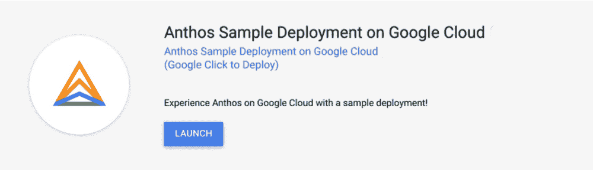

# TWiGCP—“Vegas、数据目录、BQ 物化视图和屏蔽虚拟机”

> 原文：<https://medium.com/google-cloud/twigcp-vegas-data-catalog-bq-materialized-views-and-shielded-vms-8688c6513899?source=collection_archive---------1----------------------->

以下是本周谷歌云视频系列的最新链接:

*   [Anthos 在更多的地方运行，管理更多的工作负载](http://gtech.run/ftrl8)
*   [医疗保健云支持&生命科学](http://gtech.run/rkv78)
*   [原生云数据库扳手新增功能](http://gtech.run/kc72c)
*   [谷歌云培训课程](http://gtech.run/qwzl7)

过去一周 GCP 的其他头条新闻包括:

*   [使用 Data Catalog 发现、了解和管理您的数据，现在正式发布](http://gtech.run/5xzg9)(谷歌博客)
*   [BigQuery:高效的新视图和云人工智能集成](http://gtech.run/9xrvk)(谷歌博客)
*   [谷歌云的拉斯维加斯地区现已开放](http://gtech.run/t92uw)(谷歌博客)
*   [安全性，简化:让屏蔽虚拟机成为计算引擎的默认虚拟机](http://gtech.run/vywwm)(谷歌博客)
*   [5 月期间，在 30 天内免费学习 3 种按需云技能](http://gtech.run/djegg)(谷歌博客)

来自“揭秘 Anthos”部门:

*   [通过示例部署探索 Anthos](http://gtech.run/tasv4)(Google 博客)
*   [多云特性让自动气象站上的 Anthos 成为可能](http://gtech.run/2dfce)(谷歌博客)

来自“解决我不知道的网络问题”部门:

*   [你最大的网络性能问题以及如何解决它们](http://gtech.run/wvheh)(谷歌博客)
*   [了解云 DNS 中的转发、对等和私有区域](http://gtech.run/6nkba)(谷歌博客)
*   [云路由器动态路由](http://gtech.run/p4lcv)(medium.com)

来自“(大)数据处理、报告和迁移”部门:

*   [无服务器事件:用卡夫卡实现传统流媒体的现代化](http://gtech.run/znz5v)(thejaysmith.com)
*   [将您的可视化软件连接到 Google Cloud 上的 Hadoop](http://gtech.run/gakw9)(medium.com)
*   [在谷歌云平台中创建 ETL，用于自动报告](http://gtech.run/4ncb4)(medium.com)
*   [无服务器事件:用卡夫卡实现传统流媒体的现代化](http://gtech.run/hsmhv)(medium.com)
*   【medium.com 将数据处理 Hadoop 工作负载迁移到 GCP

来自“解释和扩展 ML”部门:

*   [解释图像数据的模型预测](http://gtech.run/qq97f)(谷歌博客)
*   [从批处理和流 ETL 管道调用谷歌云机器学习 API](http://gtech.run/gdlax)(medium.com)

从“为什么优化云成本很难？”部门:

*   [无服务器工作负载的成本优化](http://gtech.run/k9x9f)(谷歌博客)
*   [明智地选择云虚拟机可以削减大数据成本](http://gtech.run/z9cpt)(谷歌博客)

来自“开始使用 Secret Manager 的时间”部门:

*   [Secret manager 集中秘密管理，改善您的安全状况](http://gtech.run/hk32n)(谷歌博客)
*   [视频] [秘密经理](http://gtech.run/8a8f4)(youtube.com)

来自我最喜欢的“客户和合作伙伴对 GCP 的最佳评价”部分:

*   [使用 Terraform 和 Github 操作在 Google 云存储上部署您的 Gatsby 网站](http://gtech.run/ezvzl)(medium.com)
*   [宣布推出 Micronaut(云运行，内部云功能)【objectcomputing.com ](http://gtech.run/tvqhx)

来自“本周云跑”部门:

*   [云上运行的 Ruby 函数！💎](http://gtech.run/ps4b7)(medium.com)
*   [有效指定云运行的环境变量](http://gtech.run/ck6bg) (ahmet.im)
*   [持续部署到在 Google Kubernetes 引擎上运行的云](http://gtech.run/wku9c)(medium.com)
*   [使用 Google Sheets 和云运行构建 REST API 扩展无服务器工具箱](http://gtech.run/dzee2)(youtube.com)

来自“**万物多媒体**”部门:

*   [视频] [什么是 BigQuery？—大查询聚焦](http://gtech.run/hmuyc)(youtube.com)
*   [视频]【youtube.com 利用 open telemetry-Stack Doctor 进行分布式跟踪
*   【视频】【youtube.com】用春云 GCP 在 GCP 开发 Spring Boot 微服务
*   [播客] Kubernetes 播客[第 101 集——开放政策代理人，蒂姆·辛里奇和托林·桑德尔](http://gtech.run/gcrtf)(kubernetespodcast.com)
*   [播客]gcppodcast.com GCP 播客[第 218 集——安东·丘瓦金博士和安什·帕特尼亚克的编年史安全](http://gtech.run/f9ht9)

从 **Beta，GA，还是什么？**"部门:

*   [GA] [云 SDK 290.0.1](http://gtech.run/wfg8w)
*   [GA] [新日志查看器](http://gtech.run/e75tf)
*   [GA][Anthos 入口](http://gtech.run/fa3y2)
*   [GA] [负载平衡器—使用谷歌管理的 SSL 证书](http://gtech.run/c68t3)
*   GKE 视窗服务器容器
*   【GA】[云数据目录](http://gtech.run/sm9rj)
*   [GA] [容器优化的操作系统运行状况监控](http://gtech.run/66w47)
*   [GA] [云 EKM(外部密钥管理器)](http://gtech.run/sfqlz)
*   [GA] [准入审批](http://gtech.run/f3s7b)
*   [GA] [子账户和标签的计费预算支持](http://gtech.run/qeewr)
*   [Beta] [GKE 向主服务器授予全球访问权限](http://gtech.run/zxkse)(从任何谷歌云区域)
*   【测试版】[媒体翻译](http://gtech.run/q244a)

本周的图片来自“使用示例部署探索 Anthos”的帖子

这就是本周的全部内容！亚历克西斯