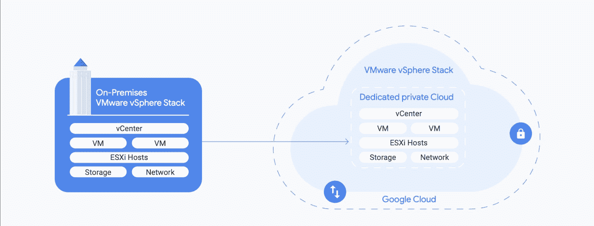

# TWiGCP—“VMware 引擎、Metastore 和裸机”

> 原文：<https://medium.com/google-cloud/twigcp-vmware-engine-metastore-and-bare-metal-6c2a46bc114c?source=collection_archive---------4----------------------->

如果你错过了 DevRel 的 **24 小时云演讲，这里有机会让你赶上[20 多场会议的点播视频](http://gtech.run/qbn99)。**

此外，提醒一下 [**云下一集**](http://gtech.run/p3rdq) 将于 7 月 14 日开播，为期 9 周的系列主题。现在预订您的课程并将其添加到您的日历中还不算太早。

过去一周的 GCP 要闻包括:

*   [谷歌云 VMware 引擎现已正式上市](http://gtech.run/l3cfg)(谷歌博客)
*   [Dataproc Metastore:完全托管的 Hive metastore 现在可用于 alpha 测试](http://gtech.run/yh5d5) (Google 博客)
*   [谷歌云作为数据处理器获得了公认的 ISO/IEC 27701 认证](http://gtech.run/t6543)(谷歌博客)
*   [裸机解决方案:来到你身边的谷歌云数据中心](http://gtech.run/juwaf)(谷歌博客)
*   [Presto 可选组件现已在 Dataproc 上可用](http://gtech.run/lv53p)(谷歌博客)

来自“赌上你的职业是一个好赌注”部门:

*   用高增长的工作和技能徽章来发展你的云计算事业(谷歌博客)
*   [谷歌云专业数据工程师认证— 2020 迷你指南](http://gtech.run/s2d48)(medium.com)

来自“面向技术领导者的白皮书和资源”部门:

*   [谷歌云的人工智能采用框架:帮助你建立变革性的人工智能能力](http://gtech.run/zhdxr)(谷歌博客)
*   [新的 IT 成本评估计划:释放价值，再投资促进增长](http://gtech.run/9r2uv)(谷歌博客)
*   [11 种利用谷歌云提高运营效率和降低成本的最佳实践](http://gtech.run/uy4xs)(谷歌博客)
*   [不仅仅是合规性:为当今以云为中心的世界重塑 DLP](http://gtech.run/eaf6a)(谷歌博客)

来自“Python 和 GCP 驱动的基因组学”部门:

*   使用 Hail、BigQuery 和 Dataproc 构建基因组学分析架构
*   [用 Hail、BigQuery 和 Dataproc 进行基因组学分析](http://tech.run/mh3bz)(谷歌博客)

来自“GCP 惯用发展”部门:

*   【seroter.com】Google Cloud 对 Java 的支持比我想象的更全面
*   [云上雨燕运行](http://gtech.run/g2n99)(medium.com)
*   [用人工智能的不和谐调节机器人实时阻止有毒信息](http://gtech.run/seqzl)(medium.com)
*   用 Firebase 构建一个无服务器的多人游戏(levelup.gitconnected.com)
*   [。云壳和 App Engine 灵活环境下的 NET Core 3.1 更新](http://gtech.run/4k7ft)(medium.com)

来自“云架构”部门:

*   [为受地区限制的工作负载设计灾难恢复](http://gtech.run/2qsrf)(cloud.google.com)
*   [medium.com GCP 的域名映射](http://gtech.run/5r6ld)
*   [具有共享 VPC 和私有服务访问的 Redis](http://gtech.run/4gsr4)(medium.com)
*   [如何用 Twilio 和谷歌云平台建立无服务器的每日天气短信提醒【medium.com ](http://gtech.run/swas8)

来自“将数据导入 BigQuery”部门:

*   [如何用自己的数据集使用 BigQuery API？](http://gtech.run/6uhjn)(towardsdatascience.com)
*   [如何使用 Python 数据流将 XML 数据加载到 BigQuery 中](http://gtech.run/pyfuw)(medium.com)

来自“谷歌云数据库和存储最新动态”部门:

*   [使用 Atlas 实时迁移从 MongoDB 迁移到 MongoDB Atlas](http://gtech.run/c4kyz)(cloud.google.com)
*   [DML 和突变——云扳手中两种数据更改技术的故事](http://gtech.run/9z2zh)(medium.com)
*   [为云存储中的对象创建设置监控的指南](http://gtech.run/ya2tf)(谷歌博客)

来自我最喜欢的“客户和合作伙伴对 GCP 的最佳评价”部分:

*   [在封锁期间，我们如何利用云和应用程序平台扩展我们的零售业务](http://gtech.run/5g9kc)(medium.com)

来自“**万物多媒体**部门:

*   【视频】【youtube.com】搭建 AI 平台管道
*   [视频] [谷歌云画板系列](http://gtech.run/ykt4u)(youtube.com)
*   [播客] Kubernetes 播客[第 110 集——米兰蒂斯，阿德里安·艾奈尔](http://gtech.run/bs2x4)(kubernetespodcast.com)
*   [播客]gcppodcast.com GCP 播客[第 225 集 Philip O 'Toole 和 Oscar Guerrero 的云审计日志记录](http://gtech.run/gdqjz)

**从 Beta，GA，还是什么？**“部门:

*   [GA] [云 SDK 299.0.0](http://gtech.run/wfg8w)
*   [GA] [大查询槽](http://gtech.run/ceuxa)
*   [GA] [私有云 4.50.00 的顶点边缘](http://gtech.run/27mrz)
*   云运行连接到 VPC 网络
*   [GA] [Anthos 服务网格 1.6](http://gtech.run/q856u)
*   [GA] [GKE 节点本地 DNSCache](http://gtech.run/9jk9f)
*   谷歌 VMware 引擎
*   [GA] [网络情报中心连通性测试](http://gtech.run/crd6r)
*   [GA] [Anthos 附着簇](http://gtech.run/dl85u)
*   【测试版】 [VPC SC 疑难解答](http://gtech.run/n45r9)
*   【测试版】 [Cloud Composer 对 VPC 服务控件的支持](http://gtech.run/x5mpu)

本周的图片说明了谷歌云 VMware 引擎的普遍可用性

这就是本周的全部内容！亚历克西斯