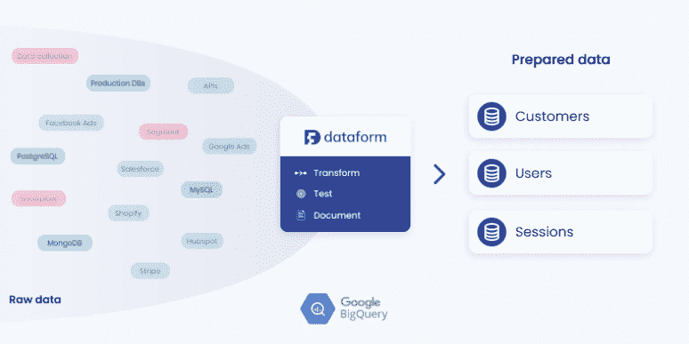

# TWiGCP —“欢迎数据表单、Dataproc Hub 和云运行最小实例”

> 原文：<https://medium.com/google-cloud/twigcp-welcoming-dataform-dataproc-hub-and-cloud-run-min-instances-a5932104687b?source=collection_archive---------1----------------------->

过去一周的 GCP 要闻包括:

*   [Dataproc Hub 让笔记本更容易用于机器学习](http://gtech.run/dsdeh)(谷歌博客)
*   [云运行为延迟敏感型应用增加了最小实例功能](http://gtech.run/mcday)(谷歌博客)
*   [Forrester Research 称谷歌云是其最新 IaaS 平台原生安全浪潮的领导者](http://gtech.run/huuxa)

从“欢迎使用数据表单到谷歌云(现已对所有人免费)”部门:

*   欢迎使用数据表单 BigQuery:在数据仓库中创建和管理数据转换
*   [用数据表单在 BigQuery 中构建 SQL 管道|作者 Lak Lakshmanan](http://gtech.run/bu26b)(medium.com)

来自“接受培训的时间”部门:

*   [2020 年 12 月的免费谷歌云学习机会](http://gtech.run/d54sl)(谷歌博客)
*   [谷歌云平台(linkedin.com)开发者基础培训](http://gtech.run/n33sv)

来自“谷歌云上的微软工作负载”部门:

*   [将微软工作负载迁移到谷歌云产生结果](http://gtech.run/9rq8q)(谷歌博客)
*   [使用谷歌云存储将 Windows 工作负载迁移到云中](http://gtech.run/v9wjp)(谷歌博客)

来自“无 VPN 安全”部门:

*   [什么是零信任身份安全](http://gtech.run/kq4x2)(谷歌博客)
*   用身份识别代理控制对你网站的访问(谷歌博客)

来自“发布/订阅支持优雅架构”部门:

*   [通过发布/订阅](http://gtech.run/gnrv9)(谷歌博客)从批处理转移到流处理，进行实时分析
*   卡尔曼滤波器、Pub/Sub 和观鸟|蔡(音)(音)

来自“云架构师熟食店”部门:

*   [使用数据库迁移服务为 MySQL 数据库的迁移做准备](http://gtech.run/hhtl8)(谷歌博客)
*   如何开发安全且可扩展的无服务器 API(谷歌博客)
*   【cloud.google.com】GCE—基于时间表的扩展
*   【cloud.google.com】GKE—自动创建的防火墙规则

来自“更快的数据处理和并行计算”部门:

*   [构建更快的机器学习数据集群](http://gtech.run/txnpc)(谷歌博客)
*   Dataproc 上的 Dask(谷歌博客)

来自“轻松 shell 命令编排”部门:

*   [运行 shell 命令并协调计算引擎虚拟机与云工作流|作者:márton Kodok](http://gtech.run/sqrs2)(medium.com)

来自“从文档中提取数据的 3 个步骤”部门:

*   [使用文档人工智能实现采购工作流程自动化](http://gtech.run/v6j4n)(谷歌博客)

来自“科技为善”部门:

*   [通过云数据分析减少食物浪费和不安全](http://gtech.run/udwp6)(谷歌博客)

来自“客户和合作伙伴与 GCP 一起解决实际问题”部门:

*   [宣布鲁宾天文台的新工作和谷歌云的天文学进展](http://gtech.run/dxurj)(谷歌博客)
*   [运行谷歌云 SQL 实现高性能、低成本](http://gtech.run/kzhla)(谷歌博客)
*   [三星 Bixby 训练通过云 TPU 获得 18 倍速度提升](http://gtech.run/6s33j)(谷歌博客)
*   [一家 3D 打印公司如何将其数据库迁移到云 SQL](http://gtech.run/yvxxt) (谷歌博客)
*   [为什么以及如何在谷歌云上运行 Esri GIS 应用程序](http://gtech.run/8bc83)(谷歌博客)

来自“**万物多媒体**”部门:

*   Kubernetes 播客[第 131 集——Kubernetes 1.20，杰里米·里卡德](http://gtech.run/wned2)(kubernetespodcast.com)
*   【视频】[如何在云运行中运行多个版本的 Python](http://gtech.run/q5gp2)
*   [视频] [扩展无服务器应用的 6 种策略](http://gtech.run/anrmd)
*   【视频】[GKE 自动缩放:集群和节点](http://gtech.run/nfcc7)

来自“**的预告，嘎，还是什么？**"部门:

*   [GA] [云 SDK 320.0.0](http://gtech.run/wfg8w)
*   [GA] [在网络间迁移 GCE 虚拟机](http://gtech.run/pblgb)
*   [GA] [VPC 数据包镜像](http://gtech.run/wtw2h)
*   VPC 安全控制系统
*   [GA] [Redis 的内存存储上的 Redis 授权](http://gtech.run/fhete)
*   [GA][data proc 作业的最大失败次数](http://gtech.run/bbeq2)
*   【GA】[云扳手锁定 _ 扫描 _ 范围独占锁定](http://gtech.run/zx4hu)
*   [预览] [基于时间表的 GCE 缩放](http://gtech.run/gah3x)
*   【预览】 [GCE 重命名一个实例](http://gtech.run/pb8ql)
*   [预览] [用于 TCP 转发的身份感知代理](http://gtech.run/6pzzt)
*   【预览】[专用服务访问的 DNS 对等](http://gtech.run/vq5ph)
*   [1.6.0] [安东尼](http://gtech.run/4fdjy)
*   [20 . 12 . 2][IntelliJ 的云代码](http://gtech.run/tz4v7)
*   【1 . 7 . 1】[云代码对 VS 代码](http://gtech.run/fmx74)

本周图片来自加入谷歌云贴吧的数据表单

这就是本周的全部内容！亚历克西斯