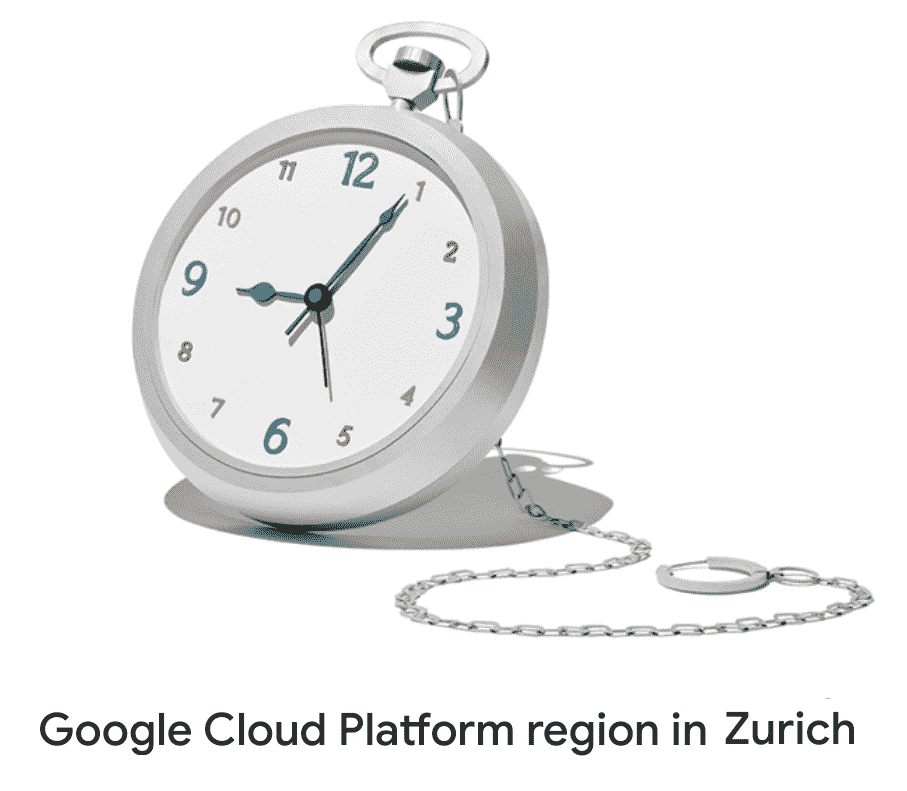

# TWiGCP —“多云的苏黎士，SRE @ Coursera，不是你平常的圆周率日”

> 原文：<https://medium.com/google-cloud/twigcp167-85d30bfe7cff?source=collection_archive---------1----------------------->

以下是过去一周的主要新闻:

"[苏黎士的新 GCP 地区:增加我们对瑞士和欧洲企业的支持](http://gtech.run/l9pea)"(谷歌博客)。这个新区域有三个可用区域，是 EMEA 的第 6 个区域，全球的第 19 个区域。

"[现场可靠性工程:测量和管理可靠性](http://gtech.run/l42nh)(Coursera)。SRE 是谷歌的 DevOps 实现，这个新的 Coursera 课程是了解更多的地方。

[谷歌云技术合作伙伴](http://gtech.run/ybc6u) (cloud.google.com)。从我们的 SLO 指南开始，查看合作伙伴可以访问哪些资源。

服务网格时代:使用 Istio 和 Stackdriver 构建 SRE 服务。如何利用 Istio 和 Stackdriver 监控轻松展现应用程序指标，并提供一步一步的教程。

来自“如果你喜欢数据和篮球，这是涅槃”部门:

*   “[让问题开始:我们如何为 NCAA 三月疯狂建立我们的分析渠道](http://gtech.run/htbmf)”(谷歌博客)
*   “[将数据转化为 NCAA 三月疯狂洞察](http://gtech.run/d2vyl)”(谷歌博客)
*   "[适应:调整团队进度指标](http://gtech.run/xgq3t)"(medium.com)

来自“持续构建|集成|部署|交付”部门:

*   [介绍持续交付基金会，Tekton、Jenkins、Jenkins X 和 Spinnaker 的新家](http://gtech.run/xj4xn)(opensource.googleblog.com)
*   [NodeJS 使用 Kubernetes &容器构建器](http://gtech.run/wf2qw)在 Google Cloud 中持续部署
*   [放心发布:测试和 CI/CD 如何将 bug 排除在产品之外](http://gtech.run/xkua4)(谷歌博客)

来自“我打赌你的圆周率一点也不像艾玛的圆周率”部门:

*   艾玛·相户爱·岩尾如何打破吉尼斯世界纪录，获得圆周率最精确的数值
*   天空中的圆周率:在谷歌云上计算破纪录的 31.4 万亿位阿基米德常数

来自“整个 GCP 又是忙碌的一周”部门:

*   谷歌云任命了 Forrester 浪潮的领导者:大数据 NoSQL
*   【medium.com】[编辑快速提示:来自云构建的更简单的 GKE 认证](http://gtech.run/wpqek)
*   [用凡赛堤外部项目访问扫描仪](http://gtech.run/y6d82)帮助阻止数据泄露(谷歌博客)
*   [探索集装箱安全:2019 年集装箱社区峰会的四点收获](http://gtech.run/g3ydn)(谷歌博客)
*   [用 big query Billing Export](http://gtech.run/8ykg7)(medium.com)核对您的每月 GCP 发票
*   [数据科学大查询](http://gtech.run/p8q2n)(towardsdatascience.com)

从“测试版，正式版，还是什么？”部门:

*   [GA] [云 SDK 238.0.0](http://gtech.run/wfg8w)
*   [GA] [实例组更新器](http://gtech.run/tndbq)
*   [GA] [用于 GCS、BigQuery、Bigtable、日志记录、发布/订阅和 Dataproc 的 VPC 服务控件](http://gtech.run/cdegd)
*   [Beta] [剖析 Python 代码](http://gtech.run/kb5r5) (GCE，GKE，GAE)
*   设定预测成本的预算
*   [2.11.0] [阿帕奇波束 2.11.0](http://gtech.run/36vs7)

来自“所有多媒体”部门:

*   [播客] Kubernetes 播客第 44 集— [持续交付基金会，特蕾西·米兰达](http://gtech.run/trc3e)(kubernetespodcast.com)
*   [播客] GCP 播客第 166 集— [露西亚·苏巴廷和凯文·尼尔森的 SAP HANA](http://gtech.run/2447r)(gcppodcast.com)

本周的图片展示了谷歌在苏黎世的最新区域

这就是本周的全部内容！亚历克西斯