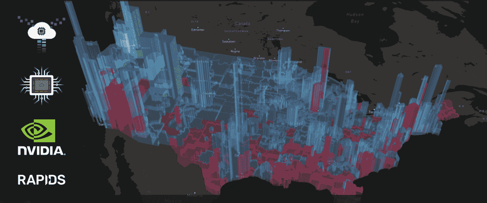

# TWiGCP—“Istio 1.1，更好的深度学习虚拟机映像，以及用于 VMware vRealize 的 GCP 插件”

> 原文：<https://medium.com/google-cloud/twigcp168-aadbc5fa7644?source=collection_archive---------1----------------------->

如果你本周从[来到这里观看谷歌云的视频系列](http://gtech.run/ju4em)，这里是本周所涉及主题的链接:

*   [这么多内容！](http://gtech.run/drzxu)
*   [获得认证](http://gtech.run/mjbln)
*   [深度学习，更容易](http://gtech.run/ljr9z)
*   [保密和安全](http://gtech.run/7lmpp)

以下是过去一周 GCP 的主要新闻:

首先，我们离下一个 2019 年的[云只有几个星期了。请务必注册或计划在接下来的](http://gtech.run/bbwjj)[on air](http://gtech.run/39w8s)！团队中的每个人都非常兴奋(也非常忙碌)！

" [Istio /宣布 Istio 1.1](http://gtech.run/w862x) " (istio.io)。这是一个关注性能和可伸缩性的版本。控制平面内存消耗是一个特别关注的领域。

" [NVIDIA 的 RAPIDS 加入了我们的深度学习虚拟机映像集，以实现更快的数据科学](http://gtech.run/ea9jd)"(谷歌博客)。如果你对深度学习感兴趣，但还没有，可以试试这些一键设置图像。你可能会发现它们非常有用，是真正的省时工具。

"[现已正式推出:VMware vRealize Automation 插件](http://gtech.run/vllbk) " (Google 博客)。VMware 客户管理和使用 Google 云资源的更多理由。

来自“本周机器学习”部门:

*   TensorFlow 2.0 和云人工智能使得训练、部署和维护可扩展的机器学习模型变得容易(谷歌博客)
*   Coconet:当今巴赫涂鸦背后的 ML 模型(magenta.tensorflow.org)
*   [分析以深度变异为特征的 3024 个水稻基因组](http://gtech.run/7tdeg)(谷歌博客)

来自我最喜欢的“客户和合作伙伴对 GCP 的最佳评价”部分:

*   [谷歌云如何帮助多人游戏打破 Apex Legends 发布记录](http://gtech.run/rbm9b)(谷歌博客)
*   下雨了 API:AccuWeather 如何使用 Apigee 与开发者共享数据(谷歌博客)
*   [阿尔斯通案例研究](http://gtech.run/g9uuf)(cloud.google.com)#计算引擎#云 cdn #云存储

来自“安全、隐私和性能解决方案”部门:

*   【cloud.google.com】在混合环境中认证企业用户
*   [为 PCI DSS 令牌化敏感持卡人数据](http://gtech.run/cfav8)(cloud.google.com)
*   [针对 GCP 和混合场景下网络性能的 TCP 优化](http://gtech.run/a8ytk)(cloud.google.com)

来自“本周 GCP 媒体”部门:

*   "[在 Google Kubernetes 引擎上部署具有持久性的 Redis](http://gtech.run/dztag)"(medium.com)
*   " [Firebase & Google Cloud:与云存储有什么不同？](http://gtech.run/ble3n)(medium.com)
*   "[为您的谷歌云项目设定预算和提醒](http://gtech.run/j66d8)"(medium.com)

从“测试版，正式版，还是什么？”部门:

*   [GA] [云 SDK 239.0.0](http://gtech.run/wfg8w)
*   [GA] [用于 VMware vRealize Automation 的 GCP 插件](http://gtech.run/vllbk)
*   [1.1] [Istio 1.1](http://gtech.run/w862x)

来自“所有多媒体”部门:

*   [播客] Kubernetes 播客[第 45 集——SPIFFE，Andrew Jessup](http://gtech.run/9fjl5)(kubernetespodcast.com)
*   (gcppodcast.com)艾玛·相户爱·伊沃的世界圆周率日

本周的图片来自宣布将 RAPIDS 添加到我们的深度学习虚拟机映像的帖子

这就是本周的全部内容！亚历克西斯