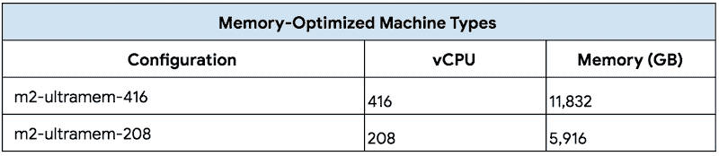

# TWiGCP —“更大更好的虚拟机、GCP 上的 Elastifile 和 Memorystore Redis 4.0”

> 原文：<https://medium.com/google-cloud/twigcp170-f3562b191178?source=collection_archive---------0----------------------->

[**云下一个 2019**](http://g.co/cloudnext) 就是这个星期！！如果你没有亲自出席，请务必关注下一期的[！](http://gtech.run/39w8s)

如果你本周从[来到这里观看谷歌云的视频系列](http://gtech.run/ju4em)，这里有本周所涉及主题的链接:

*   [为谷歌计算引擎](http://gtech.run/hej94)推出针对计算和内存优化的虚拟机。高达 416 个 vCPU 和 11，832 GB。报名提前接入！
*   [借助面向 GCP 的全新 Elastifile 云文件服务横向扩展存储](http://gtech.run/vl7lx)。  这项与 Elastifile 的联合工程成果现已在 GCP 市场推出。
*   [Cloud Memorystore:现在有了 Redis 版本支持和手动故障转移 API](http://gtech.run/xa92f) 。
    享受最新的 Redis，在这个测试版中增加了手动故障转移 API 和 OpenCensus 收集的跟踪和指标
*   [想要可重复的规模？采用基础设施作为 GCP 的代码](http://gtech.run/cy693)
*   [将您的传统数据仓库平台迁移到 BigQuery:宣布数据仓库迁移服务](http://gtech.run/2uglu)。  这包括概念验证资金支持、架构设计专家建议和在线课程

过去一周的其他 GCP 故事包括:

*   [宣布云医疗 API 测试版:提高跨组织的数据访问和共享能力](http://gtech.run/twcdj)(谷歌博客)
*   [Lustre 文件系统云部署管理器脚本简介](http://gtech.run/mfjxv)(谷歌博客)
*   [ML 套件扩展到 NLP，具有语言识别和智能回复](http://gtech.run/r2myn)(firebase.googleblog.com)
*   [在 Google Kubernetes 引擎上部署生产就绪的 git lab](http://gtech.run/ncjhc)——(cloud.google.com)
*   跨越池塘的快速跳跃:用 SDM 技术给杜楠特海底电缆增压

来自本周的“云原生”部门:

*   [服务网格时代:Istio 在混合云未来的角色](http://gtech.run/rnzmt)(谷歌博客)
*   “【medium.com】[混合云—将 GCP 与本地数据中心联系起来](http://gtech.run/8s29l)”
*   "[(medium.com)如何在 Google Kubernetes 引擎上部署 MongoDB(GKE)](http://gtech.run/dy3wu)

来自我最喜欢的“客户和合作伙伴对 GCP 的最佳评价”部分:

*   [我们为什么迁移到谷歌云平台，分两张幻灯片](http://gtech.run/fd874)([medium.com](/))
*   [fubo TV 如何与 GCP 一起构建云原生流媒体平台](http://gtech.run/9mhk6)(谷歌博客)

来自“中型大数据”部门:

*   "[哪个 BI 工具适合大查询？](http://gtech.run/svd23)(medium.com)
*   "[在 Google Cloud Dataproc 上持久化来自短暂集群的应用历史](http://gtech.run/gq75y)"(medium.com)

来自“愚人节(或者是？)”部门:

*   [谷歌郁金香:技术细节](http://gtech.run/fzct9)(medium.com)

从“贝塔，嘎，还是什么？(可能是本周即将发布的一小部分)“部门:

*   [GA] [云 SDK 240.0.0](http://gtech.run/wfg8w)
*   [GA] [监控配额指标](http://gtech.run/fpd3x)
*   [GA] [新的云功能位置](http://gtech.run/6qpvx)
*   [Beta][Redis 4.0 云存储](http://gtech.run/xa92f)
*   【测试版】[云医疗 API](http://gtech.run/twcdj)
*   【测试版】 [VPC 服务控件](http://gtech.run/ug24j)
*   [Beta] [托管实例组更新程序状态 API](http://gtech.run/cbvgt)
*   [Beta] [私有 DNS 对等](http://gtech.run/67pqw)
*   【测试版】[私有 DNS 日志](http://gtech.run/kx7hg)
*   包含重要安全更新 ( [istio.io](http://istio.io/) )的 Istio 1.1.2 和 1.0.7
*   [0.4] [公开赛 0.4.0](http://gtech.run/62vzy)

来自“所有多媒体”部门:

*   [播客] Kubernetes 播客[第 47 集——泰克顿，金·莱万多夫斯基](http://gtech.run/srmz5)(kubernetespodcast.com)
*   gcppodcast.com,【播客】GCP 播客[第 169 集](http://gtech.run/net69)
*   [YouTube] [用防火墙规则保护你的谷歌云实例](http://gtech.run/84mj9)
*   [YouTube][Redis 和 OpenCensus 的云存储](http://gtech.run/56wkh)

本周的图片是新的内存优化的机器类型

这就是本周的全部内容！亚历克西斯