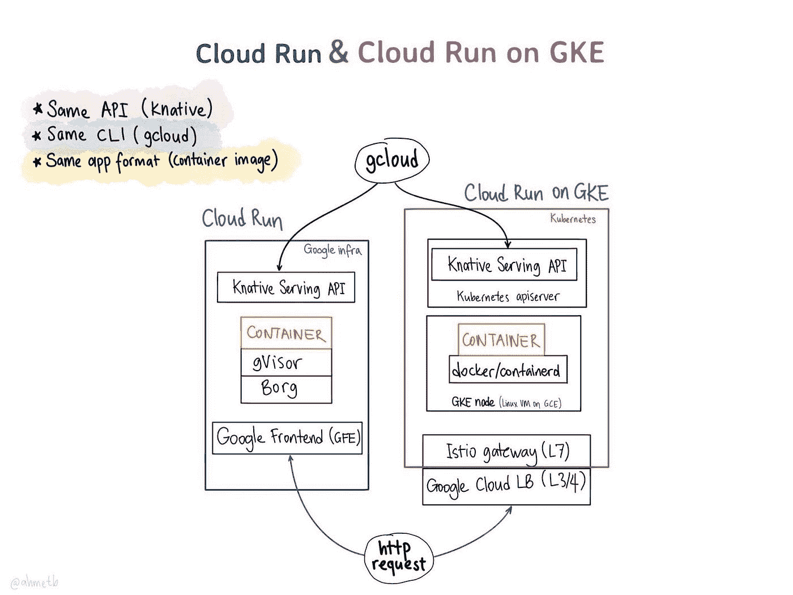

# TWiGCP“从下一个 19 年回来！" #171

> 原文：<https://medium.com/google-cloud/twigcp171-c17a29deb0cf?source=collection_archive---------1----------------------->

无论你是否是 Google Cloud Next’19 的 35000 名与会者之一，跟上所有公告的步伐可能都很难。因此，这里有一个 GCP 和从业者为重点的会议概述！

主要公告包括:

*   [介绍 **Anthos** :一个全新的平台，用于在当今的多云世界中管理应用](http://gtech.run/vkja7)(谷歌博客)
*   [将最好的**开源**带给谷歌云客户](http://gtech.run/u5eas)(谷歌博客)
*   [发布**云代码** —加速云原生应用开发](http://gtech.run/mpr7b)(谷歌博客)
*   [宣布**云运行**，我们无服务器计算堆栈的最新成员](http://gtech.run/5eudw)(谷歌博客)
*   [扩展 Google **云 AI** 让开发者更容易构建和部署 AI](http://gtech.run/kx3nl) (Google 博客)。人工智能平台& AutoML(表格、视频智能、视觉、自然语言)
*   [从数据摄取到洞察预测:谷歌**云智能分析**加速你的业务转型](http://gtech.run/j9cvg)(谷歌博客)。云数据融合、数据流 FlexRS、云数据流 SQL、云数据目录、连接表等。
*   [助力企业转型:宣布谷歌**云联网**](http://gtech.run/n23x5) (谷歌博客)新增内容。流量控制器、高可用性 VPN 和 100 Gbps 互连
*   [简化员工、合作伙伴和客户的**身份和访问管理**](http://gtech.run/jrtrs)(谷歌博客)。云 IAP / BeyondCorp，云身份，微软 AD 托管服务
*   [企业**数据库**，为你管理](http://gtech.run/a4dh2)(谷歌博客)。用于 Microsoft SQL Server 的云 SQL，用于 PostgreSQL
*   [让谷歌云成为运行你的**微软 Windows 应用**](http://gtech.run/85bj6) (谷歌博客)。GCE，微软广告托管服务
*   [用为每个企业设计的解决方案释放**人工智能**的力量](http://gtech.run/ctwlx)(谷歌博客)。文档理解人工智能、联络中心人工智能、视觉产品搜索、推荐人工智能、自动表格
*   [用 **Apigee** 混合 API 管理](http://gtech.run/svsew)选择自己的环境(谷歌博客)
*   [有什么比装酷更酷？**冰冷的档案储存**](http://gtech.run/d7h8m) (谷歌博客)
*   [谷歌云宣布在**首尔**和**盐湖城**](http://gtech.run/fn8ke) 新增区域(谷歌博客)
*   [增加对谷歌云的**信任:可见性、控制和自动化**](http://gtech.run/lyfrb)(谷歌博客)

来自“同时来自互联网上的社区”部门:

*   “[Google Cloud Run for Go](http://gtech.run/dxyk2)”(medium.com)
*   “[使用谷歌云人工智能平台笔记本作为基于网络的 Python IDE](http://gtech.run/kxd43)”(medium.com)
*   “[本周编程:谷歌云的震撼与敬畏活动](http://gtech.run/dphjb)”(thenewstack . io)
*   "[Google Cloud Run 如何结合无服务器和容器](http://gtech.run/u67su) " (thenewstack.io)
*   “[通过云构建简化云运行的持续部署，包括自定义域设置(SSL)](http://gtech.run/b6xkh)”(medium.com)
*   "[谷歌云运行部署和弹性基准测试](http://gtech.run/xpzdg)"(medium.com)

来自我最喜欢的“客户和合作伙伴对 GCP 的最佳评价”部分:

*   [澳大利亚邮政为客户提供在线和面对面的服务](http://gtech.run/8zzkx)(谷歌博客)
*   [联合利华如何使用谷歌云优化营销活动](http://gtech.run/pqzux)(谷歌博客)
*   【youtube.com 客户案例:利用云人工智能平台实现业务转型
*   [谷歌云客户创新系列—第一部分](http://gtech.run/bx4ve)(youtube.com)
*   【youtube.com 谷歌云客户创新系列—第二部分
*   【youtube.com 客户案例:利用云人工智能解决方案实现业务转型
*   [现实世界中的无服务器:来自智能城市的客户故事——零售分析](http://gtech.run/54r75)(youtube.com)
*   [Anthos 迁移真实世界的客户场景](http://gtech.run/5fzw9)(youtube.com)
*   [youtube.com GCP 网络性能监控与诊断客户小组](http://gtech.run/jektg)
*   [客户如何将 Hadoop 迁移到谷歌云平台](http://gtech.run/htftv)(youtube.com)

从“测试版，正式版，还是什么？”部门:

*   【GA】[云视频智能 API——追踪物体](http://gtech.run/zbx3r)
*   【GA】[云视频智能 API —识别文本](http://gtech.run/7m5xv)
*   [GA] [屏蔽的虚拟机](http://gtech.run/857vh)
*   【GA】[云 Bigtable 多区域复制](http://gtech.run/r32jc)
*   [GA] [云文件存储](http://gtech.run/n85y3)
*   [GA] [堆栈驱动分析器](https://cloud.google.com/profiler/)
*   【GA】[云函数 Node.js 8.15.0](http://gtech.run/ks5l7)
*   【GA】[云功能 Go 1.11.5](http://gtech.run/jty7f)
*   【GA】[云函数 Python 3.7.1](http://gtech.run/jxfuc)
*   [GA] [云调度器](http://gtech.run/vadrz)
*   【GA】[云任务](http://gtech.run/d9h2r)
*   【测试版】 [VPC 日志采样、聚合和缩减采样](http://gtech.run/gbcbf)
*   【测试版】[云存储签名网址](http://gtech.run/599rt)
*   【Beta】[Cloud AutoML 自然语言情感分析](http://gtech.run/khgd7)
*   【测试版】 [CloudSQL PostgreSQL 11.1](http://gtech.run/kpwyz)
*   【贝塔】 [reCAPTCHA 企业](http://gtech.run/dgdyn)
*   【Beta】[自动视觉边缘](http://gtech.run/5qgaw)
*   [Beta] [Cloud AutoML 视觉对象检测文档](http://gtech.run/rntgx)
*   [Beta] [内部 TCP/UDP 负载平衡](http://gtech.run/2wtfh)
*   [Beta] [云 AutoML 表](http://gtech.run/gy6y3)
*   【Beta】[云 AI Hub](http://gtech.run/a4dnw)
*   【Beta】[建议 AI](http://gtech.run/txmlm)
*   【测试版】[云数据融合](http://gtech.run/p9ym2)
*   GKE 谷歌集团
*   【测试版】[云函数 Node.js 10 测试版](http://gtech.run/suneg)
*   【Beta】[云代码为 VS 代码](http://gtech.run/mkk76)
*   【Alpha】[Intellij 云代码插件](http://gtech.run/znp9m)

来自“我敢肯定亚历克西斯忘了几个通知”部门:

*   [值得关注的新闻:来自 Google Cloud Next’19](http://gtech.run/abqev)的 122+条公告(Google 博客)

来自“所有多媒体”部门:

*   【YouTube】[所有场次(450+！)—Google Cloud Next’19](http://gtech.run/veygk)
*   [播客] Kubernetes 播客[第 48 集——安托斯迁徙，由伊西·本·绍尔](http://gtech.run/8ncfa)主持(kubernetespodcast.com)
*   【播客】gcppodcast.com GCP 播客第 170 集[——2019 年第 1 天](http://gtech.run/ecezm)
*   【播客】GCP 播客第一集 [#171 —下一个 2019 第二天](http://gtech.run/ep3he)(gcppodcast.com)
*   【播客】GCP 播客第 172 集[—下一个 2019 第 3 天](http://gtech.run/sq2g3)(gcppodcast.com)

本周的图片由 Ahmet Alp Balkan ( [@ahmetb](http://twitter.com/ahmetb) )提供

本周的图片由艾哈迈德·阿尔普·巴尔坎([@艾哈迈德布](http://twitter.com/ahmetb))提供

这就是本周的全部内容！
——亚历克西斯