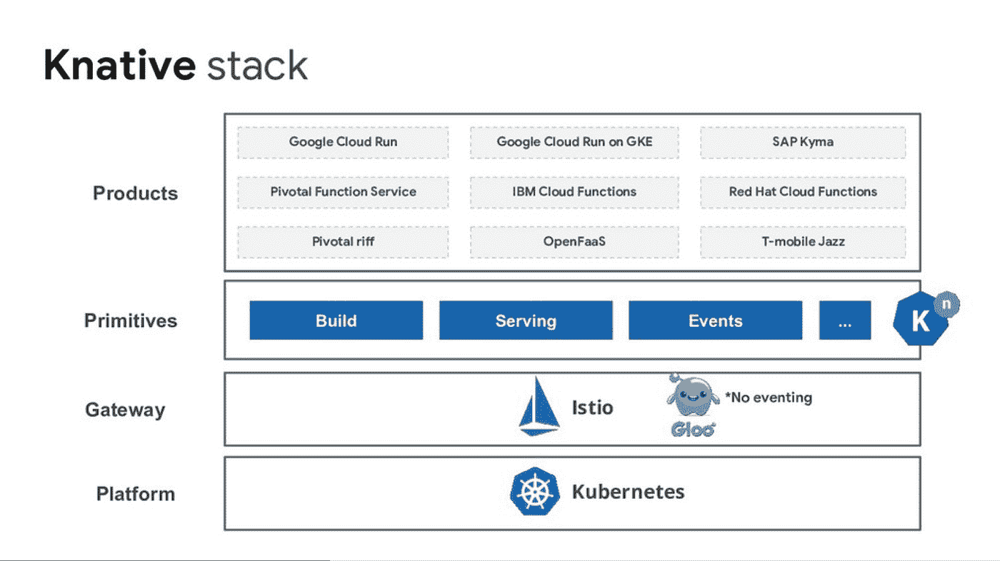

# TWiGCP—“GKE 高级、屏蔽虚拟机、私有目录、流量控制器……”

> 原文：<https://medium.com/google-cloud/twigcp172-d7abdef987b0?source=collection_archive---------0----------------------->

如果你是本周从 [**来到谷歌云的视频系列**](http://gtech.run/ju4em) 的，以下是本周所涉及主题的链接:

*   [新闻报道:谷歌云 2019 年](http://gtech.run/b58jl)发布 122 条以上公告(谷歌博客)
*   [公布云代码——加速云原生应用开发](http://gtech.run/up2lq)(谷歌博客)
*   [介绍 **GKE 高级版** —增强了企业工作负载的可靠性、简洁性和可扩展性](http://gtech.run/mhhzw)(谷歌博客)
*   [技能教程](http://gtech.run/ymdcx)(github.com)

过去一周的其他 GCP 故事包括:

*   欢迎罗伯特·安斯林来到谷歌云(谷歌博客)
*   [**屏蔽虚拟机**:防范 rootkits 和渗透的通行证](http://gtech.run/bqja7)(谷歌博客)
*   [通过**私有目录**改善企业 IT 采购，现处于测试阶段](http://gtech.run/j7sfd)(谷歌博客)
*   [**流量总监**:开放服务网格的全球流量管理](http://gtech.run/9nlc3)(谷歌博客)
*   [Cloud data proc 中的新开源工具在云规模上处理数据](http://gtech.run/uvc56)(谷歌博客)
*   [Serve (Firebase)动态内容和 host 微服务用**Cloud Run**](http://gtech.run/vrry8)**(firebase.google.com)**

**来自“跟进下一个‘19’公告”部门:**

*   **[云运行常见问题解答](http://gtech.run/b3ept)(github.com)**
*   **[谷歌云平台上的无服务器计算产品概述](http://gtech.run/6vgaf)(medium.com)**
*   **[云运行——将无服务器引入容器](http://gtech.run/nb45x) (040code.github.io)**
*   **[云安全指挥中心入门](http://gtech.run/2ha6k)(谷歌博客)**
*   **[从云运行连接到云 SQL 彼得·马利纳](http://gtech.run/d33hl)(medium.com)**
*   **[通过 GCP 市场](http://gtech.run/x3yhu)(谷歌博客)在 Kubernetes 上部署和运行 Couchbase 数据库**
*   **【medium.com】使用谷歌云人工智能平台笔记本作为基于网络的 Python IDE**
*   **[Google Cloud 的流量总监是什么？它与 Istio 服务网格有什么关系？](http://gtech.run/fmjgt)(medium.com)**
*   **[The RedMonk Google Next 2019 摘要——有时是龙](http://gtech.run/ump7k)(redmonk.com)**

**来自“是什么让 *GKE 先进*与众不同”部门:**

*   **[使用先进的 Kubernetes 自动缩放功能，包括垂直 Pod 自动缩放和节点自动配置](http://gtech.run/ktuyg)(谷歌博客)**

**来自“好东西，只是不是下一个 19 年相关的”部门**

*   **[理解 GCP 服务账户:三个常见用例](http://gtech.run/ra2jy)(谷歌博客)**
*   **[OpenCensus 追踪和 Google Cloud 发布/订阅](http://gtech.run/uykmw) (opencensus.io)**
*   **[twitter.com GCP 服务的 Chrome 键盘快捷键](http://gtech.run/j6gek)**

**来自我最喜欢的“客户和合作伙伴对 GCP 的最佳评价”部分:**

*   **[蒸发一个数据湖:奥托集团将 Hadoop 基础设施迁移到 GCP 的经验](http://gtech.run/cy4yt)(谷歌博客)**
*   **[美国柯尔百货公司利用谷歌云平台进行全渠道零售](http://gtech.run/frf5p)(谷歌博客)**

**从“测试版，正式版，还是什么？”部门:**

*   **[GA] [云 SDK 242.0.0](http://gtech.run/wfg8w)**
*   **【GA】[云任务](http://gtech.run/abcms)**
*   **【GA】[使用长期 MQTT 域](http://gtech.run/g3fyt)**
*   **【测试版】[服务账户描述](http://gtech.run/9tkac)**
*   **【测试版】[云 NAT 日志](http://gtech.run/dwuws)**
*   **【测试版】 [GKE 节点内能见度](http://gtech.run/nzs3m)**
*   **[Beta] [内部 TCP/UDP 负载平衡的故障转移概念](http://gtech.run/wfbp3)**

**来自“所有多媒体”部门:**

*   **【YouTube】[通过控制台和 gcloud cli 开始使用 Google Cloud 上的 node.js 功能](http://gtech.run/8hmbl)**
*   **【YouTube】[深入了解 GKE 网络最佳实践](http://gtech.run/hwzrt)**
*   **[播客] Kubernetes 播客[第 49 集——2019 年谷歌云直播，Eric Brewer](http://gtech.run/ffgep)(kubernetespodcast.com)**
*   **gcppodcast.com,【播客】GCP 播客[第 173 集——史迪伦·贾尼尼和瑞安·格雷戈的《云端奔跑》](http://gtech.run/cfu5n)**

**

本周的图片来自 Knative 教程** 

**这就是本周的全部内容！亚历克西斯**