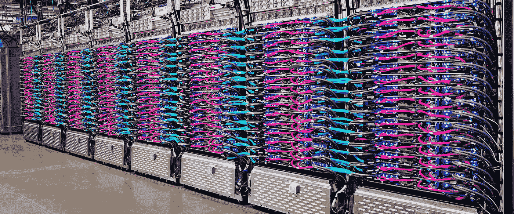

# twi GCP—“TPU 豆荚、人工智能研讨会和数据库解决方案”

> 原文：<https://medium.com/google-cloud/twigcp175-a67fed48011f?source=collection_archive---------1----------------------->

如果你是本周从 [**来到谷歌云的视频系列**](http://gtech.run/ju4em) 的，以下是本周所涉及主题的链接:

*   [谷歌云 I/O:你需要知道的消息](http://gtech.run/bka2a)
*   [云 TPU 豆荚现已公测](http://gtech.run/mtya8)  (更多 TPU 内容见下文)
*   [Google I/O 2019 上 Firebase 的新增功能](http://gtech.run/glhap)  (新增 MLKit、web perf 监控、Firestore 集合组查询、云函数模拟器等。)
*   [通过云数据准备提高机器学习和分析的数据质量](http://gtech.run/8p2jl)

过去一周的其他 GCP 故事包括:

*   [介绍 AI 工坊](http://gtech.run/jdzc4)(cloud.google.com)
*   [利用谷歌云为 SAP 客户创新](http://gtech.run/up5l9)(谷歌博客)
*   [深化谷歌云和红帽的合作，红帽企业 Linux 8 认证](http://gtech.run/q66at)(谷歌博客)
*   新的常青树谷歌机器人(webmasters.googleblog.com)

从“这些人带着云跑了一圈，有吗？”部门:

*   [Google Cloud Run——Python 和 Flask 入门](http://gtech.run/cn689)(jhanley.com)
*   [通过云运行和 Okteto 加速无服务器开发](http://gtech.run/48fms)(medium.com)
*   [谷歌云运行的 3 个最佳特性](http://gtech.run/hnmxj)(medium.com)
*   [纳塔莉向云跑](http://gtech.run/uf99k)(medium.com)

来自“TPU，大量 TPU”部门:

*   [谷歌用于机器学习的可扩展超级计算机“云 TPU 豆荚”现已公开测试](http://gtech.run/54kqx)(谷歌博客)
*   [在单个云 TPU 设备和云 TPU Pod(测试版)之间进行选择](http://gtech.run/wn45w)(cloud.google.com)

来自“Keras on TPU 自由代码实验室系列”部门(g.co/codelabs):

*   [TPU 速度数据管道:tf.data.Dataset 和 TFRecords](http://gtech.run/fb6e5)
*   [你的第一个 Keras 模型，带迁移学习](http://gtech.run/qbdeh)
*   [卷积神经网络，带 Keras 和 TPU](http://gtech.run/358v9)
*   [带有 Keras 和 TPU 的现代 convnets、squeeze net](http://gtech.run/8rpyn)

来自“您的 RDBMS 您的方式，在 GCP”部门:

*   [在计算引擎上使用 Microsoft SQL Server 备份进行时间点恢复](http://gtech.run/ftjgw)(cloud.google.com)
*   [在计算引擎上部署具有 DRBD 的高可用性 MySQL 5.6 集群](http://gtech.run/hb6ap)(cloud.google.com)
*   [在计算引擎和云 SQL 上部署 Confluence](http://gtech.run/76k9e)(cloud.google.com)
*   [将两层 web 应用程序迁移到 cloud.google.com GCP](http://gtech.run/p4ddq)

从“漫画值多少字？”部门:

*   [联邦学习(来自谷歌人工智能的在线漫画)](http://gtech.run/px289)(federated.withgoogle.com)
*   老掉牙的好东西— [更快地部署代码:借助 CI/CD 和 Kubernetes【cloud.google.com ](http://gtech.run/e74b8)

来自“DoiT 人又来了”部门:

*   用于 Grafana 的 Google BigQuery 数据源插件(github.com)

来自“跨 ML、K8S 和构建的实践”部门:

*   [用谷歌云 AutoML 自然语言建立文本分类模型](http://gtech.run/vaw53)(谷歌博客)
*   [用 Terraform 在 GKE 部署生产级头盔版本](http://gtech.run/ycc95)(谷歌博客)
*   [没有互联网连接的完全私有的 GKE 集群](http://gtech.run/kbymq)(medium.com)
*   [谷歌云构建:如何正确解决问题](http://gtech.run/7xlyj)(medium.com)

来自“我读过 JDB 的东西，你可能也应该读读”部分:

*   "[健康、可用性、可调试性](http://gtech.run/tya64) " (medium.com，JBD)

来自我最喜欢的“客户和合作伙伴对 GCP 的最佳评价”部分:

*   【cloud.google.com】ray catch 案例研究
*   【youtube.com】hot star 使用 Firebase + BigQuery 推出功能&分析数据

从“测试版，正式版，还是什么？”部门:

*   [GA] [云 SDK 245.0.0](http://gtech.run/wfg8w)
*   【测试版】[云 TPU v2 Pod |云 TPU v3 Pod](http://gtech.run/wx78j)
*   【测试版】[云 ML 引擎——自定义预测例程](http://gtech.run/bulxj)
*   【v 2 . 6 . 0】[terra form 谷歌云平台提供商](http://gtech.run/w832n)
*   谷歌 Kubernetes 引擎(GKE)插件
*   [19 . 5 . 1][IntelliJ 的云代码](http://gtech.run/wxfst)

来自“所有多媒体”部门:

*   [视频] [GCP 在谷歌 I/O 2019](http://gtech.run/nez24) 播放列表
*   Maya Kaczorowski【softwareengineeringdaily.com 集装箱平台安全
*   [播客] Kubernetes 播客[第 52 集——英国 AutoTrader，Russell Warman 和 Karl Stoney](http://gtech.run/wdz2g)(kubernetespodcast.com)
*   (gcppodcast.com)GCP 播客[第 175 集——以人为中心的人工智能与叮当](http://gtech.run/9ekuh)

本周的图片来自云 TPU 吊舱公告。一个云 TPU Pod 可以包括 1000 多个单独的 TPU 芯片，这些芯片通过一个超快速的二维环形网状网络连接在一起

这就是本周的全部内容！亚历克西斯