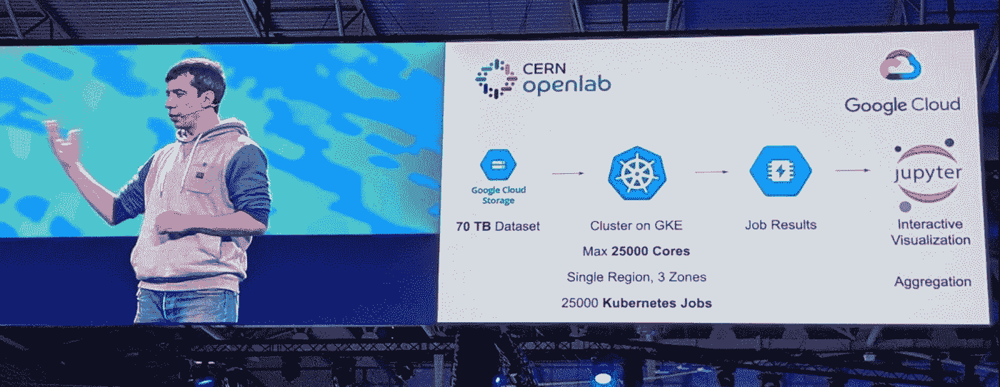

# TWiGCP —“从 Kubecon EU、GKE 发布渠道、Windows Server Containers 和全栈驱动 GKE 监控回来”

> 原文：<https://medium.com/google-cloud/twigcp177-7a1cc47cec66?source=collection_archive---------0----------------------->

如果你是本周从 [**来到谷歌云的视频系列**](http://gtech.run/ju4em) 的，以下是本周所涉及主题的链接:

*   "[在 Kubernetes 中加入“轻松”一词，并对 **GKE**](http://gtech.run/5rbnw) 进行了最新增强。"
*   " [**云运行**:将无服务器带入容器](http://gtech.run/cfc47)"
*   "[big query**中的优步数据集**:旧金山周边(以及你所在城市)的行驶时间](http://gtech.run/h5pru)"
*   "[Google 云平台播放列表入门](http://gtech.run/mkckn)"

过去一周 GCP 的其他头条新闻包括:

*   [**云审计日志**:GCP 和 G Suite](http://gtech.run/t4d3q) 的集成审计透明性(谷歌博客)
*   [Google Cloud networking 深入:通过 HA VPN 和 100 Gbps **专用互连**](http://gtech.run/rxbce) 实现更快、更可靠的连接(Google 博客)

来自“云原生、开源构建块等”部门:

*   [在谷歌云上构建云原生未来](http://gtech.run/97eum)(谷歌博客)
*   [Kubernetes 使用 Terraform 在 Google 计算引擎上进行部署](http://gtech.run/56x49)(medium.com)
*   [medium.com HTTPS 与 GKE 证书管理器](http://gtech.run/6cd8f)

来自“本周人工智能”部门:

*   [在线预测 API 使用 **scikit-learn** 和**云机器学习引擎**在【medium.com】GCP](http://gtech.run/gw8g5)上
*   [RAPIDS 0.7:我们继续前进](http://gtech.run/fcu75)……(scale # XG boost，云数据平台上的分布式 Dask)(medium.com)
*   【cloud.google.com】AI Workshop 3 新实验:语义相似度、混合整数程序、标签错误检测

来自“理解 FaaS 范式”部门:

*   "[让你的**云功能**开花结果](http://gtech.run/yv7w4)(medium.com)
*   【medium.com】[职能的没落和职能的崛起](http://gtech.run/ryzr5)

来自“cron 即服务”部门:

*   [使用**云调度器**和云功能部署一个周期性的计算引擎虚拟机工作器](http://gtech.run/ew8sb)(medium.com)
*   [使用云调度器调度 big query&云构建//Graham Polley](http://gtech.run/autt9)(polleyg . dev)

来自“容器即服务”部门

*   [使用谷歌**云运行**实现多云，并使用 Knative](http://gtech.run/qbxhh) 触发网格(TriggerMesh)
*   [使用 Cloud Run 作为 Google 上操作的 web hook](http://gtech.run/jnqk8)(medium.com)
*   [运行在 Rails 上的谷歌云:一个真实的例子(第 1 部分，共 4 部分)](http://gtech.run/qksdu)(medium.com)
*   [使用 Google Cloud Run 和 GRAND Stack 在几分钟内保护 graph QL API【medium.com ](http://gtech.run/tq2fq)
*   [通过云运行构建和部署无服务器的 dockered API](http://gtech.run/cqrps)(medium.com)

来自“最好与**合作伙伴**合作”部门:

*   [利用 Informatica](http://gtech.run/ubjyb) (谷歌博客)提供端到端的数据分析和数据管理解决方案
*   [使用谷歌协议缓冲区、谷歌云功能、云发布/订阅和 MongoDB 图集的物联网遥测收集](http://gtech.run/hcyt6)(programmaticponderings.com)

**从 Beta，GA，还是什么？**“部门:

*   [GA] [云 SDK 247.0.0](http://gtech.run/wfg8w)
*   [GA] [创建区域持久磁盘的快照](http://gtech.run/wlx5v)
*   【测试版】[创建 HTTP 目标任务](http://gtech.run/9nhh6)
*   [Beta] [在多个实例之间共享一个区域性持久磁盘](http://gtech.run/unhby)

来自“**万物多媒体**”部门:

*   【YouTube】[kubecon‬+cloudnativecon 2019 |巴塞罗纳播放列表](http://gtech.run/f6sun)(youtube.com)
*   [播客] Kubernetes 播客[第 54 集——科技、生活和 KubeCon EU，Bryan Liles](http://gtech.run/phg2v)(kubernetespodcast.com)
*   (gcppodcast.com)GCP 播客[第 177 集——克里斯·阿尼斯奇克的 Linux 基金会](http://gtech.run/kfd42)

本周来自 Kubecon EU 的图片是 CERN 在 GKE 重新发现希格斯玻色子粒子！

这就是本周的全部内容！亚历克西斯