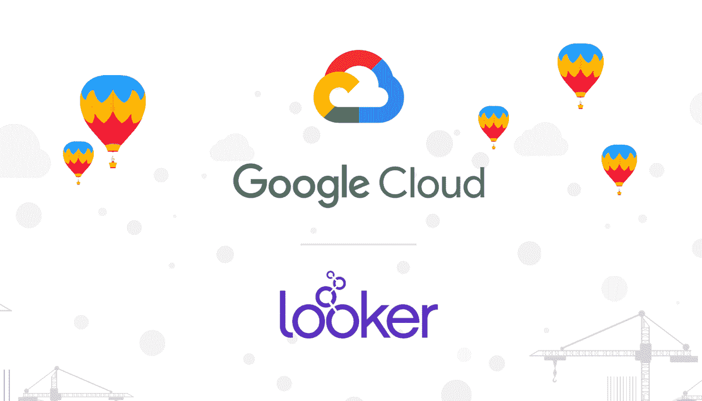

# TWiGCP —“旁观者、新定价选项、雪花和资产库存”

> 原文：<https://medium.com/google-cloud/twigcp178-9cb5f3f7ac3b?source=collection_archive---------2----------------------->

如果你是本周从 [**来到谷歌云的视频系列**](http://gtech.run/ju4em) 的，以下是本周所涉及主题的链接:

*   [“12 周认证挑战”](http://gtech.run/4mnqr)
*   [“与超级计算机竞争:云中的 HPC 成为现实”](http://gtech.run/rq3l2)
*   [“使用云扳手构建您自己的事件源系统”](http://gtech.run/tgnnl)
*   [“使用云 DLP 扫描 BigQuery 中的敏感数据”](http://gtech.run/wcwym)

过去一周 GCP 的其他头条新闻包括:

*   [谷歌收购 **Looker**](http://gtech.run/2qawy) (谷歌博客)
*   更多的选择，更少的复杂性:新的计算引擎**定价选项**随时可用(谷歌博客)#预订
*   [在谷歌云平台](http://gtech.run/7ccg2)上宣布**雪花**(谷歌博客)
*   [云**资产库存**:更简单的库存管理、安全分析和配置监控](http://gtech.run/ed968)(谷歌博客)#GA
*   [新的**翻译 API** 功能可以帮助本地化专家和全球企业](http://gtech.run/dtmpf)(谷歌博客)#TranslationAPIv3
*   [**百分之百可再生能源，连续第二年**](http://gtech.run/dukm4) **(blog.google)**
*   **周日服务中断的最新消息**

**来自“我们喜欢数据库，我们希望您也喜欢我们的数据库”部门:**

*   **[大胆思考:谷歌云数据库在 2019 年 Q2 会议上被评为 Forrester Wave 数据库即服务的领导者](http://gtech.run/v9hm5)(谷歌博客)**
*   **面向 SQL 从业者的谷歌云平台——迈克·卡恩(medium.com)**

**来自“如果你想读一篇好的研究论文”部门:**

*   **桑给巴尔岛:谷歌一致的全球授权系统**

**来自“云 AI 笔记本上每天都是海盗日”部门:**

*   **[R 朗+ GCP =💖—我眼中的深度学习](http://gtech.run/rvjau)(blog.kovalevskyi.com)**

**来自“96 个位置和 134 个网络边缘位置”部门:**

*   **[深度谷歌云联网:云 CDN](http://gtech.run/j78mu) (谷歌博客)**

**来自“简单而强大的云调度程序”部门:**

*   **通过按计划停止和启动计算引擎实例来节省资金**

**来自“超详细‘视情况而定’回答”部门:**

*   **[我应该直接查询我的 Firebase 数据库，还是使用云函数？](http://gtech.run/hmafd)(medium.com)**

**来自“强大而灵活的 GKE”部门:**

*   **[使用 Envoy 代理对 GKE 上的 gRPC 服务进行负载平衡](http://gtech.run/vs6wd)(cloud.google.com)**
*   **[对您的云提供商要求更多。使用 GKE 高级](http://gtech.run/c6657)(谷歌博客)**

**来自“云是一个具有灵活身份管理的好东西”部门:**

*   **[谷歌云运行——身份](http://gtech.run/tuj8z)(jhanley.com)**
*   **[在 Google Kubernetes 引擎上连续交付 HashiCorp Vault:备份&恢复](http://gtech.run/nfaeg)(medium.com)**

**来自我最喜欢的“客户和合作伙伴对 GCP 的最佳评价”部分:**

*   **[Tieto 的 API 如何给欧洲银行带来竞争优势](http://gtech.run/rd78a)(谷歌博客)**
*   **[IFG 和谷歌云人工智能如何给非结构化金融文档带来结构化](http://gtech.run/r6qmh)(谷歌博客)**

**来自“GCP 对微软技术的支持可能比你想象的要多得多”部门:**

*   **[在 cloud.google.com GCP 配置微软 Windows 分布式文件系统](http://gtech.run/jja4y)**
*   **[在 cloud.google.com GCP 部署具有高级网络配置的微软活动目录域控制器](http://gtech.run/dllwl)**

****Beta，GA，还是什么？**“部门:**

*   **[GA] [云 SDK 249.0.0](http://gtech.run/wfg8w)**
*   **【GA】[云资产盘点](http://gtech.run/k69wv)**
*   **【GA】[云资源仓库— SSH 认证](http://gtech.run/4tpn7)**
*   **[GA] [GKE —优化 IP 地址分配(CIDR 区块)](http://gtech.run/uu32a)**
*   **【Beta】[云 AI 平台笔记本— R 3.5.3 支持](http://gtech.run/7sguh)**
*   **【测试版】[谷歌应用引擎 Java 11 标准环境](http://gtech.run/dckds)**
*   **【测试版】 [GKE 工作量标识](http://gtech.run/uvxqn)**
*   **[1.1.8] [宣布 Istio 1.1.8](http://gtech.run/8dhwh)**
*   **[2 . 0 . 0-beta 0][tensor flow 2 . 0 . 0-beta 0](http://gtech.run/sr7vv)**

**来自“**万物多媒体**”部门:**

*   **Jupyter 和 T21 在网上**
*   **[播客] Kubernetes 播客[第 56 集——OpenEBS，Evan Powell](http://gtech.run/avq5e)(kubernetespodcast.com)**
*   **gcppodcast.com，GCP 播客第 179 集**

**

本周的图片是 Looker 的收购** 

**这就是本周的全部内容！亚历克西斯**