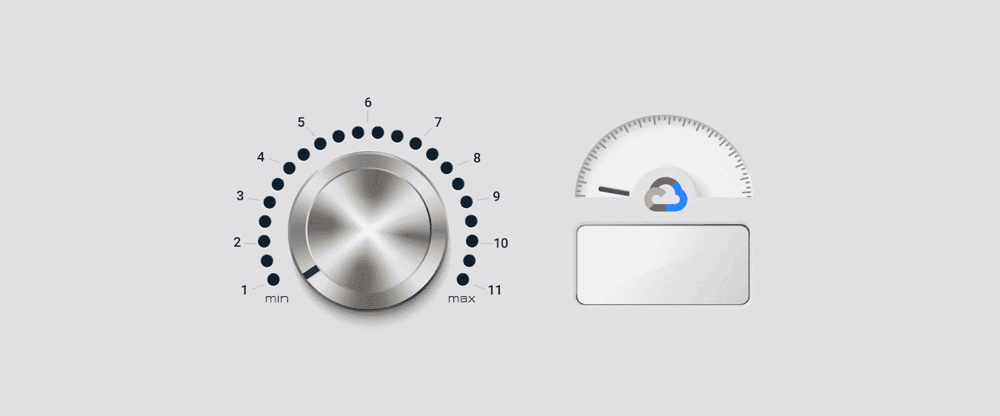

# TWiGCP —“第二代 AppEngine 运行时、Kubernetes 1.15、Istio 1.2 和 Anthos 常见问题”

> 原文：<https://medium.com/google-cloud/twigcp180-cad549be737b?source=collection_archive---------0----------------------->

如果你是本周从 [**来到谷歌云的视频系列**](http://gtech.run/ju4em) 的，以下是本周所涉及主题的链接:

*   [全球数字会议—云，您的方式](http://gtech.run/hfzz4)
*   [如何在 Google Kubernetes 引擎上运行进化策略](http://gtech.run/t9c8k)
*   [什么是微趋势？使用 GCP 开始时间序列趋势预测](http://gtech.run/erxyx)
*   [使用以太坊和谷歌云构建混合区块链/云应用](http://gtech.run/rn43v)

过去一周 GCP 的其他头条新闻包括:

*   [App Engine 第二代运行时现在获得了**两倍的内存**；加上 **Go 1.12** 和 **PHP 7.3** 现已全面上市](http://gtech.run/quwhf)(谷歌博客)
*   [转到十一: **Java 11** 运行时来到 App Engine](http://gtech.run/akqh8) (谷歌博客)
*   [宣布**Istio 1.2**](http://gtech.run/65xhp)**(Istio . io)**
*   **[**Kubernetes 1.15** :扩展性和持续改进](http://gtech.run/z5v5l) (kubernetes.io)**
*   **[承诺使用折扣一览:新报告显示您的计算引擎使用和承诺](http://gtech.run/pzgts)(谷歌博客)**
*   **[关于谷歌云 Anthos 的 5 个常见问题](http://gtech.run/xxu48)(谷歌博客)**

**来自“流程图，最佳”部门:**

*   **GCP 流程图**

**来自“您可能也会发现这很有用”部门:**

*   **[云构建依赖图](http://gtech.run/qx3tv)(thagomizer.com)**
*   **【medium.com】谷歌云平台上的[micro k8s](http://gtech.run/dd8y8)**
*   **前五名 GCP 大声喊出来**

**来自“保护所有层”部门:**

*   **[深度谷歌云网络:保护您环境的三个深度防御原则](http://gtech.run/qlyyr)(谷歌博客)**
*   **【cloud.google.com】帮助保护 GCP 的数据工作负载**
*   **【security.googleblog.com】谷歌在线安全博客:帮助组织在不收集更多数据的情况下做更多事情**

**来自“常见问题解决方案”部门:**

*   **[使用无服务器 VPC 访问将云功能与计算引擎连接起来](http://gtech.run/ubc25)(medium.com)**
*   **[利用特定领域词汇和主题分析文本情感](http://gtech.run/q9mxr)(medium.com)**
*   **[探索 Google Cloud Vision API 并使用 Python 进行功能演示](http://gtech.run/legay)(medium.com)**
*   **[使用 GCP 开始时间序列趋势预测](http://gtech.run/m5xr7)(谷歌博客)**
*   **[运行混合渲染场概念验证](http://gtech.run/mqufe)(cloud.google.com)**

**来自“BQML 示例”部门:**

*   **[使用 BigQuery ML 机器学习模板的预测营销分析](http://gtech.run/4usyg)(谷歌博客)**

**来自“本周云运行和无服务器”部门:**

*   **3 个开发者喜欢的酷酷的云运行特性，你也会喜欢的**
*   **[云运行和云功能:我用什么？为什么呢？【medium.com】(T21)](http://gtech.run/2dvjb)**
*   **[Google Cloud Run—Go 中的简单文件服务器](http://gtech.run/546qc)(jhanley.com)**

**来自我最喜欢的“客户和合作伙伴对 GCP 的最佳评价”部分:**

*   **[Leroy Merlin:用 API 改造俄罗斯家装市场](http://gtech.run/h9h9d)(谷歌博客)**
*   **[赛诺菲借助谷歌云推动数字化转型](http://gtech.run/pnjaa)(谷歌博客)**
*   **在合作伙伴的支持下，法国公司越来越多地采用谷歌云**
*   **[世界集团案例研究](http://gtech.run/mbjht)(cloud.google.com)**
*   **[我们的客户如何在谷歌云平台上使用 MongoDB Atlas](http://gtech.run/y6cda)(谷歌博客)**

**从“**贝塔，嘎，还是什么？**"部门:**

*   **[GA] [云 SDK 250.0.0](http://gtech.run/wfg8w)**
*   **[1.0] [Anthos 配置管理](http://gtech.run/wxztv)**
*   **[GA][Redis 4.0 云存储](http://gtech.run/pgt8f)**
*   **GKE 本地**
*   **【测试版】 [Java 11 AppEngine 第二代运行时](http://gtech.run/m9a8s)**
*   **[Beta] [开始迁移 Anthos](http://gtech.run/e8969)**
*   **[Beta] [BigQuery —从 Amazon Redshift 迁移数据](http://gtech.run/eyb9c)**
*   **【测试版】[云语音转文本 API MP3](http://gtech.run/bpf6k)**
*   **[Beta] [CUD 分析报告](http://gtech.run/xr2um)**

**来自“**万物多媒体**”部门:**

*   **[视频] [最佳实践:GCP 资源组织和访问管理](http://gtech.run/8yf9d)(youtube.com)**
*   **【视频】[高性能网络](http://gtech.run/u4ee2)(youtube.com)**
*   **[播客] Kubernetes 播客[第 58 集——Istio 1.2，路易·瑞安](http://gtech.run/cvh7d)(kubernetespodcast.com)**
*   **[播客]gcppodcast.com GCP 播客[第 181 集——戴文公司与帕克·内森](http://gtech.run/mq98j)**

**

本周图片摘自 Java 11 on App Engine 公告** 

**这就是本周的全部内容！**

**-亚历克西斯**