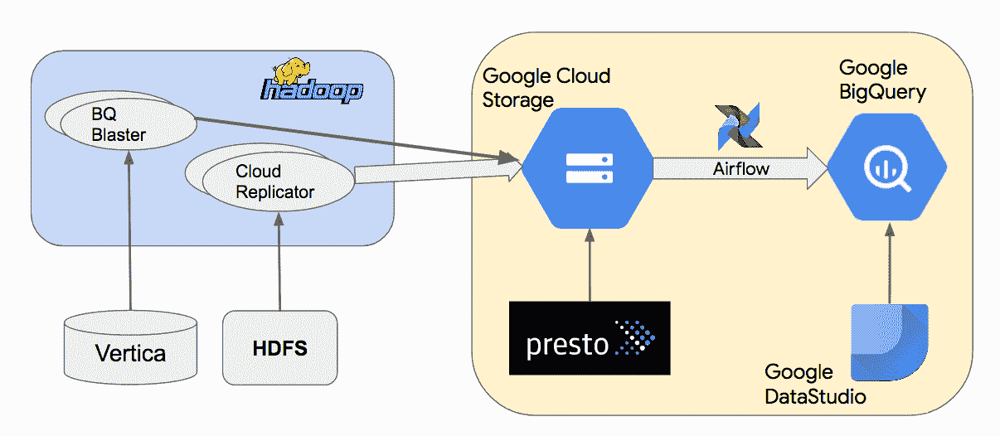

# TWiGCP —“欢迎弹性文件、TPU Pod 记录、云任务的 HTTP 目标和新 GKE 架构专业化”

> 原文：<https://medium.com/google-cloud/twigcp183-a464c1eb18e?source=collection_archive---------3----------------------->

首先，这里是谷歌云的视频系列 中本周最新 [**的链接:**](http://gtech.run/ju4em)

*   [谷歌云数据目录现已公开测试](http://gtech.run/gpnad)
*   [移民 GCP:入门](http://gtech.run/a978s)
*   [工作负载身份介绍:为您的 GKE 应用提供更好的身份验证](http://gtech.run/uurya)
*   [在 Kubernetes 上运行或不运行数据库:需要考虑什么](http://gtech.run/spzzl)

过去一周 GCP 的其他头条新闻包括:

*   [谷歌收购**elastic file**](http://gtech.run/5k8xb)**(谷歌博客)**
*   **[云 **TPU 豆荚**打破人工智能训练记录](http://gtech.run/amefe)(谷歌博客)**
*   **[宣布**云任务的 HTTP 目标**，OAuth/OpenID 连接认证](http://gtech.run/f5z3p)(谷歌博客)**
*   **[宣布新的 **GKE 建筑专业**——现在有一个月的免费使用权](http://gtech.run/f56y7)(谷歌博客)**
*   **[帮助 **OpenText** 客户将企业信息管理工作负载迁移到谷歌云](http://gtech.run/hff7l)(谷歌博客)**
*   **[谷歌人工智能博客:用无监督数据增强推进半监督学习](http://gtech.run/vc92p)(ai.googleblog.com)=>代码[此处](http://gtech.run/lxmw9)**
*   **[云源代码库开始生产调试](http://gtech.run/jq5dw)(谷歌博客)**

**来自“**云跑**，超越你好世界”部门:**

*   **Google Cloud Run Deep Dive——理解 API:【jhanley.com】第一部分 | [第二部分](http://gtech.run/w5f6k)**

**来自“有目的的无服务器应用”部门:**

*   **[创建一个时差提醒应用程序🤖与谷歌云功能⚡和谷歌云调度⏰](http://gtech.run/sfn8f)(medium.com)**

**来自“将 **BigQuery** 投入工作”部门:**

*   **[使用 BigQuery 进行地理定位:20 秒内识别出 7600 万个 IP 地址](http://gtech.run/ctfeu)(谷歌博客)**
*   **[将 Teradata 迁移到 BigQuery:模式和数据传输概述](http://gtech.run/2qlr3)(cloud.google.com)**
*   **【BigQuery 模糊匹配之旅—1/1，∞)—Soundex(medium.com)**
*   **[连接到数据库(可观察)](http://gtech.run/yduek)(observablehq.com)# big query**

**来自“GCP 技巧和最佳实践”部门:**

*   **[在没有 gcloud 的情况下向 GKE 认证](http://gtech.run/67x4w)(medium.com)**
*   **[用 Stackdriver 监控 MySQL 中的慢速查询](http://gtech.run/wpmam)(cloud.google.com)**
*   **[将云扳手用作游戏数据库的最佳实践](http://gtech.run/5hpzl)(cloud.google.com)**
*   **[Istio Canary 部署](http://gtech.run/4u8z7) (istiobyexample.dev)**

**来自仍然是我最喜欢的"**客户**和合作伙伴谈得最好的 GCP "部门:**

*   **[纽约时报**纽约时报**纽约时报](http://gtech.run/ba8bv)(blog.dominodatalab.com)**
*   **[ **Twitter** ] [用谷歌大查询](http://gtech.run/wpqmx)实现数据分析的民主化(blog.twitter.com)**
*   **[案例分析:**edu.google.com EHT**GCP](http://gtech.run/yf77q)**
*   **[Groupe **Le Monde** 案例研究](http://gtech.run/fkjes)(cloud.google.com)**
*   **[自动化重复任务:我们如何在**outfit 7**](http://gtech.run/4zhsb)**(outfit7.com)# big query 优化 AB 测试****
*   ****[**育碧**案例研究](http://gtech.run/apklf)(cloud.google.com)#象形文字#AutoML****
*   ****[ **量子位** ] [再见 Hadoop。在谷歌云上建立一个流数据处理管道](http://gtech.run/lt9x3)(谷歌博客)****

****从“**贝塔，嘎，还是什么？**"部门:****

*   ****[GA] [通过发票查看您的费用](http://gtech.run/7fj45)****
*   ****[GA] [通过 Kerberos 的 Hadoop 安全模式](http://gtech.run/2shv9)****
*   ****【测试版】[Google Cloud memory store for Redis Import and export](http://gtech.run/wp2ze)****
*   ****[Beta] [云任务的 HTTP 目标](http://gtech.run/pqqdt)****
*   ****【测试版】[导入 OVF 虚拟设备](http://gtech.run/vuk67)****
*   ****[Beta] [BigQuery ML —用张量流进行预测](http://gtech.run/wexeq)****
*   ****【Beta】[云 AutoML 视频智能物体跟踪](http://gtech.run/496zr)****
*   ****操作系统库存管理****

****来自“**万物多媒体**”部门:****

*   ****【短视频】[云下‘19 倒带播放列表](http://gtech.run/tllwy)(youtube.com)****
*   ****[播客] Kubernetes 播客[第 61 集——云原生应用捆绑包，Jeremy Rickard 和 Ralph Squillace](http://gtech.run/fp2nb)(kubernetespodcast.com)****
*   ****[播客]gcppodcast.com GCP 播客[第 185 集——加拿大丰业银行](http://gtech.run/6hvre)****

****

本周的图片是 Twitter 基于 BigQuery 的数据仓库的代表**** 

****这就是本周的全部内容！亚历克西斯****