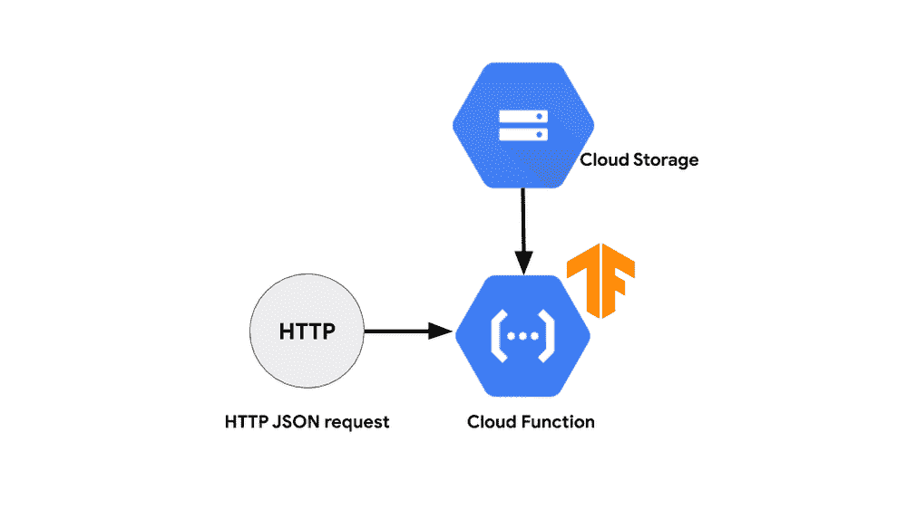

# TWiGCP—“GCP 的另一个魔力象限，云人工智能的假设工具和 DevOps 工具”

> 原文：<https://medium.com/google-cloud/twigcp184-777ae2ebc62c?source=collection_archive---------2----------------------->

首先，这里是谷歌云的视频系列 中本周最新 [**的链接:**](http://gtech.run/ju4em)

*   [谷歌收购 elastic file](http://gtech.run/aytch)
*   [宣布新的 GKE 建筑专业化认证——现在有一个月的免费使用权](http://gtech.run/f56y7)
*   [将 Teradata 迁移到 BigQuery:简介和概述](http://gtech.run/yltq7)
*   [使用 BigQuery 进行地理定位:在 20 秒内识别 7600 万个 IP 地址](http://gtech.run/gdtl9)

过去一周 GCP 的其他头条新闻包括:

*   [Gartner 称谷歌云是其 IaaS 魔力象限的领导者](http://gtech.run/gyqby)(谷歌博客)
*   [介绍云人工智能平台模型的假设工具](http://gtech.run/x4jm8)(谷歌博客)。
    现在针对基于 AI 平台的 XGBoost 和 Scikit 学习模型。
*   [为计算引擎虚拟机配置安全远程访问](http://gtech.run/5pnjy)(谷歌博客)。
    使用 IAM 策略、云 IAP 和 VPC 服务控制来降低风险。

来自“强化您的 DevOps 工具”部门:

*   GCP·德沃普斯的技巧:创建一个自定义的云壳图像，包括地形和头盔(谷歌博客)
*   [牛逼云造🕶️🌩️ 🔧](http://gtech.run/etjht)(medium.com)
*   [放心操作:通过监控、记录和错误报告保持您的功能正常运转](http://gtech.run/j29mz)(谷歌博客)
*   伊斯蒂奥和斯塔克德瑞(medium.com)

来自“GCP 数据库，你的方式”部门:

*   保持冷静，询问:在 GCP 运行你的数据库
*   [微软 SQL Server 灾难恢复](http://gtech.run/9dgw4)(cloud.google.com)

来自仍然是我最喜欢的"**客户**和合作伙伴最佳谈论 GCP "部门:

*   [如何使用具有云功能的 TensorFlow 2.0 服务深度学习模型](http://gtech.run/7lk6s)(谷歌博客)
*   【dankeeley.wordpress.com】dunhumby 和他们对 GCP 的使用
*   【Blockchain.com 用云扳手扩展和保存(谷歌博客)

**从 Beta，GA，还是什么？**“部门:

*   【GA】[云 SDK 254.0.0](http://gtech.run/wfg8w)
*   [GA] [发布/订阅认证推送](http://gtech.run/4b83k)
*   【Beta】[发布/订阅资源位置限制](http://gtech.run/zftey)

来自“**万物多媒体**”部门:

*   【短视频】[用 BigQuery GIS 查询并可视化雷击](http://gtech.run/ewgdb)(youtube.com)
*   【短视频】 [AI Hub:一切 AI 的一个地方](http://gtech.run/gwyyl)(youtube.com)
*   [视频] [Anthos 迁移:从本地迁移到 GKE 的云本地(Cloud Next’19)【youtube.com ](http://gtech.run/esbmr)
*   [播客] Kubernetes 播客[第 62 集——欧洲粒子物理研究所的大型强子 Kubernetes，由 Ricardo Rocha、Lukas Heinrich 和 Clemens Lange](http://gtech.run/syyx3)(kubernetespodcast.com)主持
*   [播客]gcppodcast.com GCP 播客[第 186 集——艾伦·戴的区块链](http://gtech.run/kkes8)

本周图片来自《带云功能的 TensorFlow 2.0》帖子

这就是本周的全部内容！亚历克西斯