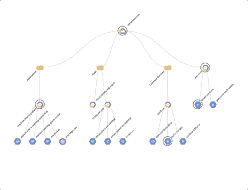

# TWiGCP—“GCP 上的 VMWare、L7 内部 LB 以及更多数据库选项”

> 原文：<https://medium.com/google-cloud/twigcp186-e24ccafd458f?source=collection_archive---------1----------------------->

以下是谷歌云视频系列 本周最新 [**的链接:**](http://gtech.run/ju4em)

*   [big query 中发生了什么:新的持久化用户定义函数、增加的并发限制、GIS 和加密功能，等等](http://gtech.run/g5dv2)
*   [如何使用 BigQuery ML 进行异常检测](http://gtech.run/jwjr5)
*   [教程:使用自动化工作流从 MySQL 迁移到云 SQL](http://gtech.run/vhxwm)
*   [谷歌云认证——专业数据工程师](http://gtech.run/amdly)

过去一周的 GCP 要闻包括:

*   [VMware Cloud Foundation 来到谷歌云](http://gtech.run/y7se5)(谷歌博客)
*   [利用谷歌云基础设施推动企业现代化](http://gtech.run/xjf46)(谷歌博客)#TrafficDirector #L7InternalLB
*   [支持企业工作负载的新 GCP 数据库选项](http://gtech.run/pwvcx)(谷歌博客)# SQL server # federated queries # elastic cloud
*   [使用云 IAM 的云功能的最低权限](http://gtech.run/gk5kd)(谷歌博客)
*   利用人工智能让医生在 48 小时内提前应对威胁生命的疾病【deepmind.com 

来自“使用云功能和云运行的人们”部门:

*   [带 Redis 和 VPC 连接器的限速无服务器功能](http://gtech.run/d5u7c)(cloud.google.com)
*   [云运行 VS 云功能:成本最低？](http://gtech.run/ku99c)(medium.com)
*   [如何使用无服务器产品获得内部资源？](http://gtech.run/swbjs)(medium.com)
*   [持续部署到基于新容器映像的云运行服务](http://gtech.run/xfp4m)(fullstackgcp.com)
*   运行在 Kubernetes 上的谷歌云(ramblings.mcpher.com)

来自不断发展的“如何”部门:

*   [使用 ngrok 在本地开发您的云任务管道！](http://gtech.run/ncudd)(medium.com)
*   【jhanley.com Google Cloud SQL 代理——作为服务安装在 GCE 上
*   [如何使用 BigQuery ML 进行异常检测](http://gtech.run/ukcrr)(谷歌博客)
*   [教程:使用 Redis 的云存储作为游戏排行榜](http://gtech.run/9k6kz)(cloud.google.com)
*   [从 Kubernetes 部署迁移到 Knative 服务](http://gtech.run/apfjl)(medium.com)
*   [如何将 Dialogflow 与 Genesys PureEngage 整合](http://gtech.run/jrdx9)(谷歌博客)

来自“可爱社区贡献”部门:

*   [云构建:开源取消](http://gtech.run/q2n5b)(medium.com)

来自“严重违规的可爱图表”部门:

*   [使用凡赛堤可视化工具了解 GCP 组织的资源层次](http://gtech.run/n46qz)(谷歌博客)

来自仍然是我最喜欢的"**客户**和合作伙伴最佳谈论 GCP "部门:

*   [触及天空:日本企业采用谷歌云进行数字化转型](http://gtech.run/g5l2d)(谷歌博客)
*   [通过 Anthos](http://gtech.run/4p6q5) (谷歌博客)为我们的 APAC 客户带来混合云和多云
*   明智的投资:Monex 如何用 API 构建金融科技生态系统(谷歌博客)

**Beta，GA，还是什么？**“部门:

*   [GA] [云 SDK 256.0.0](http://gtech.run/wfg8w)
*   [交通总监](http://gtech.run/tgehy)
*   [GA] [计算引擎 C2 机器类型](http://gtech.run/julcg)
*   Anthos 1.0.1
*   【GA】[调度 BigQuery 查询](http://gtech.run/t737k)
*   【测试版】[第 7 层内部负载平衡器测试版](http://gtech.run/besse)
*   Kubeflow:工件跟踪、数据版本控制的坚实基础&多用户支持(medium.com)
*   【阿尔法】[微软 SQL Server 云 SQL](http://gtech.run/b7b8s)
*   【阿尔法】[谷歌云游戏服务器](http://gtech.run/dnnff)

来自“**多媒体**”部门:

*   [视频] [GKE 本地起源，采访威斯顿(2019 年，巴塞罗纳库比康)](http://gtech.run/vt5zh)(youtube.com)
*   【视频】[本月 GCP:观看最新视频](http://gtech.run/hp7rf) (acloud.guru)
*   [播客] Kubernetes 播客[第 64 集——云代码，莎拉·安吉洛和帕特里克·弗林](http://gtech.run/pdfng)(kubernetespodcast.com)
*   (gcppodcast.com)GCP 播客[第 188 集——AI 与普里扬卡·维尔加迪亚的对话](http://gtech.run/afnms)

本周的图片摘自《凡赛堤观察报》

这就是本周的全部内容，下一次回顾将在八月下旬进行！亚历克西斯