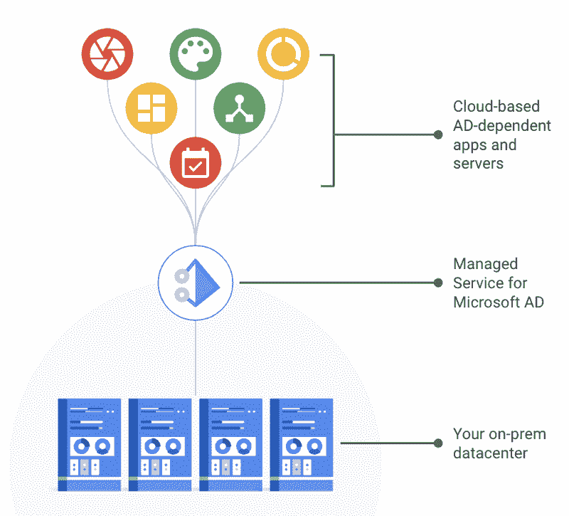

# TWiGCP—“Managed AD、Ruby in Standard 以及 healthy serverless 和 BigQuery 部分”

> 原文：<https://medium.com/google-cloud/twigcp190-f0e19c74472e?source=collection_archive---------2----------------------->

以下是本周 Cloud 的视频系列 中最新 [**的链接:**](http://gtech.run/ju4em)

*   [打了一个本垒打:准备专业云网络工程师认证](http://gtech.run/fzfec)
*   [引入云运行按钮:点击即可将您的 git repos 部署到 Google Cloud](http://gtech.run/g4m8l)
*   [跳过维护，使用 BigQuery 集群加速查询](http://gtech.run/b47td)
*   [介绍 BigQuery Terraform 模块](http://gtech.run/mqw3q)

过去一周 GCP 的其他头条新闻包括:

*   [现在处于测试阶段:微软的托管服务**活动目录**(广告)](http://gtech.run/grycq)(谷歌博客)
*   [**Ruby** 支持来到 **App 引擎标准**环境](/google-cloud/gtech.run/ak34q)(谷歌博客)
*   [云**文本转语音**将其语音数量扩大了近 70%，现在覆盖了 33 种语言和变体](http://gtech.run/nbdhj)(谷歌博客)
*   [Hadoop 的**云存储连接器**新版本:提高性能、吞吐量等](http://gtech.run/qyzms)(谷歌博客)
*   [谷歌云和 **Pluralsight** :大规模提升云技能](http://gtech.run/re2s3)(谷歌博客)
*   [**Kubernetes 安全审计**:GKE 和 Anthos 用户需要知道的事情](http://gtech.run/dma8r)(谷歌博客)

来自“全方位扩展 BigQuery 功能”部门:

*   [big query 中发生了什么:通过 10 倍的流配额、云 SQL 联盟等增加速度和灵活性](http://gtech.run/2yk58)(谷歌博客)
*   [用 ML 和 BigQuery 扩展你的专利集](http://gtech.run/ww4gz) (Google 博客)。使用公共数据集和 python 实现更快的专利美化。
*   [如何使用熊猫和 BigQuery 快速解决机器学习预测问题](http://gtech.run/d56bg)(谷歌博客)

来自不断增长的无服务器部门:

*   [使用 Pubsub 触发器的云运行](http://gtech.run/ygdp5)(medium.com)
*   【medium.com】使用谷歌云功能的快递路线
*   【medium.com】用云 Firestore(Firebase)构建 Flask(Python) CRUD API 并部署在云上运行
*   [使用 ngrok 在本地开发您的云任务管道！](http://gtech.run/3pnh5)(medium.com)
*   [在 Firebase 云存储中使用新的 list API](http://gtech.run/v4gyu)(medium.com)
*   [Knative 无服务器 Kubernetes 绕过 FaaS 重振 PaaS](http://gtech.run/jk5u9)(techtarget.com)

来自“Kubernetes 作为通用资源管理控制平面”部门:

*   [教程:使用 Google Config Connector 管理 GCP 云 SQL 数据库](http://gtech.run/bq8x2) (thenewstack.io)

从“有强化学习不适用于的东西吗？”部门:

*   [DeepMind 发布 OpenSpiel，一个在游戏中强化学习的框架](http://gtech.run/ewwrv)(github.com)

来自“如果你在这个领域，这个指南是金”部门:

*   [cloud.google.com GKE 的 PCI DSS 合规性](http://gtech.run/e5b77)

来自“谷歌工程师已经在那里，做了，并正在报告回来”部门:

*   用 Stackdriver 监控 MySQL 中的慢速查询—[gtech.run/nr53h](https://gtech.run/nr53h)(cloud.google.com)
*   big query-utils GitHub repo—[gtech.run/b76b9【github.com ](https://gtech.run/b76b9)
*   来自 Google AdSense 的数据工程经验:在推荐系统中使用流连接—[gtech.run/eltn6](https://gtech.run/eltn6)(Google 博客)

来自我最喜欢的“客户和合作伙伴对 GCP 的最佳评价”部分:

*   [音乐传到他们耳朵里:GKE 上的微服务，可抢占的 VMs 将 Musiio 的效率提高了 7000%](http://gtech.run/3x9qz) (谷歌博客)
*   [使用谷歌云语音转文本实时转录你的 Twilio 通话](http://gtech.run/cfyur)(谷歌博客)
*   凭借强大的计算能力:在谷歌云上渲染《蜘蛛侠:远离家园》

从“**贝塔，嘎，还是什么？**“部门:

*   【GA】[云 SDK 260.0.0](http://gtech.run/wfg8w)
*   [2.0] [适用于 Hadoop 的云存储连接器](http://gtech.run/8vpkl)
*   [2 . 0 . 0-rc0][tensor flow 2 . 0 . 0-rc0](http://gtech.run/aaxpb)
*   [Beta][Microsoft Active Directory 托管服务](http://gtech.run/yuu68)
*   [Beta] [Ruby on App 引擎标准](http://gtech.run/ak34q)
*   [Beta] [云视频智能 API —识别徽标](http://gtech.run/66zg5)
*   [Beta] [复制 BigQuery 数据集](http://gtech.run/9dyaq)
*   [Beta] [内部 TCP/UDP 负载平衡的下一跳概念](http://gtech.run/2l3hq)

来自“**万物多媒体**部门:

*   [视频] [组织你的 GCP 资源——超出你的账单](http://gtech.run/urmkq)(youtube.com)
*   [视频] [五步概述—云安全指挥中心入门](http://gtech.run/rv9x6)(youtube.com)
*   [播客] Kubernetes 播客[第 68 集——集装箱营地，安吉·马奎尔](http://gtech.run/tktwq)(kubernetespodcast.com)
*   [播客] GCP 播客[第 192 集——比利·雅各布森的云大桌](http://gtech.run/vsgn6)(gcppodcast.com)
*   [播客] DeepMind 播客— [第五集:走出实验室](http://gtech.run/a755t)(deepmind.com)

本周的图片来自微软活动目录(AD)的托管服务帖子

这就是本周的全部内容！亚历克西斯