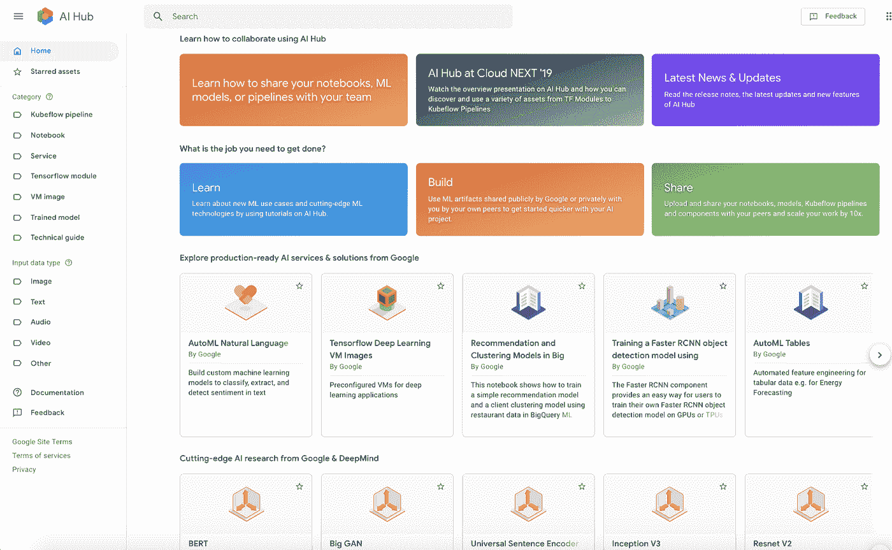

# TWiGCP —“更智能的人工智能中心，面向开发者的 Pixelbook，以及最新分享的谷歌最佳实践”

> 原文：<https://medium.com/google-cloud/twigcp191-f6ff30663fb7?source=collection_archive---------1----------------------->

以下是谷歌云视频系列 本周最新 [**的链接:**](http://gtech.run/ju4em)

*   [big query 中发生了什么:通过 10 倍的流配额、云 SQL 联盟等增加速度和灵活性](http://gtech.run/f7u93)
*   [如何使用 Pandas 和 BigQuery 快速解决机器学习预测问题](http://gtech.run/hv9fx)
*   [使用 ML 和 BigQuery 扩展您的专利集](http://gtech.run/lck5z)
*   昆汀·哈代的速读:保持简单

过去一周 GCP 的其他头条新闻包括:

*   [人工智能中心的新主页和改进的协作功能](http://gtech.run/bn57t)(谷歌博客)
*   [Go 1.13 发行说明](http://gtech.run/psmcn)(golang.org)
*   [用 Pixelbook 上的云代码构建开发工作流](http://gtech.run/bfvau)(谷歌博客)
*   [人数不足的奖学金因谷歌云而成为可能](http://gtech.run/rzskl)(allthingsopen.org)

来自“无服务器是新平台”部门:

*   [带 Tensorflow 和云运行的便携预测【medium.com ](http://gtech.run/ce5n8)
*   [云运行的无服务器 R 功能](http://gtech.run/pxldx)(ericjinks.com)

来自“考虑应用这些谷歌最佳实践”部门:

*   [谷歌工程实践文档](http://gtech.run/jfyvn) (google.github.io)
*   [创建可扩展 GKE 集群的指导方针](http://gtech.run/2hg4q)(cloud.google.com)
*   [云存储成本优化的最佳实践](http://gtech.run/9xz92)(谷歌博客)

来自“如果您喜欢数据，但还没有关注 Kalev，那么您应该关注”部分:

*   [用云探索新闻网页超链接的万亿字语言模式](http://gtech.run/3axyl)(forbes.com)
*   回顾谷歌的人工智能如何看待一周的电视新闻和人工智能视频理解的世界(forbes.com)

来自“代表关系和相似性”部门:

*   【tensorflow.org】神经结构化学习:用结构化信号训练

来自我最喜欢的“客户和合作伙伴对 GCP 的最佳评价”部分:

*   【medium.com Mercari——GCP 微服务网络架构设计
*   UPS 在谷歌云上为 2100 万包裹规划递送路线(ciodive.com)
*   [谷歌云的人工智能如何促进 Netmarble 的团队协作、游戏开发和消费者接触](http://gtech.run/wkp7d)(谷歌博客)
*   [Moorfields 如何使用 AutoML 帮助临床医生开发机器学习解决方案](http://gtech.run/48n4l)(谷歌博客)
*   [易捷航空:借助谷歌云改变客户搜索航班的方式](http://gtech.run/63ak2)(谷歌博客)

**从 Beta，GA，还是什么？**“部门:

*   [GA] [云 SDK 261.0.0](http://gtech.run/wfg8w)
*   [GA] [云发布/订阅—客户管理的加密密钥](http://gtech.run/yn6ab)
*   谷歌 Kubernetes 引擎 1.14
*   GCP 控制台中的云 DLP
*   [GA] [GKE 集群资源使用情况](http://gtech.run/s9czu)
*   [Beta] [GKE 客户管理的加密密钥](http://gtech.run/gb66m)
*   [Beta] [内部 TCP/UDP 负载平衡的下一跳概念](http://gtech.run/6l2dn)
*   【测试版】[使用屏蔽 GKE 节点](http://gtech.run/wrdkp)

来自“**万物多媒体**”部门:

*   [播客] CloudSkills.fm [第 037 集:谷歌云平台(GCP)](http://gtech.run/g5sbp) (cloudskills.fm)
*   [播客] Kubernetes 播客[第 69 集——善良，与本·艾尔德](http://gtech.run/jtm89)(kubernetespodcast.com)
*   [播客] GCP 播客[第 193 集——克里斯·阿尔邦的健康和数据科学](http://gtech.run/b4kk7)(gcppodcast.com)
*   [播客] DeepMind 播客—【deepmind.com】第六集:人工智能为所有人

本周的图片是新的 AI Hub 主页

这就是本周的全部内容！亚历克西斯