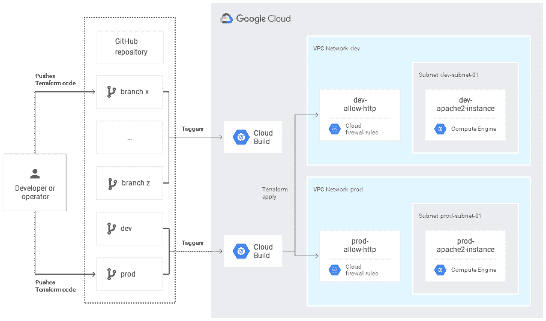

# TWiGCP—“data proc 采用 Kubernetes，MLIR 采用 LLVM，Istio 1.3 lands 和屏蔽 GKE 节点”

> 原文：<https://medium.com/google-cloud/twigcp192-bc2298874657?source=collection_archive---------1----------------------->

以下是谷歌云视频系列 本周最新 [**的链接:**](http://gtech.run/ju4em)

*   [人工智能中心的新主页和改进的协作功能](http://gtech.run/fynvp)
*   [AI 平台—持续评估概述](http://gtech.run/ptadn)
*   [解构聊天机器人:如何将 Dialogflow 与 BigQuery 集成](http://gtech.run/7zfzg)
*   [云存储成本优化的最佳实践](http://gtech.run/8trhc)

过去一周 GCP 的其他头条新闻包括:

*   [用 Kubernetes 上的云数据处理器实现 Apache Spark 的现代化](http://gtech.run/j47ff)(谷歌博客)
*   [宣布面向谷歌云平台上 SAP HANA 实例的 6 TB 和 12 TB 虚拟机正式上市](http://gtech.run/5vz78)(谷歌博客)
*   [探索容器安全:用屏蔽的 GKE 节点将屏蔽的虚拟机带到 GKE](http://gtech.run/vbdmu)(谷歌博客)
*   [谷歌和梅奥诊所将如何改变医疗保健的未来](http://gtech.run/fzllf)(谷歌博客)
*   宣布 Istio 1.3 (istio.io)
*   [开发公共云的可支持性](http://gtech.run/qdyek)(谷歌博客)
*   MLIR:用开源基础设施加速人工智能
*   [开源和开放数据](http://gtech.run/a9bs7) (blog.google)

来自“GKE 的 Dataproc 听起来很棒，我想踢它的轮胎”部门:

*   GKE 的云数据平台 Spark Jobs:如何开始

来自“SRE，就像 DevOps 一样，不仅仅是关于工具”部门:

*   [利用 SRE 原则缩小生产事故的影响](http://gtech.run/2524h)(谷歌博客)
*   [使用云功能和 Stackdriver 监控您的计算引擎足迹](http://gtech.run/uy5bf)(谷歌博客)
*   [使用 Terraform、云构建和 GitOps 将基础设施作为代码进行管理](http://gtech.run/cy6pn)(cloud.google.com)

来自“没有太多入门内容”部分:

*   【jhanley.com】谷歌云平台——入门
*   【jhanley.com Google Cloud—SSL 认证简易方式

来自“云计算让 ML 变得更简单”部门:

*   [在大图像和 3D 体积上训练 ML 模型，在云 TPUs 上进行空间分区](http://gtech.run/f6ktw)(谷歌博客)
*   [大肆宣传自动化超参数调优](http://gtech.run/xqjd3) (sararobinson.dev)

来自“网络安全扫描器 FTW”部门:

*   [使用云网络安全扫描器在 web 应用程序漏洞投入生产之前将其捕获](http://gtech.run/pk6ga)(谷歌博客)
*   [对上传到云存储的文档自动进行恶意软件扫描](http://gtech.run/zy2ee)(cloud.google.com)

来自“是时候认真考虑您的 GKE 安全选项”部门:

*   [GKE 政策审计&实施选项的简要介绍](http://gtech.run/jll4k) (grumpygrace.dev)

来自“安全地将数据输入和输出您的数据库”部门:

*   [如何在 Microsoft SQL Server 中使用 R 从 Google Analytics 接收数据](http://gtech.run/hfu5a)(habr.com)
*   [将 MySQL 备份文件加载到 BigQuery —直接从云 SQL 中加载](http://gtech.run/j4d3e)(medium.com)

来自我最喜欢的“客户和合作伙伴对 GCP 的最佳评价”部分:

*   谷歌和梅奥诊所将如何改变医疗保健的未来(谷歌博客)
*   [API 如何帮助巴基斯坦国家银行实现银行业务现代化](http://gtech.run/j4nve)(谷歌博客)
*   Sara Assicurazioni 案例研究(cloud.google.com)
*   [Quantum Metric 以光速从客户数据中得到答案](http://gtech.run/h2j52)(谷歌博客)
*   在 Universe.com 设计数据管道将客户体验放在了中心位置(谷歌博客)

从“**贝塔，嘎，还是什么？**“部门:

*   【GA】[云 SDK 262.0.0](http://gtech.run/wfg8w)
*   泰坦安全运送到加拿大、法国、日本、英国和美国的地址
*   [GA] [云人工智能平台—使用定制容器进行培训](http://gtech.run/q528k)
*   【GA】[对话流模糊实体匹配](http://gtech.run/v3nyc)
*   [GA] [对话框流正则表达式实体](http://gtech.run/dmarg)
*   [GA] [GKE 使用计量](http://gtech.run/m8v5q)
*   [GA] [AI 平台笔记本符合 HIPAA 标准](http://gtech.run/zhutr)
*   【测试版】[云日志保存搜索](http://gtech.run/ewa7e)
*   GKE v1.14.6.gke.1 通过快速发布渠道
*   [Alpha][Kubernetes 的云数据图表](http://gtech.run/y7fh9)

来自“**万物多媒体**”部门:

*   【视频系列】[超越你的账单](http://gtech.run/wubyk)(youtube.com)
*   [播客] Kubernetes 播客[第 70 集——Windows 服务器容器，Patrick Lang](http://gtech.run/z87xv)(kubernetespodcast.com)
*   gcppodcast.com 的 GCP 播客第 194 集
*   [播客] DeepMind 播客— [第七集:走向未来](http://gtech.run/z495l)(deepmind.com)

本周的图片摘自 GitOps 的云构建和地形教程

这就是本周的全部内容！亚历克西斯