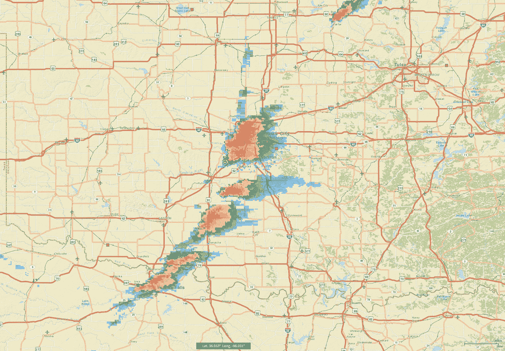

# TWiGCP—“Anthos 服务网格、针对 Anthos 的云运行以及一批 GA 版本”

> 原文：<https://medium.com/google-cloud/twigcp193-f2f71087c458?source=collection_archive---------0----------------------->

以下是谷歌云视频系列 本周最新 [**的链接:**](http://gtech.run/ju4em)

*   [了解你的 GCP 成本](http://gtech.run/bcskc)
*   [谷歌地图平台最佳实践:优化和性能提示](http://gtech.run/pr8sh)
*   [利用 SRE 原则缩小生产事故的影响](http://gtech.run/9g57q)
*   [宣布面向 Google 云平台上 SAP HANA 实例的 6 TB 和 12 TB 虚拟机正式上市](http://gtech.run/kukdy)

过去一周 GCP 的其他头条新闻包括:

*   [Anthos 通过托管服务网格和面向混合云的无服务器简化应用现代化](http://gtech.run/zjgw9) (Google 博客)# cloud run 4 Anthos # AnthosServiceMesh # BinaryAuth # AnthosConfigMgt
*   [GKE 上的容器原生负载平衡现已全面推出](http://gtech.run/5wwf3)(谷歌博客)
*   [云构建被评为 Forrester Wave 中持续集成的领导者](http://gtech.run/wxrr8)(谷歌博客)

来自“服务网络”部门:

*   [白皮书] [服务网格时代:用 Istio 设计、保护和管理微服务](http://gtech.run/3xgjc)(cloud.google.com)
*   使用(cloud.google.com)Istio 授权访问在 GKE 服务上运行的云

来自“你可能不知道 GCE 真正擅长的事情”部门:

*   [面向计算引擎的虚拟显示设备现已上市](http://gtech.run/jnt57)(谷歌博客)
*   如何在谷歌计算引擎上部署 Windows 容器

来自“控制局面”部门:

*   [谷歌云防火墙规则记录:你应该如何以及为什么使用它](http://gtech.run/8pewp)(谷歌博客)
*   [使用云异常检测来检测和补救安全异常的 3 个步骤](http://gtech.run/u3c4m)(谷歌博客)
*   [使用凡赛堤配置验证器保护您的 GCP 基础设施](http://gtech.run/bwzlg)(谷歌博客)

来自“数据管道”部门:

*   【cloud.google.com 使用 Fivetran 和云功能构建定制数据集成
*   [用谷歌云建立文档理解管道](http://gtech.run/9egmh)(谷歌博客)

来自“数据到洞察”部门:

*   [将发布工作流程转移到 BigQuery 以获得新的数据洞察力](http://gtech.run/p58dt)(谷歌博客)
*   [实时开放整个 NOAA 级 NEXRAD 天气雷达数据档案！](http://gtech.run/lmz3y)(linkedin.com)

来自“迁移路径”部门:

*   [将推送队列迁移到云任务](http://gtech.run/2ubwn)(cloud.google.com)
*   [Python 3 版本的 ndb (Google Cloud Datastore)客户端库](http://gtech.run/klwl5)(github.com)

来自我最喜欢的“客户和合作伙伴对 GCP 的最佳评价”部分:

*   [德意志交易所集团选择谷歌云实现未来增长](http://gtech.run/rkhe3)(谷歌博客)
*   [DACH 企业采用谷歌云进行数字化转型](http://gtech.run/xq529)(谷歌博客)
*   [WPP 使用谷歌云释放数据和创造力的力量](http://gtech.run/s65nz)(谷歌博客)

从 **Beta，GA，还是什么？**“部:

*   [GA] [云 SDK 263.0.0](http://gtech.run/wfg8w)
*   一个巨大的里程碑！Agones
*   [GA] [用于计算引擎的虚拟显示设备](http://gtech.run/jnt57)
*   [GA] [GKE —使用带有容器的节点图像](http://gtech.run/nqslw)
*   GKE 节点内能见度
*   [GA] [二进制授权](http://gtech.run/zf7ac)
*   使用 VPC 流量测井
*   [GA] [BigQuery ML k-means 聚类](http://gtech.run/jz6ml)
*   [GA] [谷歌容器注册表——漏洞扫描](http://gtech.run/sqyvx)
*   【0 . 9 . 0】[致命发球](http://gtech.run/srf5f)
*   [Beta] [云 IAM —访问故障排除](http://gtech.run/nbgat)

来自“**多媒体**”部门:

*   [视频] [Istio 1.3:一次巡演](http://gtech.run/wnm3a)(youtube.com)
*   [视频] [加快 2019 年 DevOps 报告结果状态](http://gtech.run/qd5rr)(youtube.com)
*   [播客] Kubernetes 播客[第 71 集——集装箱，德里克·麦高恩](http://gtech.run/ws4mh)(kubernetespodcast.com)
*   [播客] GCP 播客[第 195 集——凯茜·珀尔和杰西卡·德内·厄尔利·查的对话式人工智能最佳实践](http://gtech.run/qptdx)(gcppodcast.com)
*   [播客] DeepMind 播客— [第八集:戴密斯·哈萨比斯—采访](http://gtech.run/ealsd)(deepmind.com)

本周的图片是 NOAA 的 3 级 NEXRAD 实时天气雷达数据档案

这就是本周的全部内容！亚历克西斯