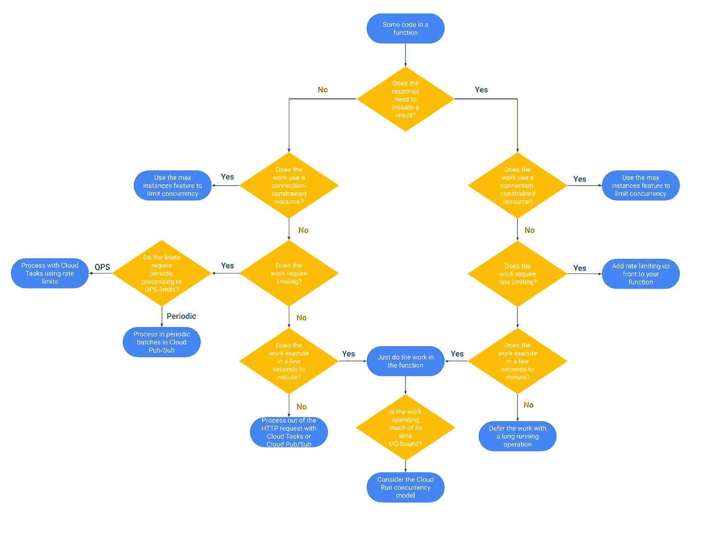

# TWiGCP —“面向所有人的云扳手、面向 GitHub 的云构建、面向 GCP 的 Apache Kafka 和快乐汇丰”

> 原文：<https://medium.com/google-cloud/twigcp194-f8cbc887ad42?source=collection_archive---------2----------------------->

以下是谷歌云视频系列 本周最新 [**的链接:**](http://gtech.run/ju4em)

*   [首席信息官的云成功指南:解耦让你的业务高速运转](http://gtech.run/kyfyh)
*   [面向计算引擎的虚拟显示设备现已正式上市](http://gtech.run/3chtr)
*   [使用凡赛堤配置验证器保护您的 GCP 基础设施](http://gtech.run/yvcv3)
*   [谷歌云开发者的备忘单](http://gtech.run/zjfn3)

过去一周 GCP 的其他头条新闻包括:

*   [**云扳手**增强 SLA，增加 CSV 支持，并增强监控细节](http://gtech.run/33xld)(谷歌博客)
*   [加速云在**波兰**的采用，与 key partnership 和一个新的**云地区**](http://gtech.run/paejy) (谷歌博客)
*   [谷歌云平台与合流的合作伙伴交付了一个**托管的 Apache Kafka 服务**](http://gtech.run/ay4xg) (谷歌博客)
*   [**云构建**为 GitHub](http://gtech.run/4n5fl) (谷歌博客)带来先进的 CI/CD 功能
*   [2019](http://gtech.run/f7cbv)**Firebase 峰会**有何新内容【firebase.googleblog.com】
*   [谷歌云任命了弗雷斯特浪潮的领导者:**流媒体分析**](http://gtech.run/sy3ef) (谷歌博客)
*   [为大家构建 ML 模型:理解**机器学习中的公平性**](http://gtech.run/xbpld) (谷歌博客)

来自“整个 GCP 色域的最佳实践”部门:

*   [如何在 Google Kubernetes 引擎上部署 Windows 容器](http://gtech.run/u6ry6) (Google 博客)
*   [big query 的成本优化最佳实践](http://gtech.run/k629r)(谷歌博客)
*   [6 种无服务器应用扩展策略](http://gtech.run/u5h3n)(谷歌博客)
*   [数据仓库迁移挑战以及如何应对这些挑战](http://gtech.run/gy4fj)(谷歌博客)
*   ML 设计模式#2:检查点(towardsdatascience.com)

来自“其他人是如何做到的”部分:

*   [在谷歌云上运行一个抓取平台，每月仅需 0.05 美元](http://gtech.run/blh5y)(medium.com)
*   [使用 GitHub Actions 发布您的云跑步应用](http://gtech.run/jc36m)(medium.com)

来自“本地谷歌云无服务器是真实的”部门:

*   [快速入门:为部署在 VMware 上的 Anthos 部署到云运行](http://gtech.run/aywtg)(cloud.google.com)

来自“克鲁德土著”部门:

*   [将 Istio 引入生产集群](http://gtech.run/ehdma)(blog.realkinetic.com)
*   [Knative—Kubernetes—带无服务器的本地 PaaS](http://gtech.run/urx4u)(it next . io)

来自“管道一切”部门:

*   [创建无服务器移动交付渠道](http://gtech.run/l8gry)(cloud.google.com)
*   [帮助保护从数据湖到数据仓库的管道](http://gtech.run/m4t9q)(cloud.google.com)

来自“改善您的日常 BigQuery 体验”部门:

*   十大提示:释放你的超级能力【medium.com 
*   告发昂贵的谷歌大查询查询(blog.doit-intl.com)

来自我最喜欢的“客户和合作伙伴对 GCP 的最佳评价”部分:

*   采用云，伴随着新的发明，为汇丰银行充电
*   [部署人工智能:Lumiata 如何利用人工智能让医疗保健变得更智能](http://gtech.run/g9kh4)(谷歌博客)
*   [USAA 和谷歌云合作加速汽车索赔](http://gtech.run/9zhfm)(谷歌博客)

**从 Beta，GA，还是什么？**“部门:

*   [GA] [云 SDK 264.0.0](http://gtech.run/wfg8w)
*   [GA] [GKE HTTP(s)负载均衡与入口](http://gtech.run/z36z3)
*   【GA】[短命服务账号凭证](http://gtech.run/4hffs)
*   [GA] [DNS 转发](http://gtech.run/vf7fe)
*   [GA] [将 GPU 附加到云 Dataproc 集群](http://gtech.run/6brn2)
*   [GA] [BigQuery 数据传输服务—从 Teradata 迁移数据](http://gtech.run/24nyj)
*   [GA] [限制云发布/订阅资源位置](http://gtech.run/539tl)
*   [GA] [Marketplace —支持多个网络接口卡](http://gtech.run/sv4a5)
*   【GA】[CloudSQL PostgreSQL 11](http://gtech.run/3zm5f)
*   [Beta] [虚拟机实例规模调整推荐程序 API](http://gtech.run/zq6sw)
*   [Beta] [GCE 实例健康检查(API)](http://gtech.run/vqqeq)
*   [Beta] [Anthos 策略控制器](http://gtech.run/p46uw)

来自“**万物多媒体**”部门:

*   Kubernetes 播客[第 72 集——Kubernetes 1.16，拉克伦·艾文森](http://gtech.run/vjzdb)(kubernetespodcast.com)
*   gcppodcast.com，GCP 播客第 196 集——杰西·休斯顿的凤凰实验室
*   [视频][(youtube.com)GCP 必需品——亲身体验 GCP](http://gtech.run/ws25e)

扩展无服务器应用的 6 个策略

这就是本周的全部内容！亚历克西斯