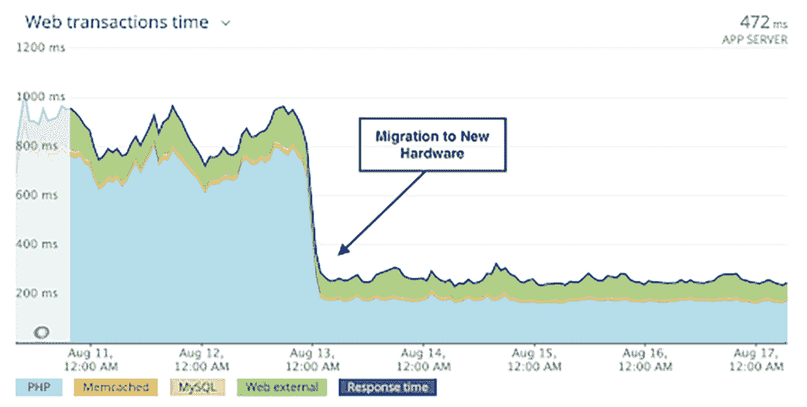

# TWiGCP —“更智能的优化云、人工智能更新和 TF 2.0”

> 原文：<https://medium.com/google-cloud/twigcp195-6f56166a9deb?source=collection_archive---------2----------------------->

以下是谷歌云视频系列 本周最新 [**的链接:**](http://gtech.run/ju4em)

*   [如何在 Google Kubernetes 引擎上部署 Windows 容器](http://gtech.run/357u8)
*   [数据仓库迁移挑战以及如何应对这些挑战](http://gtech.run/hqapr)
*   [扩展无服务器应用的 6 种策略](http://gtech.run/ajptf)
*   [为每个人建立 ML 模型:理解机器学习中的公平性](http://gtech.run/l68mw)

过去一周 GCP 的其他头条新闻包括:

*   [宣布 AutoML Vision Edge、AutoML Video 和 Video Intelligence API 的更新](http://gtech.run/d6pzc)(谷歌博客)
*   [使用新的基于人工智能的推荐器优化您的谷歌云环境](http://gtech.run/n5xh2)(谷歌博客)# iam recommender # computeenginerengsizing
*   [使用新的 BindPlane 集成扩展跨云和提供商的 Stackdriver 日志记录](http://gtech.run/23ev8) (Google 博客)

来自“TensorFlow 大周”部门:

*   [TensorFlow 2.0 现已上市！](http://gtech.run/nmaza)(medium.com)
*   [Google Cloud 中的深度学习虚拟机现在支持完整的 TensorFlow 2.0 版本](http://gtech.run/a29nk)

从“如何迁移、归档、连接和保护(可能一次完成！)”部门:

*   [由保存大师对媒体进行长期存档](http://gtech.run/hlfr9)(谷歌博客)
*   [将 Node.js 应用从 Heroku 迁移到云运行](http://gtech.run/kc98t)(cloud.google.com)
*   [通过 VPN 隧道设置对云 API 的私有访问](http://gtech.run/zqvft)(cloud.google.com)
*   [用谷歌云阻止数据泄露的 4 个步骤](http://gtech.run/bpzsr)(谷歌博客)
*   [使用谷歌云](http://gtech.run/wcg75)(谷歌博客)检测并响应日志中的高风险威胁

来自“本周大查询”部门:

*   [如何管理项目中的 BigQuery 统一费率时段](http://gtech.run/a2rbr)(谷歌博客)
*   [天气怎么样？使用 Colab 从 BigQuery](http://gtech.run/fr2xp) (谷歌博客)中获得更多
*   【medium.com】创建弹性搜索到 BigQuery 数据管道
*   [数据仓库存储还是数据湖？为什么不两者都要？](http://gtech.run/tl7ml)(medium.com)

来自“Kubernetes 安全研讨会的示例代码和脚本”部门:

*   [高级 Kubernetes 安全研讨会](http://gtech.run/znyrn)(github.com)

来自“可能不是最佳实践，但嘿，它的工作！”部门:

*   [黑客入侵谷歌云运行](http://gtech.run/4nycd)(blog.doit-intl.com)

来自“海量数据满足海量存储和处理能力”部门:

*   [使用物联网设备跟踪资产:Pycom、Sigfox 和 GCP](http://gtech.run/agx7j)(cloud.google.com)

来自“过渡、技术和人力驱动”部门:

*   [用云扳手和无服务器重新思考商业软件交付](http://gtech.run/hpjlv)(谷歌博客)
*   [将一个典型的工程运营团队转变为 SRE 的发电站](http://gtech.run/nlx3a)(谷歌博客)

来自“如果您使用过 jib，如果没有，您可能应该使用”部分:

*   [Jib 用户反馈](http://gtech.run/ntxr9)(docs.google.com)

来自我最喜欢的“客户和合作伙伴对 GCP 的最佳评价”部分:

*   塞恩斯伯里如何对世界饮食方式产生新的见解(谷歌博客)
*   [用人工智能的力量加速行业变革](http://gtech.run/7upkg)(谷歌博客)
*   WP 引擎新的谷歌计算优化基础设施的早期真实结果(wpengine.com)# C2 instances

**Beta，GA，还是什么？**“部门:

*   [GA] [云 SDK 265.0.0](http://gtech.run/wfg8w)
*   【GA】[HA 云 VPN](http://gtech.run/qf4p9)
*   操作系统库存管理
*   【GA】[进口 OVF 虚拟设备](http://gtech.run/npyy4)
*   [GA] [改进的 GCE 块存储性能](http://gtech.run/3t79r)
*   [GA] [云互联 100G 连接](http://gtech.run/uc5mu)
*   [GA] [保留计算引擎区域资源](http://gtech.run/mvg3r)
*   [Beta] [大查询脚本、存储过程和临时表](http://gtech.run/28b2z)
*   [Beta] [云 IAM —控制建议数据处理](http://gtech.run/bdb9c)
*   [Beta] [云代码 IntelliJ — Kubernetes 支持现处于测试阶段](http://gtech.run/tzwbs)

来自“**万物多媒体**”部门:

*   [播客] Kubernetes 播客[第 73 集——CRDs、可扩展性和 API 机制，丹尼尔·史密斯](http://gtech.run/5rh93)(kubernetespodcast.com)
*   (gcppodcast.com)GCP 播客[第 197 集——马修·塔姆塞特和拉维·乌普雷蒂的量子比特](http://gtech.run/ssj4t)
*   [视频] [宣布 tensor flow 2.0](http://gtech.run/9nmwe)(youtube.com)
*   [视频][youtube.com GCP 精华——保持联系](http://gtech.run/9ag72)
*   [视频] [开始使用 IAP 保护 App Engine 应用](http://gtech.run/6v99p)(youtube.com)

本周的图片来自 WP 引擎使用 GCP 新 C2 实例的体验

这就是本周的全部内容！亚历克西斯