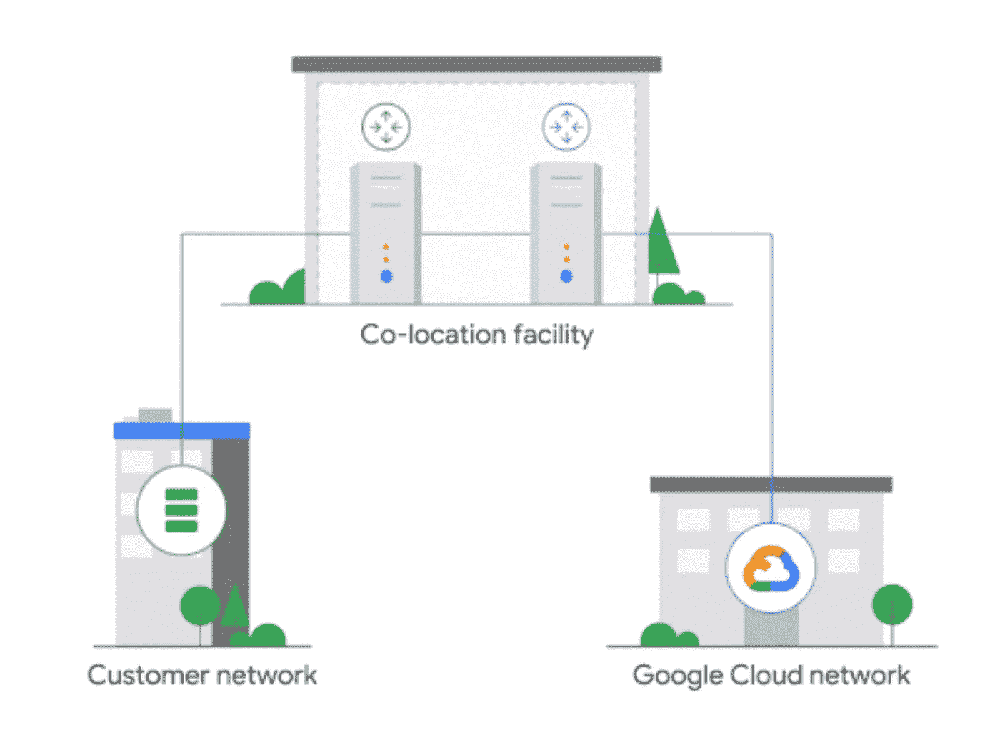

# TWiGCP —“增强的混合连接、大量的发布和 moar 公共数据集！”

> 原文：<https://medium.com/google-cloud/twigcp197-f43f4051b163?source=collection_archive---------5----------------------->

以下是谷歌云视频系列 本周最新 [**的链接:**](http://gtech.run/ju4em)

*   [掌控您的数据:只需点击几下鼠标即可扫描敏感数据](http://gtech.run/qakvy)
*   [密码管理最佳实践 2019 版](http://gtech.run/gjf2z)
*   [计算引擎还是 Kubernetes 引擎？新的培训教你谷歌云架构的基础知识](http://gtech.run/ksucy)
*   [KubeCon + CloudNativeCon —北美 2019](http://gtech.run/fknxc)

过去一周 GCP 的其他头条新闻包括:

*   [Google Cloud 100 Gbps 专用互联和 HA VPN 正式发布](http://gtech.run/73qpd) (Google 博客)
*   [使用用于 BigQuery 的 Grafana 插件，数据可视化更加容易](http://gtech.run/jvx6r)(谷歌博客)
*   【CARTO 和 BigQuery 公共数据集的数据分析(谷歌博客)
*   [借助 Google Cloud 中的新产品增强功能，掌控您的安全](http://gtech.run/z7aq5) (Google 博客)= >安全健康分析测试版

来自“单一平台与数据隔离”部门:

*   [混合和多云监控和记录模式【cloud.google.com ](http://gtech.run/g8eqn)

来自“GDELT 利用新的海量数据集进行扩展”部门:

*   [GDELT 全局实体图&新 11B 实体数据集](http://gtech.run/ytypm)(blog.gdeltproject.org)
*   [GDELT 神经情感数据集](http://gtech.run/etayt)(blog.gdeltproject.org)

来自我最喜欢的“客户和合作伙伴对 GCP 的最佳评价”部分:

*   [亚航:采用谷歌云的现代身份解决方案](http://gtech.run/kq2zb)(谷歌博客)
*   API 管理和指导:高效地安装家庭服务
*   [黑骑士和探索征服一个由合作伙伴、开发者和客户组成的生态系统](http://gtech.run/2d3aj)

从" **Beta，GA，还是什么？**"部门:

*   【GA】[云 SDK 267.0.0](http://gtech.run/wfg8w)
*   【GA】[云函数 Max 实例](http://gtech.run/82933)
*   [正式发布] [100 Gbps 专用互连](http://gtech.run/uzggd)
*   [GA] [高可用性(HA) VPN](http://gtech.run/hnd39)
*   [GA] [通过 API 启用/禁用服务帐户](http://gtech.run/822v3)
*   [GA] [基于 MySQL 区域持久磁盘的高可用性](http://gtech.run/ejwv8)
*   【GA】[App Engine 标准 Java11 运行时](http://gtech.run/hdyu9)
*   [1.3.3] [宣布 Istio 1.3.3](http://gtech.run/ma99n)
*   【测试版】[云 SQL for SQL Server](http://gtech.run/vc7nr)
*   【Beta】[用云扳手冬眠 ORM](http://gtech.run/q9krh)
*   [Beta] [安全健康分析](http://gtech.run/ay7lb)
*   【测试版】 [App Engine Go 1.13](http://gtech.run/qnv4j)
*   【Beta】[App Engine node . js 12](http://gtech.run/l5sme)

本周的图片来自 100 Gbps 专用互连和 HA VPN 公告帖子

这就是本周的全部内容！亚历克西斯