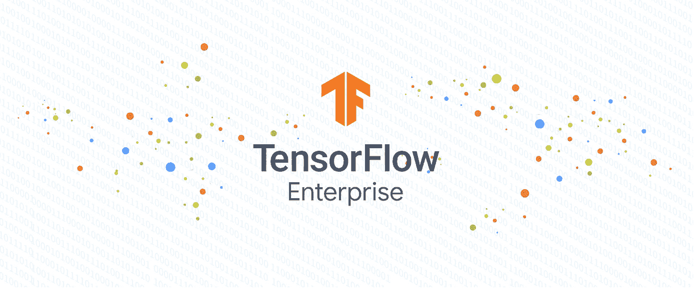

# TWiGCP—“tensor flow 走向企业，AppEngine Java 走向 11”

> 原文：<https://medium.com/google-cloud/twigcp198-bb0e52845b9e?source=collection_archive---------3----------------------->

以下是谷歌云视频系列 本周最新 [**的链接:**](http://gtech.run/ju4em)

*   [探索容器安全:开源 Kubernetes 中的漏洞管理](http://gtech.run/htl6r)
*   [App Engine Java 11 正式发布——部署一个 JAR，扩展它，所有这些都是完全托管的](http://gtech.run/dkthe)
*   [big query 的变化:新特性为您的数据仓库带来了灵活性和可伸缩性](http://gtech.run/pxp4k)
*   [使用 GKE 使用计量来应对过度供应](http://gtech.run/294bp)

过去一周的 GCP 要闻包括:

*   [TensorFlow Enterprise:云中受支持、可扩展且无缝的 tensor flow](http://gtech.run/ja6za)(谷歌博客)
*   [Java 11 运行时来到应用引擎](http://gtech.run/c4jme)(谷歌博客)
*   [名人识别现已向经批准的媒体&娱乐客户](http://gtech.run/gn93e)(谷歌博客)开放
*   [针对(Parquet 和 ORC)开源文件的联合查询现已可用](http://gtech.run/2kthz)(谷歌博客)
*   [云块存储数据保护——新功能](http://gtech.run/jg2h9)(谷歌博客)
*   [谷歌 Kubernetes 引擎的新加密选项](http://gtech.run/ycv8c)(谷歌博客)
*   [Google Cloud 上的 Unity Simulation 帮助你创建视觉上丰富的模拟，具有巨大的可扩展性](http://gtech.run/x2dat) (Google 博客)
*   [借助云安全指挥中心和事件威胁检测提高您的云安全性](http://gtech.run/rnc5g)(谷歌博客)

来自“全方位运营”部门:

*   [编写定制的凡赛堤配置验证器模板](http://gtech.run/faurb)(谷歌博客)
*   [将策略情报建议与基础设施集成为代码](http://gtech.run/wg76j)(谷歌博客)
*   [了解堆栈驱动审计日志](http://gtech.run/zpgeq)(medium.com)
*   [利用可抢占的虚拟机和 GPU 降低机器学习工作流的成本](http://gtech.run/ur6xa)(谷歌博客)
*   【谷歌云上的灾难恢复:概述(medium.com)

来自“数据万能”部门:

*   [带脚本的云数据仓库，存储过程](http://gtech.run/8fcy5)(谷歌博客)
*   [公共数据集分析比赛现在开始](http://gtech.run/vzebm)(谷歌博客)
*   [连接到谷歌云 SQL —思考一下](http://gtech.run/d8el9)(medium.com)
*   [数据分析管道准备工具可以与编排器集成](http://gtech.run/h2bdy)(谷歌博客)
*   [云中从 SAP apps 到 BigQuery 的数据复制](http://gtech.run/vbv8g) (Google 博客)
*   [用 reddit 和 BigQuery 分析危机:2019 年智利抗议](http://gtech.run/hqm4b)(towardsdatascience.com)

来自“关于 TF 企业的更多信息和强化学习的未来展望”部分:

*   [使用 TensorFlow Enterprise](http://gtech.run/dmtqk) (谷歌博客)更快更轻松地访问谷歌云中的数据
*   [AlphaStar:星际争霸 2 中的特级大师级使用多智能体强化学习](http://gtech.run/bsnpx)(deepmind.com)

来自“提高抽象级别，即无服务器”部门:

*   [Knative = Kubernetes networking++](http://gtech.run/ddw4u)(Ahmet . im)
*   用 Firebase 在 10 分钟内创建一个自动扩展的 API！(verygood.ventures)

来自我最喜欢的“客户和合作伙伴对 GCP 的最佳评价”部分:

*   把你自己的 IP 地址带到谷歌云，就像比特里一样
*   [与 HCL Technologies 合作扩展企业云的采用](http://gtech.run/uyjrn)(谷歌博客)

**Beta，GA，还是什么？**“部门:

*   [GA] [云 SDK 269.0.0](http://gtech.run/wfg8w)
*   [GA] [GKE 应用层秘密加密](http://gtech.run/j95bu)
*   [1.0] [CloudEvents 达到 1.0 版本](http://gtech.run/tyb43) (cncf.io)
*   【Beta】big query[查询外部分区数据](http://gtech.run/75c7q)和[加载外部分区数据](http://gtech.run/gp2mh)
*   [Beta] [查询 ORC、Parquet 格式的 BigQuery 云存储数据](http://gtech.run/95bwv)
*   [Beta] [云构建—创建 GitHub 应用触发器](http://gtech.run/dttrn)

来自“**万物多媒体**”部门:

*   [视频] " [如何使用事件威胁检测—云安全指挥中心入门](http://gtech.run/ljqbe)(youtube.com)
*   [视频] " [云发布/订阅概述—发布/订阅变得简单](http://gtech.run/xzl6w)(youtube.com)
*   [视频] " [将 Spring Boot 应用部署到 App Engine Java 11](http://gtech.run/6pez4)(youtube.com)
*   [播客] Kubernetes 播客[第 77 集——工程生产力和测试，凯瑟琳·贝瑞](http://gtech.run/uh733)(kubernetespodcast.com)
*   (gcppodcast.com)GCP 播客第 201 集——面对玛利亚·劳拉·斯库里

本周的图片说明了 TensorFlow Enterprise 的发布

这就是本周的全部内容！亚历克西斯