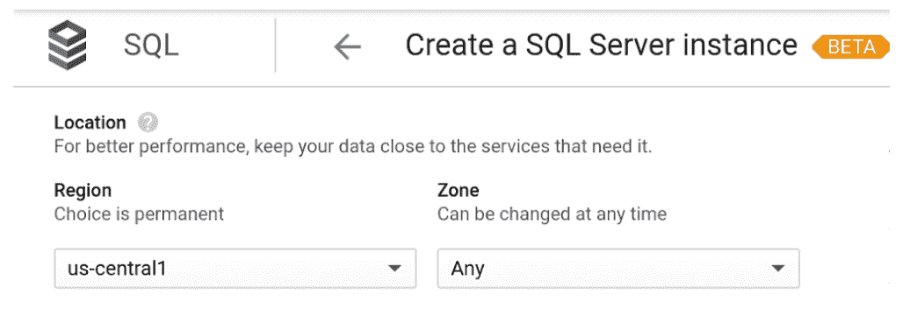

# TWiGCP—“Google 云信任、测试版 SQL Server 和一些 Quantum”

> 原文：<https://medium.com/google-cloud/twigcp198-c1877419d92b?source=collection_archive---------1----------------------->

以下是谷歌云视频系列 本周最新 [**的链接:**](http://gtech.run/ju4em)

*   [通过重要合作伙伴和新的云区域加快云在波兰的采用](http://gtech.run/3ma2c)
*   [通过增强的混合连接选项改善您与 Google 云的连接](http://gtech.run/9zhr8)
*   [让全球知识 2020 IT 技能和薪酬调查听到你的声音](http://gtech.run/wrh99)
*   [学习机器学习——谷歌人工智能的网络漫画](http://gtech.run/7ktjb)

过去一周 GCP 的其他头条新闻包括:

*   [面向 SQL Server 的云数据库服务现已推出](http://gtech.run/3mlzf)(谷歌博客)
*   [展示我们在云中保护客户数据的承诺](http://gtech.run/7y8ef)(谷歌博客)
*   [我们的量子计算里程碑意味着什么](http://gtech.run/b2lwp)(谷歌博客)
*   [差异化之旅:通过合作伙伴的专业知识和专业化重塑客户成功](http://gtech.run/u6u37)(谷歌博客)
*   谷歌关于可再生能源拍卖的新案例研究【cloud.google.com，

来自“本周数据库”部门:

*   [弹性扩展您的 MySQL 环境](http://gtech.run/aektw)(cloud.google.com)
*   [SQL Server 云 SQL 入门](http://gtech.run/xgzdf) (stephanefrechette.dev)

来自“本周云原生”部门:

*   当一个 Kubernetes 漏洞被报告时会发生什么
*   [用 mitmproxy](http://gtech.run/sfxtn) (ahmet.im)检查 kubectl 流量
*   [谷歌 Kubernetes 引擎 PCI DSS 合规指南](http://gtech.run/wfwme)(谷歌博客)
*   [GKE 使用计量正式发布，增加了解决过度配置的工具](http://gtech.run/a8xvd)(谷歌博客)

来自“本周无服务器”部门:

*   [使用带有云运行的无头 Chrome](http://gtech.run/aaggy)(开发到)
*   [在云上运行 gRPC 认证](http://gtech.run/7ufyv) (ahmet.im)
*   【cloud.google.com】云运行现已符合 HIPAA 标准
*   [使用 API 密钥](http://gtech.run/m6xj2)(medium.com)保护云运行、云功能和应用引擎

来自“本周基础设施”部门:

*   [使用 VPC 网络对等技术部署基于虚拟机的集中式设备](http://gtech.run/fq27n)(cloud.google.com)
*   [使用内部 TCP/UDP 负载平衡器作为下一跳，部署基于虚拟机的集中式设备](http://gtech.run/bmkz8)(cloud.google.com)
*   "[持久磁盘和复制](http://gtech.run/xyj9n)"(medium.com)
*   [将 Teradata Vantage 引入谷歌云](http://gtech.run/wwcne)(谷歌博客)
*   [查找并修复你的谷歌云资源中的错误配置](http://gtech.run/5wk6x)(谷歌博客)

来自“本周大数据”部门:

*   [你的管道好吗？管理和监控云数据流设置](http://gtech.run/yk7w8)(谷歌博客)
*   谷歌大查询:营销人员指南【conversionxl.com 
*   [用加密密钥保护数据分析管道](http://gtech.run/2maxk)(谷歌博客)
*   [通过 GEG 可视化实体网络:BigQuery，Gephi &云自然语言 API](http://gtech.run/dmxds)(blog.gdeltproject.org)

来自“本周 ML/AI”部门:

*   [利用人工智能平台优化机器学习(ML)工作负载](http://gtech.run/9al46)(谷歌博客)

克日什托夫的“GCP 美食”系列:

*   堆栈驱动程序监控(blog.softwaremill.com)
*   [堆栈驱动程序日志和基于日志的警报](http://gtech.run/t2vtd)(blog.softwaremill.com)
*   [堆栈驱动追踪](http://gtech.run/x9ger)(blog.softwaremill.com)
*   堆栈驱动分析器(blog.softwaremill.com)
*   【blog.softwaremill.com】stack driver 调试

来自我最喜欢的“客户和合作伙伴对 GCP 的最佳评价”部分:

*   [标准工业公司选择谷歌云来帮助推动他们的数字化转型](http://gtech.run/63k5e)(谷歌博客)

**从 Beta，GA，还是什么？**“部门:

*   【GA】[云 SDK 268.0.0](http://gtech.run/wfg8w)
*   [GA] [块存储性能— 100K 读取 IOPS(64+vcpu)](http://gtech.run/7ku8p)
*   [GA][Redis 最大内存配置的云内存存储](http://gtech.run/6v2ky)
*   [GA] [BigQuery 脚本—声明变量](http://gtech.run/pv4fl)
*   [GA] [管理组织中的操作系统登录](http://gtech.run/se8rw)
*   【测试版】[云 SQL for SQL Server](http://gtech.run/sylgk)
*   【Beta】[App 引擎标准——Python 3.8](http://gtech.run/lfknj)

来自“**万物多媒体**”部门:

*   [“谁在那里？—探索云身份”](http://gtech.run/cqpuj)(youtube.com)
*   [播客] Kubernetes 播客[第 76 集——普鲁米，乔·达菲](http://gtech.run/r9b6g)(kubernetespodcast.com)
*   (gcppodcast.com)GCP 播客 [**第 200 集**——比约恩·林德伯格主演的大片](http://gtech.run/pnevl)

本周的图片来自“SQL Server 云数据库服务现已推出”的帖子

这就是本周的全部内容！亚历克西斯