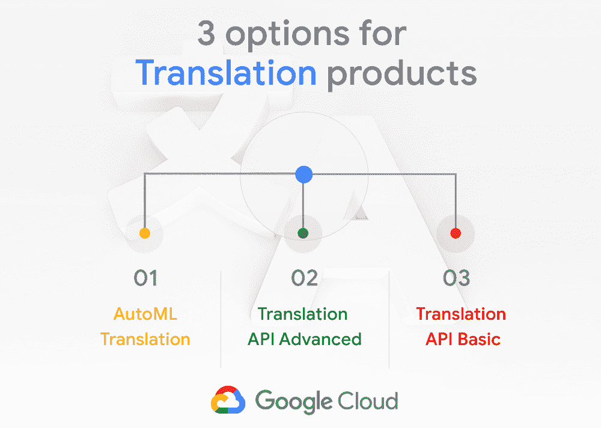

# TWiGCP—“Skaffold hits GA、翻译选项、应用引擎运行时，以及 BQ 脚本和存储过程”

> 原文：<https://medium.com/google-cloud/twigcp199-67acb64a71b0?source=collection_archive---------0----------------------->

以下是谷歌云视频系列 本周最新 [**的链接:**](http://gtech.run/ju4em)

*   [适合您业务的云存储数据保护](http://gtech.run/yl2yv)
*   [使用脚本和存储过程的 BigQuery 中的命令和控制现在更容易了](http://gtech.run/9sqpf)
*   [使用 SAP 工具将数据从 SAP apps 复制到 big query](http://gtech.run/qlg6k)
*   [放出消息:AutoML 翻译正式上市，加上翻译 API 的更新](http://gtech.run/3b6rz)

过去一周的 GCP 头条新闻包括众多产品发布:

*   Kubernetes 构建自动化工具 Skaffold 正式发布(Google 博客)
*   [现已全面上市:AutoML 翻译，外加两个新的翻译 API 版本](http://gtech.run/jfbht)(谷歌博客)
*   [big query 中的脚本和存储过程](http://gtech.run/d2tew) (Google 博客)
*   [数据流——Python 3 和 Python 流现已推出](http://gtech.run/e23dg)(谷歌博客)
*   谷歌在线安全博客:open titan——开源透明、可信、安全的芯片
*   [更新应用引擎，增加新的运行时:Nodejs 12、Go 1.13、PHP 7.3 和 Python 3.8](http://gtech.run/s32wy) (谷歌博客)

同时，在无服务器类别中:

*   [通过无服务器访问 Oracle 数据库](http://gtech.run/xs5hs)(medium.com)
*   [用 Pascal 进行无服务器计算？](http://gtech.run/aptd7)(medium.com)
*   [长期支持 App Engine 标准环境运行时](http://gtech.run/tt9wj)(cloud.google.com)

来自 GCP 合作部:

*   Nutanix Xi 框架现在运行在谷歌云上
*   [现在你可以通过谷歌云市场](http://gtech.run/rdtxf)(redislabs.com)获得 Redis 企业云

来自“大数据和存储”部门:

*   [面向自动气象站专业人员的谷歌云平台:大数据](http://gtech.run/96jxl)(cloud.google.com)
*   [为云扳手打开更多开发工具的大门](http://gtech.run/tn6tf)(谷歌博客)
*   [Firebase 博客:Cloud Firestore 现在支持查询！](http://gtech.run/eucsw)(firebase.googleblog.com)
*   [“OK Boomer”迅速升级——一个 reddit+BigQuery 的报道](http://gtech.run/jw38h)(medium.com)

来自“本周机器学习”部门:

*   [云 TPU 破解 AI 推理记录](http://gtech.run/4vpvc)(谷歌博客)
*   [使用谷歌高级翻译 API 改进机器翻译](http://gtech.run/xyzck)(medium.com)
*   [使用 Kaggle 的数据科学家的新机器学习能力](http://gtech.run/jzqaz)(谷歌博客)

从“你最近在读谷歌云媒体出版物吗？”部门:

*   [不到 10 分钟的 CI/CD 解决方案，使用可在 medium.com GCP 使用的 Terraform &](http://gtech.run/8cs4l)
*   [使用谷歌云构建的 e2e Kubernetes CI/CD](http://gtech.run/rt6hm)(medium.com)
*   [持久磁盘和复制](http://gtech.run/q2tes)(medium.com 的贾纳)
*   [在 Google Cloud 上为内部运行的应用程序提供热灾难恢复【medium.com ](http://gtech.run/4b4a5)
*   我是如何找到最好的披萨店的🍕在 13，000 个城市使用云任务、云功能和谷歌地图🗺medium.com 的️
*   [基于 Firebase 的安全模式:将规则与云功能相结合以获得更大的灵活性](http://gtech.run/hc7ru)(medium.com)

**Beta，GA，还是什么？**“部门:

*   [GA] [云 SDK 270.0.0](http://gtech.run/wfg8w)
*   【GA】[云 AutoML 翻译](http://gtech.run/x232d)
*   [GA] [GKE —运行可抢占的虚拟机](http://gtech.run/t3a7e)
*   [Beta] [计算引擎—管理自动缩放器](http://gtech.run/3htsd)
*   [Beta] [支持对整数列进行分区的表的 big query](http://gtech.run/gu3km)
*   [0.10.0] [Knative 客户端发布](http://gtech.run/f9btz)

来自“**多媒体**”部门:

*   【视频】 [TensorFlow 隐私(AI 冒险)](http://gtech.run/h6pn7)(youtube.com)
*   [视频] " [像谷歌人一样开发和部署到 Kubernetes，作者大卫·加格奥特](/google-cloud/gtech.run/sel9e)(youtube.com)
*   [视频] " [雷·曾](http://gtech.run/rn9l9)(youtube.com)的最佳实践
*   [视频] " [云运行，Mete Atamel](http://gtech.run/h64n9)(youtube.com)的无服务器容器
*   [播客] Kubernetes 播客[第 78 集——KUDO，与 Gerred Dillon](http://gtech.run/rqbgj)(kubernetespodcast.com)
*   (gcppodcast.com)GCP 播客[第 202 集——卡米·梅的超级固体](http://gtech.run/uglv5)

本周图片来自翻译博文

这就是本周的全部内容！亚历克西斯