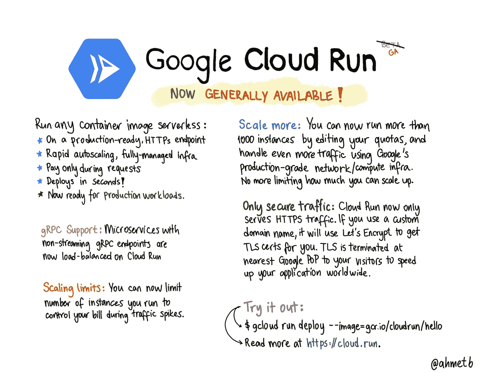

# TWiGCP —“云运营与联络中心 AI hit GA+GKE 与网络智能中心批量引进”

> 原文：<https://medium.com/google-cloud/twigcp200-b29642e8d539?source=collection_archive---------0----------------------->

以下是谷歌云视频系列 本周最新 [**的链接:**](http://gtech.run/ju4em)

*   [云 TPU 打破人工智能推理的可扩展性记录](http://gtech.run/4vcjb)
*   [探索云 IAM 推荐器背后的机器学习模型](http://gtech.run/2gcrr)
*   [TensorFlow Enterprise 使访问 Google Cloud 上的数据变得更快更容易](http://gtech.run/6xtxt)
*   [KubeCon + CloudNativeCon 北美 2019](http://gtech.run/dz5qd)

过去一周的 GCP 头条新闻包括众多产品发布:

*   [基于知识的**云运行**服务正式发布](http://gtech.run/4gql7)(谷歌博客)
*   [谷歌云推出**网络情报中心**](http://gtech.run/wjaq4) (谷歌博客)
*   [**联络中心 AI** 现已普遍可用](http://gtech.run/f8d6w)(谷歌博客)
*   [在 Google Kubernetes 引擎](http://gtech.run/9pq57) (Google 博客)上运行**批处理工作负载**
*   [Hadoop 和 Spark 集群的自动扩展能力](http://gtech.run/xb9rb)(谷歌博客)
*   [介绍 Apigee 的新高级 API Ops](http://gtech.run/qgw45) (谷歌博客)

来自“预算 API 能为您做什么”部门:

*   [监控云成本并创建大规模预算](http://gtech.run/e8pa4)(谷歌博客)

来自“如何实现 72TB/秒”部门:

*   [谷歌的居里私人海底电缆已准备好服务于美国和智利之间，其分支通往巴拿马](http://gtech.run/whm5y)(谷歌博客)
*   [居里:谷歌国际私人海底电缆内幕](http://gtech.run/jdmk8)(youtube.com)

来自“谷歌和其他人将人工智能投入工作”部门:

*   [使用推理 API 探索自然语言 API 对 1 亿篇新闻文章的标注](http://gtech.run/3dhza)(blog.gdeltproject.org)
*   [云 IAM 推荐系统中使用的机器学习技术](http://gtech.run/rk2p8)(谷歌博客)
*   【cloud.google.com】使用基础设施建议作为代码

来自“无服务器 Google Cloud 比 Cloud Run 有更多”:

*   [视频] [Serverlessconf 纽约 2019: Serverless:一个编程模型的 ops 体验？唐娜·马拉耶里](http://gtech.run/65rtl) (acloud.guru)
*   [视频] [纽约 2019:杀死库伯内特|伊恩·富勒](http://gtech.run/3let9) (acloud.guru)
*   [视频] " [功能框架](http://gtech.run/4rrgm)(youtube.com)
*   [Go 功能框架](http://gtech.run/tef7w)(medium.com)

**从 Beta，GA，还是什么？**“部门:

*   [GA] [云 SDK 271.0.0](http://gtech.run/wfg8w)
*   【GA】[云运行](http://gtech.run/dvmsl)
*   交通局长
*   [GA] [云火店在查询](http://gtech.run/xahnl)
*   [GA] [VPC 网络对等](http://gtech.run/6qzs9)
*   [1.4] [宣布 Istio 1.4](http://gtech.run/efq2y)
*   【测试版】[批上 GKE](http://gtech.run/msby6)
*   【测试版】 [VPC 数据包镜像](http://gtech.run/wbgsl)
*   【测试版】[网络拓扑](http://gtech.run/a2m9h)

来自“**万物多媒体**”部门:

*   [视频] [网络智能中心](http://gtech.run/9gqtk)(youtube.com)网络拓扑入门
*   [视频] " [使用 Jib 构建 Docker 图像](http://gtech.run/3wqh6)"(youtube.com)
*   [视频] " [开始使用假设分析工具](http://gtech.run/a69k6)(youtube.com)
*   [播客] Kubernetes 播客[第 79 集——云原生 Rejekts，克里斯·库尔](http://gtech.run/w89wn)(kubernetespodcast.com)
*   [播客] GCP 播客[第 203 集——唐娜·马拉耶里的云跑 GKE](http://gtech.run/pur9a)(gcppodcast.com)

本周的图片来自 Ahmet 转发云运行 GA 公告的推文

这就是本周的全部内容！
——亚历克西斯