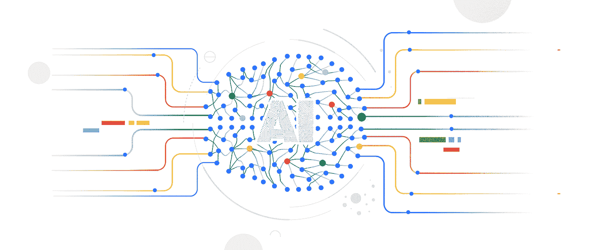

# TWiGCP —“人工智能解释、裸机、合规性、云代码 GA 和云简单”

> 原文：<https://medium.com/google-cloud/twigcp201-4fead3de0725?source=collection_archive---------1----------------------->

以下是谷歌云视频系列 本周最新 [**的链接:**](http://gtech.run/ju4em)

*   [云运行，一个托管的有价值的服务，正式发布](http://gtech.run/fhp6u)
*   [宣布网络情报中心——实现主动网络运营](http://gtech.run/22nnx)
*   [监控云成本并创建大规模预算](http://gtech.run/6bygl)
*   [居里海底电缆设置为传输至智利，中途停靠至巴拿马](http://gtech.run/y6g8q)

过去一周的 GCP 头条新闻包括众多产品发布:

*   [谷歌云和 G Suite 控制和可见性的新安全工具](http://gtech.run/2mkla)(谷歌博客)
*   [谷歌云人工智能解释增加公平、责任和信任](http://gtech.run/fa9kz)(谷歌博客)
*   [裸机解决方案让您可以在接近谷歌云的地方运行传统工作负载](http://gtech.run/q76eq)(谷歌博客)
*   [云数据流中的流分析现在更简单、更具成本效益](http://gtech.run/xx2v5)(谷歌博客)
*   使用 Anthos: Migrate、Apigee hybrid、Cloud Code & Cloud Run (谷歌博客)移动和更新你的应用
*   [数据仓库的成本灵活性(使用 BigQuery)](http://gtech.run/m7w5n) (谷歌博客)
*   [帮助谷歌云客户在云中运行更多 VMware 工作负载(使用 CloudSimple)](http://gtech.run/3d6bl) (谷歌博客)
*   [云数据库采用对象关系映射，Hibernate](http://gtech.run/4gua3) (谷歌博客)

来自“喜欢别人写的帖子”部门:

*   本周在 Next UK 发生了什么

来自“最佳实践和金块”部门:

*   [使用 Anthos 配置管理和 GitLab 进行策略管理的最佳实践](http://gtech.run/kyy2a)(cloud.google.com)
*   [教程:将 Knative Eventing 与 Google Cloud Pub/Sub](http://gtech.run/5fhlw)(thenewstack . io)集成
*   [非官方云 AI 平台笔记本市场](http://gtech.run/h35bf) (notebooks.solutions)
*   【github.com】展示云运行一些特性的教程
*   [何时使用 Google Kubernetes 引擎与云运行容器](http://gtech.run/tp4j4) (Google 博客)

来自“让您的集装箱安全直截了当”部门:

*   [更新的 GKE 强化指南(moar 安全默认值)](http://gtech.run/kplg4)(cloud.google.com)
*   [[白皮书]为什么集装箱安全对您的业务至关重要](http://gtech.run/lek3e)(cloud.google.com)
*   [gVisor 安全基础知识—第 1 部分](http://gtech.run/ykyr8) (gvisor.dev)

来自“关于关键访问理由、数据驻留和法规遵从性的更多信息”部门:

*   [谷歌云支持欧洲的数据、安全和隐私要求及偏好](http://gtech.run/6wpxe)(谷歌博客)
*   [帮助遵守新加坡法规的资源](http://gtech.run/xfwb7)(谷歌博客)
*   [使用谷歌云满足数据驻留需求](http://gtech.run/2rxa7)(谷歌博客)
*   [关键访问理由如何让你成为访问他们在谷歌云平台(GCP)](http://gtech.run/gbn66) (谷歌博客)上的数据的最终仲裁者

来自我最喜欢的“客户和合作伙伴对 GCP 的最佳评价”部分:

*   约翰·刘易斯&合伙人选择谷歌云(谷歌博客)
*   [沃达丰呼吁借助谷歌云实现数字化转型](http://gtech.run/r4rpg)(谷歌博客)
*   [只吃外卖服务选择谷歌云](http://gtech.run/aatdm)(谷歌博客)
*   [谷歌云帮助交通部推动数字化转型](http://gtech.run/ed8tq)(谷歌博客)
*   [克莱姆森实验在谷歌云上使用了 210 万 vcpu](http://gtech.run/bc96x)(谷歌博客)
*   [DFS 与谷歌云合作，更好地服务客户](http://gtech.run/ggg4j)(谷歌博客)
*   [云加速计划帮助 SAP 客户简化向云的过渡](http://gtech.run/kmv8f)(谷歌博客)

从“**贝塔，嘎，还是什么？**"部门:

*   [GA] [云 SDK 272.0.0](http://gtech.run/wfg8w)
*   【GA】[云码(针对 VS 码)](http://gtech.run/kl5w9)
*   【GA】[云代码(针对 IntelliJ)](http://gtech.run/m2fb9)
*   [GA] [数据存储导出/导入(控制台)](http://gtech.run/wlsaa)
*   统一桶级访问
*   【GA】[云任务 HTTP 目标](http://gtech.run/zhnbs)
*   [GA] [为 MIG 应用实例规模建议](http://gtech.run/nfq5b)
*   汽车视觉
*   为了蚂蚁而迁移
*   【GA】[尖顶杂交](http://gtech.run/5tx9d)
*   【GA】[云数据融合](http://gtech.run/s5thu)
*   【GA】[云数据流资源调度(FlexRS)](http://gtech.run/bmk48)
*   【GA】[云 SQL 客户经理加密密钥](http://gtech.run/tmx6s)
*   [1.4][Istio 1.4 对 Anthos 服务网格的用户意味着什么](http://gtech.run/qnjdf)
*   【Beta】[可解释的 AI](http://gtech.run/dscr5)
*   【测试版】[日志路由器](http://gtech.run/7tvyj)
*   [Beta] [多个网卡的内部负载平衡器](http://gtech.run/j8xtg)
*   【测试版】 [BigQuery 预约](http://gtech.run/g4yq8)
*   【测试版】[big query 预约查询的服务账号选项](http://gtech.run/z2wrq)
*   【Beta】[big query ML 预处理函数](http://gtech.run/c734v)
*   [Beta] [云 DNS 创建托管反向查找区域](http://gtech.run/zsbp7)
*   [Beta] [云 DNS 创建或更新带有私有转发目标的转发区域](http://gtech.run/ddwfd)

来自“**多媒体**”部门:

*   【YouTube】[kubecon‬+cloudnativecon 2019 |圣地亚哥播放列表](http://YouTube] KubeCon‬ + CloudNativeCon 2019 | San Diego playlist)(youtube.com)
*   [播客] Kubernetes 播客[第 80 集——Lyft 和 KubeCon NA 2019，张薇琪](http://gtech.run/cvnnx)(kubernetespodcast.com)
*   [播客]gcppodcast.com GCP 播客[第 203 集——与曾雷在谷歌云上的端到端 Java](http://gtech.run/ywfqf)

本周图片来自 AI 解说公告博文

这就是本周的全部内容！亚历克西斯