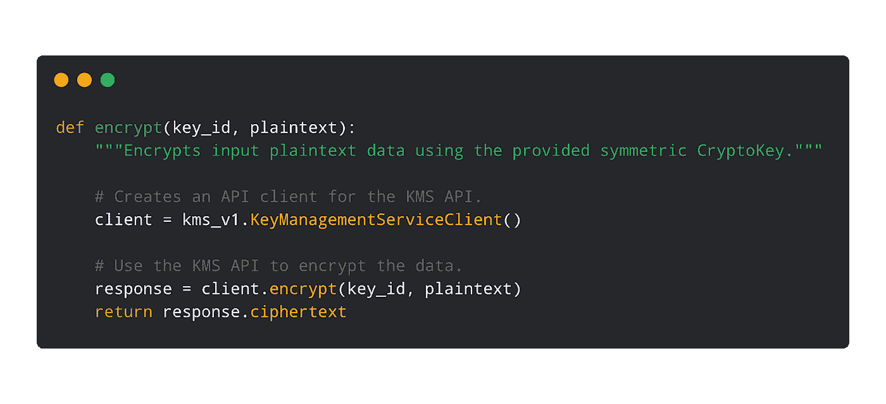

# twi GCP—“KMS 客户端库、物联网设备 SDK 和 CSP 配置管理”

> 原文：<https://medium.com/google-cloud/twiggcp-2019week9-4167e00f34ba?source=collection_archive---------2----------------------->

欢迎来到每周一期的谷歌云平台时事通讯，每周一从[medium.com/google-cloud/weekly](/google-cloud/weekly)开始发布！

以下是过去一周的故事:

“ [*谷歌云平台基础知识:核心基础设施培训*](http://gtech.run/k9wza) ”。每天都有新用户，也许是你的同事，迈出他们的第一步 GCP。通过演示、演示和动手实验，这门课适合他们。

“ [*Coursera —谷歌云*](http://gtech.run/nw5f8) ”。Coursera 的自定进度培训课程(GCP 基础和许多其他课程)仍然非常受欢迎，尤其是如果你打算获得认证的话。

[*使用 Cloud Composer 实现基础架构自动化*](http://gtech.run/8wlkp) 。在这个新的分步解决方案中，了解由谷歌(使用 GKE)管理的 Apache Airflow。本教程向您展示了如何自动备份计算引擎虚拟机实例。

[*使用新的云 KMS 客户端库和示例*](http://gtech.run/7qxrq) 启动您的加密技术。新的 GCP KMS 客户图书馆在这里！这些基于 gRPC 的库更加符合语言习惯，并且包含了大量适用于所有语言的示例代码！

[*让 AI 驱动的语音更易理解*](http://gtech.run/rlyvx) 。语音到文本，文本到语音—更多的功能，更多的声音，更多的语言，更好的准确性，更低的价格！

“ [*介绍云物联网设备 SDK*](http://gtech.run/5fhyv) ”(谷歌博客)。嵌入式 C 库，用于连接、供应和管理具有云物联网核心的设备。

" [*利用 CSP 配置管理*](http://gtech.run/fz5nn)(Google 博客)控制您的 Kubernetes 集群。继上周发布云服务平台(CSP)测试版之后，合乎逻辑的下一步。

来自我最喜欢的“客户和合作伙伴对 GCP 的最佳评价”部分:

*   [塔拉尼斯:利用先进的无人机成像和人工智能帮助农民养活地球](http://gtech.run/gt8r8)(cloud.google.com)
*   [Recursion Pharmaceuticals 借助谷歌云加速药物研发](http://gtech.run/wedey)(谷歌博客)
*   [英国最大的汽车市场 Auto Trader UK 如何利用 Istio 和谷歌 Kubernetes 引擎推动变革](http://gtech.run/l3tp7)(谷歌博客)
*   [探索集装箱安全:DroneDeploy 如何在 GKE 获得 ISO-27001 认证](http://gtech.run/kw9h3)(谷歌博客)
*   [布提克。:使用 big query](http://gtech.run/x6qfm)(cloud.google.com)定制商业智能解决方案
*   OpenVPN:使用云身份凭证访问企业网络(谷歌博客)

来自“考虑您的选择”部门:

*   " [*在 GCP 上运行 Redis:四种部署场景*](http://gtech.run/nvucq) "(谷歌博客)
    看看云存储、GKE 还是计算引擎最适合你。
*   [*谷歌云平台容器威胁检测与防护*](http://gtech.run/pxhkk)(medium.com)

来自“我们可以让这些 ML 堆栈更加高效”部门:

*   “ [*让深度学习虚拟机和 Jupyter 笔记本为你开夜车:用 Papermill*](http://gtech.run/p6tu5) 进行健壮的自动化训练”(谷歌博客)。在运行期间创建深度学习虚拟机。
*   “ [*在 TPU 上快速训练，在 GPU 上灵活服务:切换你的 ML 基础设施以适应你的需求*](http://gtech.run/pt3gu) ”(谷歌博客)

从“你在关注统计计算吗？”部门:

*   "[*R at scale on the Google Cloud Platform*](http://gtech.run/6qlrz)"(code . marked mondson . me)
*   “[*30 分钟内 RStudio 和 big query*](http://gtech.run/j273z)”(medium.com)

来自“将 ML 带到领域和位置”部门:

*   [利用谷歌云和机器学习进行大规模创意分析](http://gtech.run/wh5dv)(cloud.google.com)
*   [用 ML 监控家用电器的功率读数](http://gtech.run/ruyw7)(谷歌博客)

从“GCP 和游戏一切”部门的新登录页面:

*   [用谷歌云构建游戏](http://gtech.run/6vt6m)(cloud.google.com)

来自“GCP 在客户所在地会见客户”部门:

*   [将 GCP 与 Azure Active Directory 联合起来](http://gtech.run/x9s2j)(cloud.google.com)
*   [通过计算引擎上的 IBM MQ 获得快速、可靠的消息传递](http://gtech.run/x9nn8)(谷歌博客)

来自 Doug 的“Firebase & Google Cloud”部门:

*   ”[云火石有什么不同？](http://gtech.run/4buhl)(medium.com)

从“测试版，正式版，还是什么？”部门:

*   [GA] [云 SDK 236.0.0](http://gtech.run/wfg8w)
*   [1.12] [GKE 1.12.5 集群现已推出](http://gtech.run/el6e6)
*   【Beta】[云 Bigtable 多区域复制](http://gtech.run/ggr9x)
*   【Beta】[VPC 进出口定制航线](http://gtech.run/6qrss)
*   【版本 0 . 9 . 1】[张量流扩展](http://gtech.run/hg3d5)

来自“所有多媒体”部门:

*   [视频] [开发 DataStudio 连接器(data vis dev talk:S01)](http://gtech.run/4bny6)(youtube.com)
*   [视频] [用 Stackdriver 报警——Stack Doctor](http://gtech.run/4z4ll)(youtube.com)
*   [播客] Kubernetes 播客第 42 集— [策略和配置管理，与(kubernetespodcast.com)约翰·默里](http://gtech.run/9wgj7)
*   [播客]gcppodcast.com GCP 播客第 164 集

本周的图片来自“云 KMS 客户端库”帖子

这就是本周的全部内容！亚历克西斯