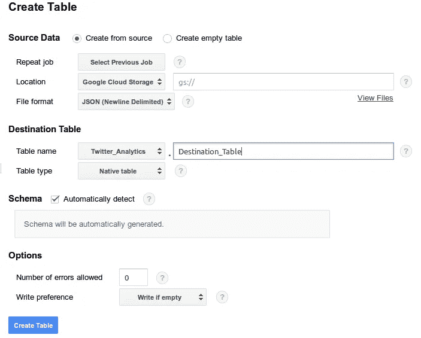

# Twitter 分析(第一部分)

> 原文：<https://medium.com/google-cloud/twitter-analytics-part-1-801c9d494487?source=collection_archive---------0----------------------->

Twitter 是一个了解外面真实世界发生了什么的好工具。这就是为什么我选择它来对阿根廷国家队最后两场足球比赛期间的用户心态进行实时分析，使用 Python 和 Google Cloud 基础设施。

# 第一步:获取数据

首先要做的是设置环境并开始收集数据。

## 1)生成 Twitter API 凭证。

前往 https://apps.twitter.com/[创建一个新应用，然后前往“密钥和访问令牌”并点击“创建我的访问令牌”。保存“API 密钥”、“API 秘密”、“访问令牌”、“访问令牌秘密”。](https://apps.twitter.com/)

## 2)创建您的谷歌云帐户。

谷歌给了我们 300 美元来试用这个平台，这对这个项目来说绰绰有余。你必须输入你的信用卡号码来激活你的账户，但是谷歌向我们保证，在我们同意之前，他们不会向我们收费。

## 3)创建您的 Python 脚本

首先安装 python 的 tweepy 包(【https://github.com/tweepy/tweepy】T4)来轻松连接 Twitter 流媒体。可以以库例为鉴:[https://github . com/tweepy/tweepy/blob/master/examples/streaming . py](https://github.com/tweepy/tweepy/blob/master/examples/streaming.py)。

## 4)创建一个计算引擎实例

首先，Google Cloud 会要求你创建一个新项目，所有的数据和实例都将存放在这个项目中。之后，创建一个你想要部署你的脚本的实例，确保你在创建它的时候给了访问所有“Google Cloud API”的权限(否则你总是可以编辑这个实例)。要考虑的事情是，最小类型的实例是免费的(谷歌保证它将继续免费)，而不会消耗你的 300 美元信用。另一点要考虑的是你要使用的磁盘的大小，如果你有大量的数据，也许你需要一个更大的磁盘，而不是标准的。

## 5)安装谷歌云 SDK

按照[https://cloud.google.com/sdk/](https://cloud.google.com/sdk/)中的说明将 SDK 安装到您的计算机中，您将在那里管理项目。这将使您可以轻松地通过 SSH 连接“计算引擎”实例，将文件传输到“云存储”并连接到“BigQuery”。

## 6)运行您的脚本

一旦您将全新的脚本转移到您的计算引擎实例，您现在就可以运行它并将结果存储到一个文件中，以便稍后在“BigQuery”中进行分析。如果你想在几小时/几天/几个月内收集数据，我建议你在后台运行。为此，您可以创建一个守护进程:

[https://gist . github . com/Joseph Ernest/77 fdb 0012 b 72 ebdf 4c 9d 19d 6256 a 1119](https://gist.github.com/josephernest/77fdb0012b72ebdf4c9d19d6256a1119)

或者只是使用类似于:

`*nohup python -u myscript.py > ./mylog.log 2>&1 &*`

## 7)将您的数据移动到 BigQuery

有几种方法可以将数据发送到“BigQuery ”,你可以实时传输，批量处理，或者最简单的方法…

当您收集了所有需要的数据后，停止您的脚本，并使用 Google Cloud SDK 将结果文件发送到“数据存储”，只需执行以下操作:

*gsutil CP results . txt GS://my-project . appspot . com/*

一旦传输完所有数据，就可以转到 BigQuery 并创建一个 JSON(新行分隔符)文件形式的表。

很快下一部分…