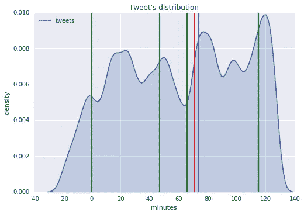
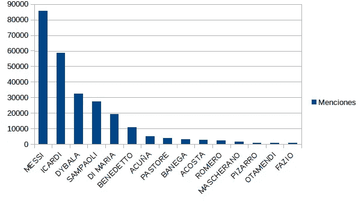

# Twitter 分析(第二部分)

> 原文：<https://medium.com/google-cloud/twitter-analytics-part-2-f282c49c6de7?source=collection_archive---------0----------------------->

Twitter 是一个了解真实世界的好工具。这就是为什么我选择在阿根廷国家队的最后两场足球比赛期间，使用 Python 和谷歌云基础设施对用户的精神状态进行实时分析。

*这是文章的第二部分(要了解这个故事如何开始，请访问:*[*【https://medium . com/Google-cloud/Twitter-analytics-part-1-801 c9d 494487*](/google-cloud/twitter-analytics-part-1-801c9d494487)*)*

# 第二步:分析数据

## 1)谷歌数据实验室

Google Datalab 提供了轻松访问 BQ 中的数据并在 Jupiter 笔记本中进行分析的可能性。我们还可以使用大量现有的包进行统计、机器学习和数据处理。在谷歌云平台内部署也很容易:[https://cloud.google.com/datalab/docs/quickstarts](https://cloud.google.com/datalab/docs/quickstarts)

首先要做的是确保你的项目中安装了所有的包，我的意思是 Pandas，Seaborn，Numpy，Matplotlib 和 Scikit-learn(如果你想做一些 ML 项目就需要)。如果没有，您可以随时安装或更新软件包，打开笔记本并键入:

> *！pip 安装库名称*

第二，你必须让数据可以进入笔记本。我们可以这样做:

> *%%sql —模块数据名称-d 标准
> #SQL 查询
> SELECT
> created _ normalize，
> text
> FROM
> 【表名】*

然后通过用 python 编码来获取数据

> *导入 datalab.bigquery 为 bq
> my_data_frame = bq。查询(数据名称)。to_dataframe()*

正如您在该表中看到的，我有一个名为“created_normalize”的字段，这是因为我首先在 python 中处理数据以规范化日期。

好了，现在我有了一个包含查询结果的数据框，接下来呢？我开始将日期更改为时间线，以分钟为单位，比赛开始时间为 0。

> min _ datetime = my _ data _ frame[' created _ normalize ']。min()
> difference = 20
> my _ data _ frame[' time _ line ']=[int(((x—min _ datetime)。total _ seconds())/60)-my _ data _ frame 中 x 的差异['created_normalize']]

注意我用了 20 分钟的间隙，那是因为我在比赛开始前 20 分钟就开始录音了。

这为数据集“time_line”增加了一个新列，让我们可以轻松地绘制几分钟内的推文数量。

> *my _ data _ frame[' tweets ']= my _ data _ frame[' time _ line ']
> ax = SNS . kdeplot(my _ data _ frame[' tweets ']，shade = True)
> ax . set(xlabel = ' minutes '，ylabel='density '，title = ' Tweet ' s distribution ')
> PLT . axv line(x = 0，color='g ')
> PLT . axv line(x = 47，color = ' g*

阿根廷-委内瑞拉(2017 年 9 月 5 日)

绿线代表每半场的开始/结束，红线代表委内瑞拉的一个进球，蓝线代表阿根廷的一个进球。

或者我们可以查找每个阿根廷球员的名字。

我们可以利用这些数据做更多的事情，剩下的就交给你了…

如果你想要这两场比赛的数据，我会向所有人公开。