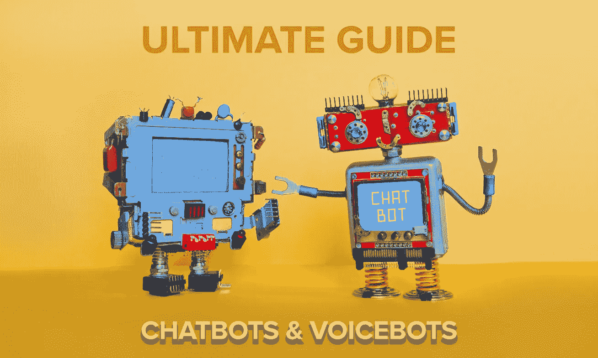

# 从头开始构建自己的聊天机器人和语音机器人的终极指南。

> 原文：<https://medium.com/google-cloud/ultimate-guide-to-build-your-own-chatbots-and-voicebots-from-scratch-772bd2568fe5?source=collection_archive---------0----------------------->

想从头开始学习构建自己的聊天机器人吗？这里有一个有用的资源列表，可以帮助你开始学习。我是一名谷歌开发专家，以下是我创建的内容列表。这个终极教程系列由超过 **10.5 小时的内容**组成，帮助你从头开始构建自己的聊天机器人或语音机器人，并学习如何与所有平台集成，如脸书、Whatsapp、Twilio、Slack、Telegram、Line 等。

**学习如何从头开始构建聊天机器人**。在这个终极聊天机器人教程中，你将学习如何构建一个初级到高级的聊天机器人，它可以集成到多个平台，如网络、脸书信使、电话、聊天或消息。
从头开始构建自己的聊天机器人——终极聊天机器人教程

2.在聊天机器人终极教程的第 2 部分中，你将学习如何构建一个基础到高级的聊天机器人，它可以集成到多个平台上，如脸书信使、WhatsApp、Twilio 等等。
[使用 Dialogflow 创建一个脸书和 WhatsApp 聊天机器人](https://www.youtube.com/watch?v=bccFFjk76IA&list=PLG9FQRMgm_JIFAQ1d6PxzARiySBupelaz&index=4)

3.**学习通过 fulfillment 和 webhooks 连接到后端和集成**。学会与谷歌日历整合，设置约会等。[将聊天机器人连接到后端](https://www.youtube.com/watch?v=8ao93nfjeSo&list=PLG9FQRMgm_JIFAQ1d6PxzARiySBupelaz&index=4)

4.使用 Dialogflow 继续集成并创建一个 **Slack bot、Telegram bot、& Line bot** 。[创建一个懒汉机器人，电报机器人&线路机器人](https://www.youtube.com/watch?v=-9BQ6tCEjTw&list=PLG9FQRMgm_JIFAQ1d6PxzARiySBupelaz&index=6)

5.了解如何为你的聊天机器人添加丰富的回复和 SSML。SSML 太酷了。—学习添加丰富的回复，如卡片、图像、列表、建议芯片等——针对不同平台的丰富回复，如谷歌助手、脸书、Messenger、Slack 等。[给你的聊天机器人添加丰富的回复和 SSML](https://www.youtube.com/watch?v=R27eiWHKYZQ&list=PLG9FQRMgm_JIFAQ1d6PxzARiySBupelaz&index=7)

6.学习如何**创建你自己的 3D 数字/虚拟助手或数字人**。[创建你自己的 3D 数字/虚拟助手或数字人](https://www.youtube.com/watch?v=gjCqS91Vl98&list=PLG9FQRMgm_JIFAQ1d6PxzARiySBupelaz&index=8)

7.走得更远一点。在本教程中，您将学习如何从头开始构建自己的 flutter 应用程序，还将学习如何将 Dialogflow 集成到 Flutter 应用程序中。[使用 Flutter 和 Dialogflow 构建自己的聊天机器人和语音机器人应用](https://www.youtube.com/watch?v=4elnjgA7iP8&list=PLG9FQRMgm_JIFAQ1d6PxzARiySBupelaz&index=9)

8.学习如何**将聊天从机器人移交或转移到实际的现场代理**。您将构建一个简单的 Dialogflow 代理、一个 Node.js 服务器和一个 web 界面，用于处理从 Dialogflow 代理到人工操作员的基于文本的对话。[聊天机器人向人类的移交从零开始](https://www.youtube.com/watch?v=EOAypIKmzyY&list=PLG9FQRMgm_JIFAQ1d6PxzARiySBupelaz&index=10)

9.**使用情感分析更好地了解您的用户**。您将学习如何构建聊天机器人，并通过使用 Dialogflow 情绪分析来帮助您了解用户的情绪或情绪，从而使其更加智能。[情感分析](https://www.youtube.com/watch?v=elYkFU2SWIQ&list=PLG9FQRMgm_JIFAQ1d6PxzARiySBupelaz&index=11)

如果你觉得这些内容有用，可以订阅 youtube 频道的 **Tech 和 Sach** 并成为每周直播的一部分。

**🔴订阅频道永不错过一集:**[https://bitly.com/techwithsach](https://bitly.com/techwithsach)