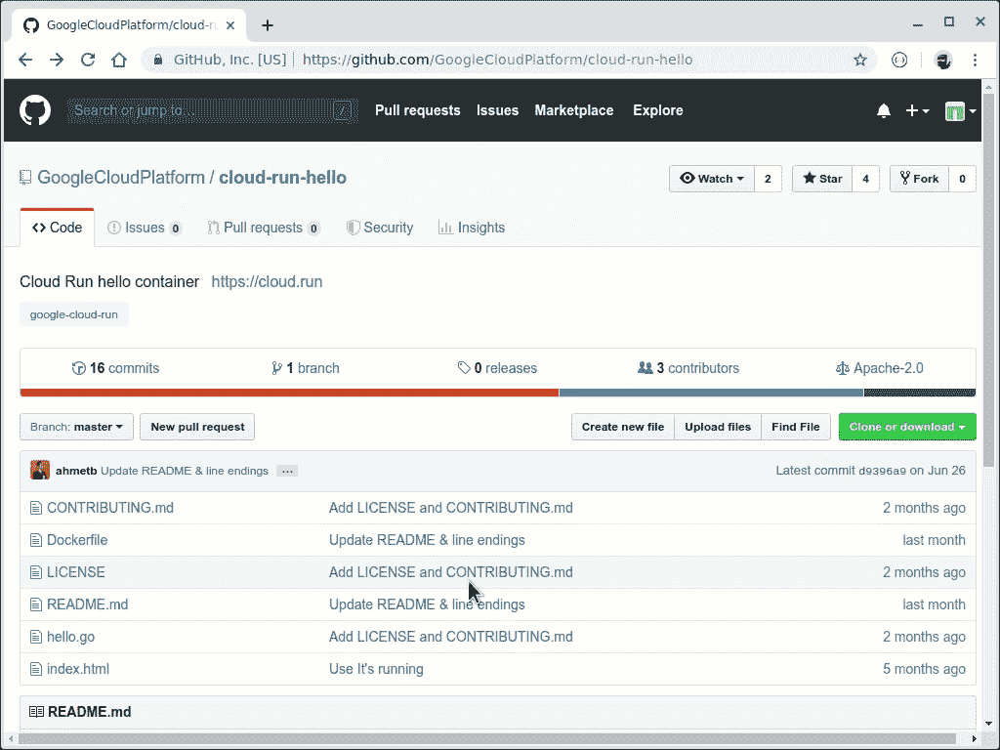

# 揭开云运行中点击部署的魔力

> 原文：<https://medium.com/google-cloud/uncovering-the-magic-of-click-to-deploy-for-cloud-run-52d6ac79f6e1?source=collection_archive---------0----------------------->

我喜欢使用命令行，但是当我想快速运行时，我并不总是想安装工具，然后复制粘贴一堆命令。我宁愿只点击一个按钮。这正是 Cloud Run Button 在 Cloud Run 上部署 GitHub repos 所做的事情。看看这个:

任何包含无服务器应用的 GitHub repo 都可以启用云运行按钮，只需在`README.md`文件中添加以下标记:

``

当用户点击按钮时，它将启动云壳，并做一些魔术，使这些“快速旋转”更容易。要直接跳到实际文档，请查看 [GitHub repo for Cloud Run 按钮](https://github.com/GoogleCloudPlatform/cloud-run-button)。如果你还在阅读，让我们浏览一下 Cloud Run Button 的所有功能。

**1。Git 克隆**

点击按钮的 repo 被克隆到一个临时云外壳环境中。可以手动指定分支和子目录，也可以根据引用 URL 自动检测。

**2。解析 app.json**

有时候 repo 需要配置一些关于按钮如何构建和部署项目的东西。遵循 [Heroku 按钮的 app 设置样式](https://devcenter.heroku.com/articles/app-json-schema)，这些设置在项目目录下的`app.json`文件中指定。我们将在一分钟内完成一系列设置，但是这里需要指出的是，可以使用一个`name`字段来设置云运行服务名称和容器注册表映像名称。([查看云运行按钮的 app.json 设置的完整文档](https://github.com/GoogleCloudPlatform/cloud-run-button#customizing-deployment-parameters)。)

**3。项目设置/选择**

谷歌云平台中的一切都是“项目”的一部分，因此用户需要选择一个项目。如果用户已经有一堆项目，有一个很好的项目选择器。如果用户没有项目，这个按钮可以帮助他们完成。

**4。计费账户验证**

要在 Cloud Run 上部署应用程序，你需要建立一个计费帐户，即使你不会因为处于 [Cloud Run 免费层](https://cloud.google.com/run/pricing#pricing_table)或使用一些[免费试用积分](https://cloud.google.com/free/docs/gcp-free-tier)而实际被收取任何费用。“云运行”按钮会验证您是否有与项目相关联的计费帐户，如果没有，它会帮助您设置一个帐户。

**5。云运行 API**

对于要在云运行上部署应用程序的云运行按钮，它需要启用云运行 API。因此，如果需要，它会这样做。

**6。区域选择**

Google Cloud Platform 分为多个区域，这些区域由划分网段和服务水平协议的区域组成。云运行是区域性的，因为它在给定区域的底层分区中自动冗余。您可以[从多个区域中选择](https://cloud.google.com/run/docs/locations)来部署您的应用，因此按钮会提示用户选择区域。

**7。环境变量**

云运行使用环境变量进行配置，因此项目的`app.json`文件可以指定这些变量。这些值可以随机生成，也可以由按钮提示用户输入。([查看云运行按钮的 app.json 设置的完整文档](https://github.com/GoogleCloudPlatform/cloud-run-button#customizing-deployment-parameters))。)

**8。构建项目**

该按钮现在将把项目从源代码构建到一个容器映像中，因为这是云运行所需的格式。首先，按钮检查一个`Dockerfile`，如果找到，它用 Docker 构建它。如果没有`Dockerfile`,那么这个按钮会检查是否有一个 Maven (Java 构建工具)项目安装了 Jib 插件(用于创建容器映像的 Java 构建工具插件)。在这种情况下，它运行 Maven Jib 构建任务来构建容器映像。如果没有支持 Maven Jib 的项目，那么按钮尝试的最后一件事是通过 Heroku Buildpacks 使用 [Cloud Native Buildpacks](https://buildpacks.io/) 构建项目，Heroku build packs 可以构建大多数 Java、Python、Node、Ruby、Go 和 PHP 项目。

**9。推送容器图像**

Cloud Run 需要容器映像在 Google 容器注册表中，因此除非构建步骤进行了推送，否则按钮会从本地 docker 守护进程推送映像(即，它会将映像从 Cloud Shell 上传到 GCR)。

**10。运行预部署钩子命令**

项目的`app.json`文件可以指定在创建云运行服务之前将运行的命令。如果服务尚不存在，则运行这些脚本(注意:按钮也可以部署现有服务的新版本。)

**11。部署云运行服务**

该项目现在使用 GCR 的容器映像部署到 Cloud Run！这将在新服务上设置环境变量和选项(目前只是是否允许未经身份验证的请求)。

12。运行部署后挂钩命令

就像 precreate 命令一样，如果在`app.json`中指定了 postcreate 命令，那么就会运行这些命令。这可用于调配其他资源，如存储桶、云 SQL 实例、服务帐户等。这些命令可以使用 gcloud 命令来添加新的环境变量或更改新部署的服务的其他设置。

这就是按钮的魔力！只需点击，各种事情就发生了，让一个应用程序在云上运行。将它添加到您的回复中，如果我们能帮上[什么忙，请告诉我们！](https://github.com/GoogleCloudPlatform/cloud-run-button/issues)