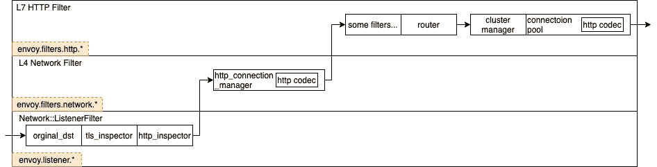

# 像高级工程师一样理解云负载平衡器

> 原文：<https://medium.com/google-cloud/understand-cloud-load-balancer-like-a-senior-engineer-d4f55f3111fc?source=collection_archive---------0----------------------->

# 软件负载平衡器(SLB)

大多数云负载平衡器开发者今天使用的是软件负载平衡器。它们不仅用于平衡网络流量，而且几乎可以平衡任何计算资源，包括 CPU 资源、内存和磁盘空间资源、网络资源等。

有时人们只是称它们为代理，尤其是在云原生或服务网格的上下文中，因为代理将网络转发作为其主要功能。代理/负载平衡器主要负责三个功能:

*   **端点发现**
*   **健康检查**
*   **负载均衡**

# L4/L7 负载平衡

业界的负载均衡解决方案基本上是两种:第四层负载均衡器和第七层负载均衡器。第 4 层和第 7 层是指 OSI 模型中的层。第 4 层是传输层，第 7 层是应用层。

来自维基百科的 OSI 模型

# L4 负载平衡器

L4 负载平衡并不意味着负载平衡器将在第 4 层工作。事实上，大多数 L4 负载平衡器仍然工作在第 2 层和第 3 层。有时，您可能会听到人们谈论第 2 层负载平衡或第 3 层负载平衡。现在都叫第四层负载均衡。

L4 负载平衡器在上游和下游之间保持相同的 TCP 连接。这将确保来自同一来源的流量总是被路由到同一后端。引擎盖下发生了什么？让我们重温一下 OSI 模型的七层。

第一层是物理层，传输比特流。这一层中的设备，包括网卡和各种电缆光纤，可以直接与交叉线通信。

第二层是数据链路层，它传输数据帧。WIFI (802.11)、以太网(802.3)、PPP 都在这里工作。交换机在这一层工作，维护一个地址表，将每台设备的 MAC 地址与 LAN 端口相关联。同一局域网中的设备可以通过交换机进行通信。

第三层是网络层，传输数据包。OSPF、IS-IS、BGP 和其它路由协议都在这一层工作。在路由器的帮助下，设备可以通过 IPv4/IPv6 寻址进行通信。网络数据包现在可以在整个广域网上传输。

第四层称为传输层，它传输数据段。TCP / UDP 协议在这里工作，它们知道主机的端口号。IP 标识主机在互联网上的位置，而端口标识在该主机上监听该端口的程序。

前三层称为媒体层，前四层称为主机层。在前三层，网卡可以处理流量，并将它们转发到下一跳。从第 4 层开始，流量将冲击 Linux 内核网络堆栈，其性能比 NIC 处理更差(我们确实有一些旁路内核选项，但这超出了今天讨论的范围)。一般来说，低层在处理数据包时表现更好。这就是为什么 L4 负载平衡主要在第 2 层和第 3 层工作。

## 第 2 层负载平衡

实际上有两种方式来执行转发行为:数据包封装和重写。

在第 2 层，它主要是重写。如果你仔细看看标准的 802.3 框架结构，它会是这样的

802.3 框架结构

我们现在可以忽略其他字段，专注于源 MAC 地址和目的 MAC 地址。交换机将媒体访问控制地址与局域网端口相关联，并根据地址表转发数据帧。问题是，如果我们只依靠交换机转发流量，数据包就永远不会穿过子网。所以路由器实际上会封装和去封装数据包。

L2 包重写

一旦路由器收到网络数据包，它首先将其解封装，删除原始的第 2 层报头和尾部(以太网报头包含源和目的 MAC 地址)，然后使用路由表来确定下一跳地址，并重新封装数据包。路由器将使用自己的媒体访问控制地址作为新的源媒体访问控制地址，下一跳地址作为新的目的媒体访问控制地址，并用新的第 2 层报头和尾部封装数据包。

第 2 层负载平衡器也以同样的方式工作。例如，谷歌使用网络缩放器作为第 2 层负载平衡器，后来被[磁悬浮](https://research.google/pubs/pub44824/)取代。虚拟 IP 地址(VIP)将提供给所有真实的服务器和负载平衡器。当用户向 VIP 发送请求时，它首先命中 L2 负载均衡器，该负载均衡器确定将请求转发到的真实服务器，并修改数据帧中的目的 MAC 地址。

L2·DSR(直接服务器返回)

由于第 2 层负载平衡器仅在转发期间更改帧的目的 MAC 地址，而不涉及更高层的协议(不修改有效负载的内容)，因此在更高层(第 3 层)看来，所有数据都保持不变。

由于请求数据包的目的 IP 与服务器 IP 匹配，因此服务器可以直接传输响应，而无需再次通过负载平衡器。这就是所谓的 **L2 DSR(第 2 层直接服务器返回)**。

## 第 3 层负载平衡

第 3 层可以处理更复杂的负载平衡任务。网络地址转换(NAT)和 IP 封装是两种最常见的形式。

您的家庭路由器每天使用**网络地址转换(NAT)** 将私有 IP 地址转换为公共 IP 地址。类似地，第 3 层负载平衡器也可以重写 IP 报头，以修改源和目的 IP 地址，并将流量重定向到适当的后端服务器。代价是负载平衡器本身必须处理所有流量，从而导致性能瓶颈。

专用网络和互联网之间的网络地址转换(来自 wikepedia)

另一个选择是 **IP 封装**。它将现有的 IP 报头和有效载荷视为完整的有效载荷，然后添加新的 IP 报头。例如，谷歌和谷歌云使用 Maglev 作为 [L4 TCP/UDP 外部负载平衡器](https://cloud.google.com/load-balancing/docs/network)。

根据 [Maglev 论文](https://research.google/pubs/pub44824/)(2016 年发表)，每个后端服务器都将拥有一个或多个虚拟 IP 地址(VIP)。当 Maglev 向 VIP 发送数据包时，它会选择一个与该 VIP 相关联的服务端点，并使用**通用路由封装(GRE)** 通过添加一个指向该端点的外部 IP 报头来封装数据包。后端服务器将解封装并使用客户端请求包，然后发回响应。谷歌也在第三层使用 DSR。因此响应包将服务器 VIP 作为源地址，用户的 IP 作为目的地址。

第 3 层直接服务器返回

DSR 负载平衡器仅处理入站流量。当你在 google.com 上搜索某个东西时，你的请求可能只需要几千字节，但是响应可能需要几百甚至几千字节，尤其是当结果中有一些图表的时候。借助 DSR，我们可以节省 99%的负载平衡带宽。

## 第 4 层负载平衡

第 4 层负载平衡将在环路中包含端口号。第 4 层负载平衡器将使用 IP:Port，而不是 IP 地址。事实上，这种情况很常见，很容易在您的家用路由器上找到。我们讨论了 NAT 如何在第 3 层将私有地址转换为公有地址。但是，如果您家里有多台设备，但只有一个对外的公共地址，那么如何将多个私有地址映射到一个公共地址呢？

原来家庭路由器上的 NAT 模式实际上是 NAPT(网络地址和端口转换)，它将来自不同私有 IP 地址的请求映射到同一公共 IP 的不同端口。可用的端口号范围从 0 到 65535，这对于大多数住宅场景来说绰绰有余。

网络地址和端口转换(来自 wikepedia)

如果您回忆一下本文开头关于 OSI 模型中七层的段落，您会很容易地发现端口号不包含在 IP 协议(网络层)中，而是包含在 TCP/UDP 协议(传输层)中。因此，重写端口将发生在第 4 层。

## 谷歌云 L4 负载均衡器

通常，云公司有一个更具描述性的产品名称，而不是第 4 层或第 7 层。如果你访问谷歌云用户指南页面，它们被称为 TCP/UDP 负载平衡器和 HTTP(s)负载平衡器。

负载平衡器可以分为内部负载平衡器和外部负载平衡器。外部负载平衡器需要公共 IP 地址，而内部负载平衡器只能在虚拟私有云(VPC)内工作。Google Cloud 使用 [Maglev](https://research.google/pubs/pub44824/) 作为[外部 TCP/UDP 网络负载均衡器](https://cloud.google.com/load-balancing/docs/network)，它包含了上面提到的所有 2/3/4 层负载均衡功能。

谷歌云[内部 TCP/UDP 负载均衡器](https://cloud.google.com/load-balancing/docs/internal)建立在[仙女座](https://research.google/pubs/pub48645/)网络虚拟化堆栈之上。所有第 3/4 层活动现在都由 SDN(软件定义网络)管理。

仙女座架构(来自 Cloud Next’18)

准确地说，第 4 层内部负载平衡是 Andromeda 提供的虚拟化网络功能(VNF)之一。

Andromeda 使用 health checker 服务检查后端虚拟机的端点，并通过 health reporter 将端点相关信息传递给虚拟机控制器(VMC)。VM 控制器将该信息编程到 OpenFlow 前端(OFE)。

OpenFlow 前端将通过 OpenFlow 协议向 VM Host 内部的虚拟交换机(Open vSwitch，OVS)通告路由信息。当客户端虚拟机向后端虚拟机发送请求时，数据包将首先通过虚拟交换机，然后离开虚拟机主机。然后，虚拟交换机将挑选一个健康的后端虚拟机，并将流量定向到那里，就像真正的负载平衡器一样。换句话说，没有中间体负载平衡器。流量在虚拟机之间流动，可以避免阻塞点，提高网络性能。

使用 Andromeda 的内部负载平衡器(来自 Cloud Next’18)

# L7 负载平衡器

L4 负载平衡器主要通过转发 TCP 流量来工作，但是在客户端和服务器之间维护相同的 TCP 通道。而 L7 负载平衡器充当代理，在客户端和负载平衡器之间建立一个连接，在负载平衡器和服务器之间维护另一个连接。L7 负载平衡器可以被视为客户端和真实后端服务器之间的附加服务器，它接受来自客户端的请求，并在将请求路由到真实服务器之前根据请求的内容做出初始决定。

有些要求 L4 负载平衡器不支持，而 L7 负载平衡器支持。例如，L7 负载平衡器可以根据 URL 路径将流量重定向到不同的服务，这是微服务环境中的常见用例。

通过评估 HTTP(s)请求内容，L7 负载平衡器可以提供更高级的功能。然而，代价是效率，因为 L7 负载平衡器将不得不经历另一轮 TCP 握手。在微服务架构中，L7 负载平衡器/代理将是流量管理的基石。

## 谷歌云 L7 负载平衡

Google Cloud 内部 HTTP(S)负载平衡(L7 负载平衡)是基于 Envoy 代理的托管服务。

特使代理可以用作边车代理。在微服务场景中，服务被分成不同的独立单元。Sidecar 代理(Envoy)位于工作负载旁边(它们可以在相同的虚拟机或 Kubernetes Pods 中运行)。代理中介所有入站/出站(HTTP、REST、gRPC、Redis 等)流量。因此，服务实例只知道本地代理，而不知道整个网络。

Sidecar 代理(来自 Cloud Next’19)

除了 sidecar 代理之外，Envoy 还可以用作 L7 负载平衡器。这里有一个由[谷歌云指南](https://cloud.google.com/load-balancing/docs/l7-internal#load_balancing_using_path-based_routing)提供的用例样本。在此图中，内部 HTTP(S)负载平衡是一个基于开源特使代理的托管服务。

来自 Google Cloud 的例子:基于第 7 层负载平衡的内部(微)服务

> 一个常见的用例是服务之间的负载平衡流量。在本例中，内部客户端可以通过使用路径为`/video`和`/images`的相同基本 URL 来请求视频和图像内容。
> 
> 内部 HTTP(S)负载平衡器的 URL 映射指定对路径`/video`的请求应该发送到视频后端服务，而对路径`/images`的请求应该发送到图像后端服务。在以下示例中，视频和图像后端服务通过使用计算引擎虚拟机来提供，但它们也可以通过使用 GKE pod 来提供。
> 
> 当内部客户端向负载平衡器的内部 IP 地址发送请求时，负载平衡器根据此逻辑评估请求，并将请求发送到正确的后端服务。

特使处理 HTTP 请求

Envoy 的 ListenerFilter 拦截入站流量，确定协议，然后将其传递给第 4 层的 [http_connection_manager](https://www.envoyproxy.io/docs/envoy/latest/configuration/http/http_conn_man/http_conn_man#config-http-conn-man) 进行处理。一旦数据包被`codec`解码，它们将被传递给 [L7 HTTP 过滤器](https://www.envoyproxy.io/docs/envoy/latest/intro/arch_overview/http/http_filters)。`[envoy.filters.http.router](https://www.envoyproxy.io/docs/envoy/latest/configuration/http/http_filters/router_filter#config-http-filters-router)`必须是过滤器链中的最后一个。它会根据 URL 路径和路由配置定位目标集群，然后根据负载均衡策略选择目标地址。

在前面的示例用例中，视频和图像后端服务部署在负载平衡器特使之后，每个服务都有一个 sidecar 特使。这是我对负载平衡器特使的配置。它将按循环顺序挑选可用的后端。

负载平衡器特使配置

# **总结**

*   云负载均衡器主要完成三项工作:端点发现、健康检查和负载均衡。
*   负载均衡解决方案基本上有两种类型:L4 负载均衡器和 L7 负载均衡器。
*   第 4 层(传输层)负载平衡器在客户端和服务器之间保持相同的 TCP 连接。它包括所有第 2 / 3 / 4 层负载平衡技术。
*   Google Cloud 内部 TCP/UDP 负载均衡器(L4 负载均衡器)是 Andromeda 提供的虚拟化网络功能之一。
*   第 7 层(应用层)负载均衡器功能更强大，是服务网格流量管理的基础，但这是有代价的:效率。
*   Google Cloud 内部 HTTP(S)负载均衡器(L7 负载均衡器)基于开源的 Envoy 代理。