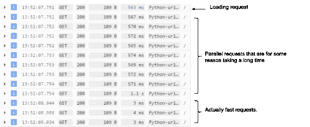
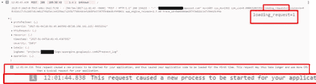
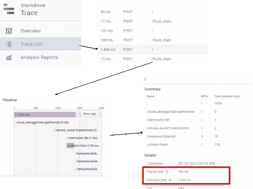

# 了解和分析应用引擎冷启动时间

> 原文：<https://medium.com/google-cloud/understanding-and-profiling-app-engine-cold-boot-time-908431aa971d?source=collection_archive---------0----------------------->

我一直在做这整个"[性能宣传](https://www.youtube.com/playlist?list=PLWz5rJ2EKKc9CBxr3BVjPTPoDPLdPIFCE)的事情一个[长时间](https://www.youtube.com/watch?v=0UNWi7FA36M)。因此，当我将注意力转向“[云](https://cloud.google.com/)”的消息传出后，我开始收到开发人员的 pings，他们希望帮助提高他们基于云的应用程序的性能。

一个同事；让我们叫他“卡特”写了一个名为“*诱饵和缝合*的网站，帮助钓鱼爱好者与该地区的设计师联系，创造个人品牌的钓鱼服装。在假期休息期间，他看到该应用程序上有大量用户，并得到一些反馈，即他们在白天第一次使用该应用程序时，该应用程序运行非常慢，之后，它变得明显更快。

通常，当我听到这样的反馈时，意味着一件事:**冷启动性能**。

当一个[应用引擎](https://cloud.google.com/appengine/)实例第一次启动时，它必须执行一堆只在初始引导时发生的工作。如果这项额外的工作太长，那么它会延迟实例对用户流量的响应(也就是说，这很糟糕)。

通常，谷歌[应用引擎](https://cloud.google.com/appengine/)(标准版)的冷启动问题非常罕见，这也是我对这个问题感兴趣的地方。卡特的用户已经开始抱怨这些性能问题，这意味着是时候让他和我坐下来研究代码，喝一杯茶，找出问题所在。

忙到没时间看书？查看上面的视频以了解总结。

# 使用日志记录分析启动时间

每当您获得关于性能的反馈时，第一步应该是检查系统给了您什么时间信息，而不必开始过多地挖掘，或者浪费时间构建整个分析工具。幸运的是，我们的[应用引擎](https://cloud.google.com/appengine/)记录了关于每个请求的信息，包括请求被您的服务处理需要多长时间。看了一眼谷歌云控制台的日志，证实了我的怀疑:我们遇到了冷启动时间的问题。

Google Cloud 控制台将显示通过您的实例发出的请求的日志数据。

最上面用蓝色突出显示的请求是我的“加载请求”。正是这个请求导致了一个实例的旋转。点击它确认这个状态；“加载请求”标志被设置为 1，并添加一个日志条目来指示这是一个加载请求。

导致创建实例的请求在日志中会有一些带注释的数据。

对于我们的例子，我们感兴趣的是我们的冷启动时间花了多长时间，这可以显示在日志概要中，单击一个项目就可以看到。这有助于了解加载延迟如何随着时间的推移而调整，但它并没有帮助我理解部分请求可能会花费在加载时间和请求服务上。至少我们已经确认了用户报告的事情确实发生了，但是我们还不知道为什么。

# 跟踪时分析启动时间

[Stackdriver](https://cloud.google.com/stackdriver/) 追踪内置于 [App Engine](https://cloud.google.com/appengine/) 标准中；请求被记录，关于它们的 [RPC 调用](https://en.wikipedia.org/wiki/Remote_procedure_call)的细节也被列出。它可以很容易地快速洞察您的时间在请求过程中的去向，以找到启动项目，搜索延迟高于其邻居的元素(如下面的 1400 毫秒请求，比相同位置的其他请求慢 10 倍)。

选择它会调出一个 trace，其中 *cloud_debugger。DebugletStarted* 占用了大部分时间。这个块只在产生了一个新实例时执行，所以很明显这是一个导致冷启动发生的请求。

如果您查看 summary 视图，它会告诉您跟踪的时间与未跟踪的时间，因此您可以看到这个预热用了 1209 毫秒(实际请求是 195 毫秒)。

您可以在左图中看到，在创建套接字以允许连接到实例之前，大约有 900 毫秒。这是启动时间的粗略指标。

此外，跟踪中断了应用程序进行的任何 RPC 调用，因此您可以看到您可能被阻止的内容。

跟踪向我们展示了一些非常重要的信息:RPC 调用不是问题，GAE 的通用启动时间也不是问题；我的启动代码内部发生了一些事情，导致了性能峰值。

# 自定义跟踪指标

现在，Bait-and-Stitch 的加载时间约为 1.2 秒；我们已经排除了[应用引擎](https://cloud.google.com/appengine/)的原因，并确保没有任何奇怪的 RPC 调用导致问题。遗憾的是，我们仍然不知道问题出在哪里。为了获得更多的洞察力，我们需要对我们的代码进行更多的剖析。

看，跟踪在记录 RPC 函数调用所花费的时间方面做得很好；但是它不会跟踪这些调用之间出现的所有自定义代码。要做到这一点，我们需要利用 [Stackdriver 跟踪 API](https://cloud.google.com/trace/api/reference/rest/) ，它允许我们修补现有的跟踪，这些跟踪是[应用引擎](https://cloud.google.com/appengine/)用我们自己的数据生成的，因此它们将全部显示在一个好地方。

Carter 和我能够编写一个小的实用程序类来跟踪各种代码段的开始和结束时间，并根据需要将这些结果转换成 JSON 字符串

现在，我们将这个 JSON 字符串格式化，以完全匹配 Stackdriver 跟踪为其公开的 Rest API 接受的内容。一旦我们建立了 auth 流，并挖掘了一些其他信息，Stackdriver 就完成了所有的繁重工作。

结果是，我们发出的任何请求，现在都有了堆栈跟踪尚未监控的代码块的自定义跟踪数据。

确保在你的申请中加入花生酱；这有助于给他们一个奶油的味道。

很漂亮，是吧？

# 理智检查:GAE 的启动时间有多快？

但是让我们退后一步，确认一些事情:对于一个 hello-word 应用程序，GAE 的启动时间有多快？

通过上面的测试，我能够开始获得关于 GAE 启动时间有多快的时间数据。为此，我编写了一个脚本，杀死所有实例，发出一个请求，并获取冷启动请求的日志记录时间。

计时的结果相当有趣: [*App 引擎*](https://cloud.google.com/appengine/) *启动时间真的很快。*

为了让事情看得更清楚，我决定用各种类型的配置测试一个基本的应用程序。下图显示了基本 hello-world 应用程序的实例类型与启动时间的关系:

对于 F2 实例来说，250 毫秒的启动时间非常快。这比在 4G 连接上从大多数 cdn 获取一个 Javascript 文件还要快。这意味着 GAE 本身非常擅长响应实例创建时间。

*(注意，如果你想知道为什么 B1、B2、B4 实例的时间明显变慢，我们将在以后的帖子中讨论这个问题)*

我的加载时间大约是 1.2 秒，所以很明显，这不是 GAE 的错，而是“*诱饵和缝合*代码中发生了一些事情。

# 每一毫秒都很重要

设置了自定义跟踪后，我们现在对“*诱饵和缝合*”应用程序的冷启动时间中出现的问题有了一个非常清晰的了解…并且..不太好。但是要解决这个问题，我们需要更深入地挖掘，这是另一篇文章的主题。；)