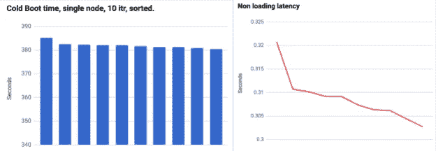
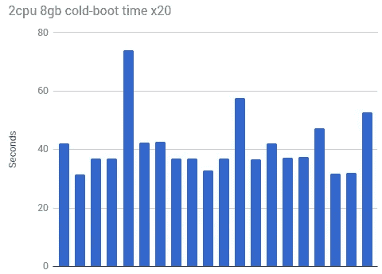
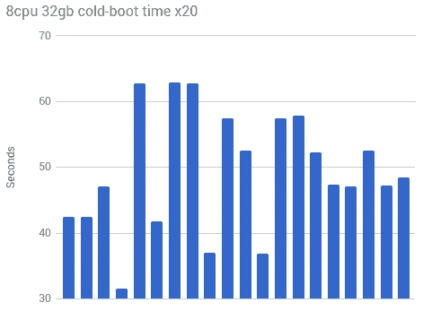
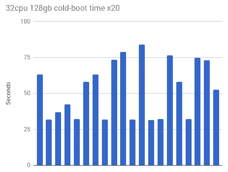
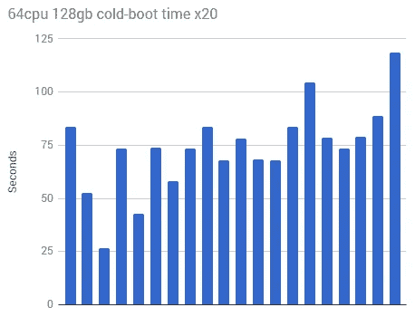
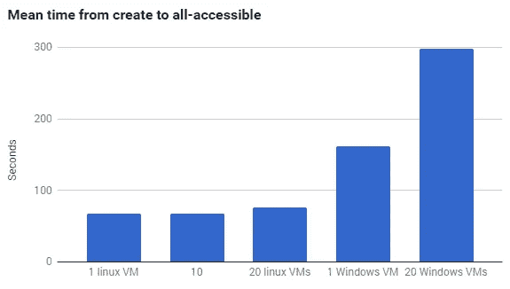
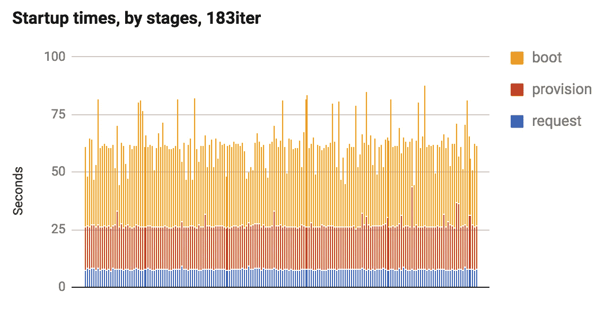

# 了解和分析 GCE 冷启动时间

> 原文：<https://medium.com/google-cloud/understanding-and-profiling-gce-cold-boot-time-32c209fe86ab?source=collection_archive---------1----------------------->

上周我在纽约做了一个演讲，在那里我见到了“FoodiePics”的幕后人员，这是一个只允许你分享食物图片的社交网络。没有文字。没有音频。没有表情符号。只有一张食物的照片，以及拍摄地点的地理位置标签。

原来，他们已经阅读了我以前关于 App Engine 启动性能的文章，并来找我帮助他们的应用程序，他们的 Google Compute Engine 实例遇到了类似的冷启动问题。他们的 GCE 实例拍摄上传的照片，对它们运行一些逻辑(以确保照片是食物)，并压缩和存储它以备后用。他们给我看了一张类似这样的图表:

他们看到他们的应用程序的冷启动时间超过 380 秒，而请求的响应延迟在 300 毫秒左右。

在这一点上，我还没有机会深入研究 GCE 冷启动性能，所以我很乐意以此为借口进行进一步的研究。

让我们开始吧！

嘿！忙到没时间看书？检查 TL；上面的 DR 视频！

# GCE 启动本身有多快？

此时，您可能会在我的性能调试模式中看到一个共同的趋势:当试图跟踪这样的性能问题时，我首先喜欢删除我的代码，并建立一个基线，以了解我的代码对事情的影响有多严重。

因此，解决问题的第一步是运行一个快速测试，看看是否:

1)给定一个静态配置，GCE 实例从“plz create”到“ok，你可以 SSH 给我”需要多长时间？

2)给定配置的变化，这个数字如何变化？

所以，让我们做一个简单的测试，启动一个实例只需 20 次迭代，计时我们可以 ssh 到它的时间，然后杀死它。

平均来说，一个 2CPU、8GB 的虚拟机(运行 debian)需要 41.5 秒才能启动。如果我增加内核和内存数量会怎么样？我认为改善资源应该会缩短启动时间，因为有更多的周期可以帮助映像启动和运行。

这里的平均时间是 49.39 秒。稍微差一点，但仍在误差范围内。这种情况会继续线性恶化吗？让我们向前跳 4x 看看。

这个时间平均约为 52 秒，这与我认为 vm 启动时间与请求的资源成线性关系的想法不完全一致；这些数字似乎都在误差范围内。我们很容易看到大约 30 秒的启动时间，根据配置开销的不同，会出现峰值。

也就是说，GCE 最近将虚拟机可以请求的最大 CPU 数量增加到 64 个，当我们测试启动时间时，我们确实看到平均冷启动时间始终高于其他配置:

这里的平均时间似乎是 73 秒。比其他的要高一点。

无论如何，这些数字让我知道了两件事:

GCE 虚拟机的冷启动时间与 CPU/Ram 配置无关(64 核的情况除外，后者更高)

2)*FoodiePics*虚拟机的 300 秒冷启动时间是由其他原因造成的。

# 让我们检查图像？

为了确保我已经完成了这个测试，让我们再运行一个测试，看看您可以使用的图像类型。Google 计算引擎使用操作系统[映像](https://cloud.google.com/compute/docs/images)为您的实例创建根持久磁盘。如果你不熟悉这个术语，我们在这里不谈论 [JPGs](/@duhroach/reducing-jpg-file-size-e5b27df3257c#.ic4dzzls9) 。从这个意义上来说,“映像”是包含引导加载程序、操作系统和根文件系统二进制数据文件。当您创建实例时指定一个图像，当它被创建时，第一步是将图像数据拷贝到您创建的实例的磁盘上。

所以，我们来做一个小测试:保持配置不变，但改变图像类型；这对冷启动时间有什么影响？(在这次测试中，我使用的是*Ubuntu-14–04*和 *windows-2012-r2* )

毫不奇怪，结果有一些变化。大多数基于 linux 的构建表现得非常相似，但是 windows 构建要慢得多。

但是 *FoodiePics* 使用的是 linux 虚拟机，而且一次只启动一两个；所以图像的选择与他们缓慢的冷嘘时间没有任何关系。

# 旁白:请求和配置时间

对事物进行剖析的一个好的副作用是，你通常最终会学到更多你以前不了解的系统的某些部分(或者更确切地说，你最终会给以前的后台系统增加透明度)。也就是说，GCE 在**响应您的请求、配置您的虚拟机、**然后启动您的实例时有明显的延迟。(你可以在这里阅读更多关于官方[舞台的信息)](https://cloud.google.com/compute/docs/instances/checking-instance-status)

在同事 [Cloud DA Terry Ryan](https://twitter.com/tpryan) 的帮助下，我能够获得他们申请的每个阶段的资料，如下所示:

具体来说:

*   **请求**是从请求虚拟机到从 API 得到确认你已经请求的响应之间的时间。在我的测试中，这是服务响应 [insert instance](https://cloud.google.com/compute/docs/reference/latest/instances/insert) REST 命令所用时间的计时。
*   **供应**是 GCE 在其庞大的架构上为您的虚拟机寻找空间所花费的时间；这可以通过定期轮询 [Get 实例 API](https://cloud.google.com/compute/docs/reference/latest/instances/get) 并等待“状态”标志从“供应”设置为“运行”来找到。
*   **开机时间**是你所期待的；映像安装和自定义代码执行，直到我的服务可用。

该图显示，每当您想要启动新实例时，大约有 7 秒用于响应请求，大约 18 秒用于配置虚拟机。

当创建实例的请求来自负载均衡器时，还不清楚(现在还不清楚)这些时间是否相似，但是要记住这一点。

# 再来一份..性能

有许多小事都会影响 GCE 实例的冷启动时间。当你试图追踪问题时，消除潜在的问题和找到原因一样重要。

所以，通过这些小测试，我们发现:

1)冷启动时间相对于 CPU/Ram 配置是不变的

2)启动时间受您选择的映像的影响。大多数 Linux 操作系统都是一样的，但是 Linux / Win 之间有很大的差异

3)这显然是 FoodiePics 在启动实例时在代码中做的事情。

在做了进一步的调查之后，我们确实发现了问题所在；但是这是另一篇文章的主题；)

## 嘿！

想了解更多关于如何[剖析 App 引擎启动时间](/@duhroach/understanding-and-profiling-app-engine-cold-boot-time-908431aa971d)？
想了解更多关于 [GAE 的调度器设置](/@duhroach/app-engine-scheduler-settings-and-instance-count-4d1e669f33d5)？
想知道首先避免[启动新实例的方法](/@duhroach/app-engine-startup-time-and-the-global-variable-problem-7ab10de1f349)？
想成为[数据压缩专家](http://shop.oreilly.com/product/0636920052036.do)？