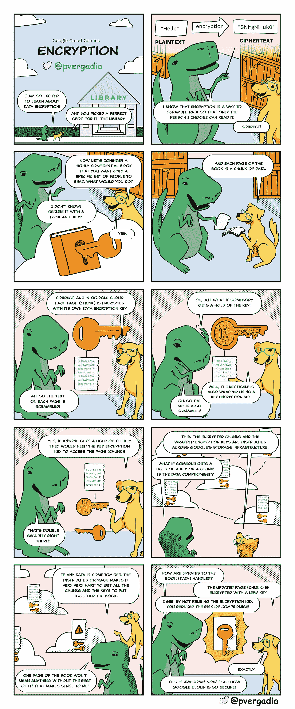

# 了解谷歌云中的数据加密

> 原文：<https://medium.com/google-cloud/understanding-data-encryption-in-google-cloud-c36d9095fb38?source=collection_archive---------0----------------------->

## 云中的数据是如何加密的？

## GCP 漫画#4:加密保护云中的数据

 [## GCP 漫画

### 谷歌云漫画(GCP 漫画)

gcpcomics.com](https://gcpcomics.com/) 

加密是一个将明文作为输入，并将其转换为输出(密文)的过程，该输出只显示很少或不显示有关明文的信息。使用公共加密算法，但是执行依赖于保密的密钥。要将密文解密回原始形式，需要使用密钥。

> 当您使用 Google Cloud 时，数据在静态和传输中都会被加密以保护数据。

*   *静态加密—* 用于保护存储在磁盘(包括固态硬盘)或备份介质上的数据。
*   *传输中的加密*——用于保护在互联网上传输的数据，在谷歌的基础设施内移动

在这一期的 [**GCP 漫画**](https://gcpcomics.com/) 中，我们要报道的正是这个……给你！

## [谷歌云中的静态加密](https://cloud.google.com/security/encryption-at-rest/default-encryption)

*   谷歌使用几层加密来保护静态的客户数据。使用一种或多种加密机制对静态存储的所有客户内容进行加密，无需客户采取任何操作。存储在 Google Cloud 中的所有数据都使用 AES256 在存储级加密，只有少数在 2015 年之前创建的[持久磁盘](https://cloud.google.com/persistent-disk)使用 AES128。
*   用于存储的数据被分割成块，每个块用唯一的数据加密密钥加密。这些数据加密密钥与数据一起存储，用密钥加密密钥加密(“包装”)，这些密钥专门存储在 Google 的中央密钥管理服务中并在其中使用。谷歌的密钥管理服务是冗余的，并且是全球分布的。
*   谷歌使用一个通用的加密库 Tink，它整合了我们的 FIPS 140–2 验证模块 [BoringCrypto](https://csrc.nist.gov/projects/cryptographic-module-validation-program/Certificate/3318) ，可以在几乎所有谷歌云产品上一致地实现加密。一致地使用一个公共库意味着只有一个小组的密码专家需要实现和维护这个严格控制和审查的代码。

## [谷歌云中的在途加密](https://cloud.google.com/security/encryption-in-transit)

*   Google 采用了多种安全措施来帮助确保传输中数据的真实性、完整性和隐私性。
*   当数据移动到不受 Google 控制或代表 Google 的物理边界之外时，会在一个或多个网络层对数据进行加密和认证。在由谷歌或代表谷歌控制的物理边界内传输的数据通常经过认证，但不一定加密。
*   根据正在建立的连接，谷歌对传输中的数据应用默认保护。例如，使用 TLS 保护用户和谷歌前端(GFE)之间的通信。
*   对广域网上的数据加密有额外要求的 Google Cloud 客户可以选择在数据从用户移动到应用程序，或从虚拟机移动到虚拟机时，对数据实施进一步的保护。这些保护包括 IPSec 隧道、Gmail S/MIME、托管 SSL 证书和 Istio。
*   谷歌积极与业界合作，帮助将传输中的加密带给任何人、任何地方，并计划保持传输中加密的行业领先地位。

# 资源

*   要了解更多关于谷歌云安全的信息，请点击[链接](https://cloud.google.com/security/overview/whitepaper)查看详细的安全白皮书。
*   [谷歌云中的静态加密](https://cloud.google.com/security/encryption-at-rest/default-encryption)
*   [谷歌云端传输中的加密](https://cloud.google.com/security/encryption-in-transit)

想要更多的 GCP 漫画吗？访问[**gcpcomics.com**](https://gcpcomics.com/)&跟我上[中台](/@pvergadia/)，上 T [维特](https://twitter.com/pvergadia)别错过下一期！