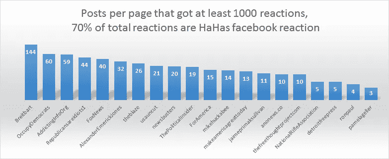

# 使用谷歌情感分析了解脸书的反应

> 原文：<https://medium.com/google-cloud/understanding-facebook-reactions-using-sentiment-analysis-f17b6e561ff3?source=collection_archive---------0----------------------->

2019 更新:新文章出欧文:

 [## medium.com 内部的冒险按每个帖子的超链接数量排名前 30.000。

### 媒体上前 30.000 篇帖子的数据可视化:

medium.com](/@baditaflorin/a-adventure-inside-medium-com-top-30-000-posts-by-number-of-hyperlinks-in-each-post-a387cbd476ca) 

如果你不知道什么是情绪分析，你可以在这里阅读[马特·基瑟](https://medium.com/u/dada28c46df7?source=post_page-----f17b6e561ff3--------------------------------)写的一篇文章:

 [## 情感分析初学者指南

### 开始情感分析所需的一切

medium.com](/@mattkiser/a-beginner-s-guide-to-sentiment-analysis-888390a8085a) 

我决定用[爆发工具](https://hackernoon.com/detecting-fake-viral-stories-before-they-become-viral-using-fb-api-f67a18cd4f0a#.9gp7f4cyh)对我正在监控的 facebook 帖子进行[谷歌](https://medium.com/u/991272e72e68?source=post_page-----f17b6e561ff3--------------------------------)云情绪分析，这是我为想要消除虚假病毒新闻的记者制作的一个令人惊叹的工具。

我想看看我们是否能更好地理解那些带有特定脸书反应(爱、哈哈、悲伤、愤怒、哇)的帖子。

例如，对于[这篇文章](https://www.facebook.com/AlexanderEmerickJones/videos/662745247236393/)，我总共有 261 个反应。

还有 129 个赞。我从总反应中减去喜欢的数量，得到的是**“情绪反应”的总数。**

我计算了每种情绪的百分比。

# 第二部分

使用 G Cloud 自然语言 API 处理超过 20，000 个脸书状态，并将结果写入为保存数据而创建的单独模型中。

**为了能够理解结果，我们首先需要理解分数和量级是什么意思:**

## 解读情感分析值

文档情感的*得分*表示文档的整体情感。文档情感的 ***大小*** 表示文档内存在多少**情感内容**，该值通常与文档的长度成正比。

具有中性分数(大约在`0.0` ) **的文档可以指示低情绪文档，或者可以指示混合情绪**，具有彼此抵消的高正值和负值。
通常，您可以使用`magnitude`值来消除这些情况的歧义，因为真正中性的文档将具有较低的`magnitude`值，而混合文档将具有较高的量值。

*   情感的`score`介于`-1.0`(负面)和`1.0`(正面)之间，对应于文本的整体情感倾向。
*   `magnitude`表示给定文本中情绪的总体强度(积极和消极)，介于`0.0`和`+inf`之间。与`score`不同，`magnitude`没有规格化；文本中的每种情感表达(积极的和消极的)都对文本的`magnitude`有贡献(因此较长的文本块可能具有较大的幅度)。
*   **下图显示了一些样本值以及如何解释它们**:

# 第三部分。利润

我发现能够看到脸书的情绪聚集在分数和数量轴周围是很有趣的，这是谷歌情绪分析为每个 FB 帖子文本预测的。

# 脸书愤怒的反应——情绪分析

我们可以看到，对于产生强烈愤怒回应的帖子，大多数被谷歌云归类为负面或中性得分的文本。

有些愤怒的帖子得分为正，但大多数产生愤怒回应的帖子的文字描述得分为负。

如果我们也看看**的量级**，我们会发现，在文本的**量级变得大于 1.5 之后，在**正得分部分**(图像的右边部分)找到愤怒的帖子变得越来越难。**

# 脸书爱情反应——情感分析

> 爱是积极的，恨是消极的。用数据证明。

如果我们看的是爱，我们会看到不同的分布。分数为负的文章往往会得到较少的喜爱。至少如果文本的大小超过 1

# Wows 帖子浅薄肤浅

我从来不明白 wows。它们是什么？这不是哈哈，不是喜欢，也不是爱。我认为它们很肤浅。我没得到惊喜。为什么我要说这个故事？

因为这部戏好跟我的 [**确认偏差**](/orangemind/confirmation-bias-b64166a73#.mjk3jip42) 那个哇是肤浅的，浅薄的。感谢 [Ray Alez](https://medium.com/u/7bd985689049?source=post_page-----f17b6e561ff3--------------------------------) 确认偏颇的文章。现在有了谷歌提供的数据，它帮助我证明了这个理论。看图片然后向下滚动看伪解释。

大多数帖子得到了很大比例的回复，这些回复的文字量低于 1。

所以我们有两种可能的解释。第一，因为 wow 没有传达任何情感内容，所以得到大部分总体反应的帖子。(浅薄)

第二，总体反应如 wow 的帖子都很短。

> 文档情感的 ***量级*** 表示文档内存在多少**情感内容**，该值通常与文档的长度成正比。
> 
> 具有中性分数(大约`0.0` ) **的文档可以指示低情绪文档，或者可以指示混合情绪，**具有彼此抵消的高正值和负值。

这是一个至少有 1000 个回复的列表，其中 75%到 100%的回复是“哇”

每个 FB 页面的分布如下所示。我喜欢它。使用 WOW`s 似乎是一个找到另类媒体或其他类别发布的“耸人听闻的帖子”的好方法。

# 什么让一个用户难过？脸书悲伤的反应。

产生悲伤情绪的最上面几页是:

## 帖子里 80%到 100%的情绪都是悲伤的。

> 底特律自由报今天失去了一位亲爱的家人。前餐馆评论家西尔维娅·雷克托去世，享年 66 岁。人们会怀念她，深情地怀念她。
> 
> -因《成长的烦恼》中的父亲而闻名的艾伦·锡克，因心脏病发作去世，享年 69 岁。
> 
> -向 2016 年去世的标志性世界领袖、运动员和名人致敬。

几乎所有的文章都与某人的死亡有关。

这里有趣的事情是**结合了从悲伤的人的百分比到愤怒的人的百分比的信息。**

如果有人因为年老而去世，人们会做出悲伤的反应，留下评论，然后就完事了。

但是如果有人因为炸弹爆炸而死亡，那么你会有悲伤和愤怒的混合反应，中间还有一些奇怪的惊叹。

## 帖子中有 60%到 80%的情绪是悲伤的，20%到 40%的情绪是愤怒的。

在这里，我们可以混合帖子，如

> ——“我低头一看……看到了我 12 周大的胎儿。它的头被砸碎了，眼睛长在头的两边。它的身体连着头，只剩下右臂和右手。我被我所看到的震惊和恐惧。”—来源 facebook.com/liveaction
> 
> 官员们说，调查人员正试图拼凑三个孩子的最后时刻，他们和母亲一起回家时发现一名枪手正在他们新墨西哥州阿尔伯克基的家中等待。——福克斯新闻
> 
> 令人不寒而栗的话…数百名阿勒颇男子据报道“失踪”。让我想起了斯雷布雷尼察。结果是 8000 名“失踪”的穆斯林男子和男孩事实上被屠杀了。—[facebook.com/camanpour/](https://www.facebook.com/camanpour/)

## 发帖者悲伤和愤怒的反应数量几乎相同。

> 一辆卡车冲进柏林的一个圣诞市场，造成至少 9 人死亡，袭击者在逃。— BretBaierSR
> 
> -我们不能忘记弗林特。
> 2017 年将是毒害弗林特数千居民的水危机三周年。直到现在，这个城市的许多居民仍然使用瓶装水来饮用、做饭和洗澡。
> 
> 本周日，观看由底特律自由出版社的 Ryan Garza 和 Brian Kaufman 制作的关于弗林特生活的 17 分钟特别纪录片。—facebook.com/detroitfreepress/

我很好奇我们是否能看到世界各地悲伤和愤怒的比例之间的联系。我们选取了 1000 篇关于有人在美国被杀的文章，1000 篇关于有人在欧洲被杀的文章，1000 篇关于有人在中东被杀的文章，然后我们比较他们的反应百分比。

# 你哈哈？—脸书·哈哈斯反应

下面几页似乎专门为脸书用户创造哈哈时刻。

**Hahas 超过 80%的帖子**

> ——这里有一个视频，把“噎”在朝鲜蓟里。——福克斯新闻
> 
> -特朗普胜利之旅外的一名孤独抗议者令自己尴尬，并威胁要起诉 Infowars 在公共场所合法拍摄。—亚历山大·梅里克·琼斯
> 
> ——特朗普是对自己的活恶搞。这太荒谬了。— usuncut
> 
> -公平地说，特朗普的支持者并不是盒子里最聪明的家伙……-占领民主党

有 60 %- 80%的帖子有 60 %- 10%以上的人感到愤怒。

> 我宁愿 ________ 也不愿读左派的《华盛顿邮报》。—布莱巴特
> 
> 安德里亚·米切尔的反特朗普情绪已经正式达到狂热程度！现在，她感到绝望的是，在特朗普治下，奥巴马的气候议程可能会受到质疑。—新闻要闻
> 
> 乌比·戈德堡猛烈抨击川普！—布莱巴特
> 
> 在 2016 年的最后一次新闻发布会上，巴拉克·奥巴马总统分享了他对希拉里·克林顿在今年大选中的待遇的看法。你同意还是不同意他的说法？——福克斯新闻

## 关于我

在过去的 3 年里，我与 **Rise 项目合作，par 的**[**OCC RP**](https://www.occrp.org/en)**调查性新闻网络，我做数据分析和模式识别来揭示非结构化数据集中的腐败模式。**

**2016 年 9 月我已经搬到旧金山，[开始新的生活](/@baditaflorin/why-i-maxed-out-my-credit-card-moved-to-silicon-valley-to-become-a-entrepreneur-a6aaced118f3)。寻找一份工作，在那里我可以应用我的专业知识，并支付 SFO 的租金。**

**目前正在开发一个工具，可以在虚假的病毒式新闻传播之前检测出它们。**

**你可以在网上找我**上媒** [**弗罗林【巴迪塔】、**](https://medium.com/u/3b723c70c152?source=post_page-----f17b6e561ff3--------------------------------)**[**AngelList**](https://angel.co/florin-badita)**、**[**Twitter**](https://twitter.com/baditaflorin)**，L** [**inkedin、**](http://linkedin.com/in/baditaflorin)**O**[**penstreetmap**](https://www.openstreetmap.org/user/baditaflorin/diary)****

******有时候我会在博客上写**[**http://florinbadita.com/**](http://florinbadita.com/)****