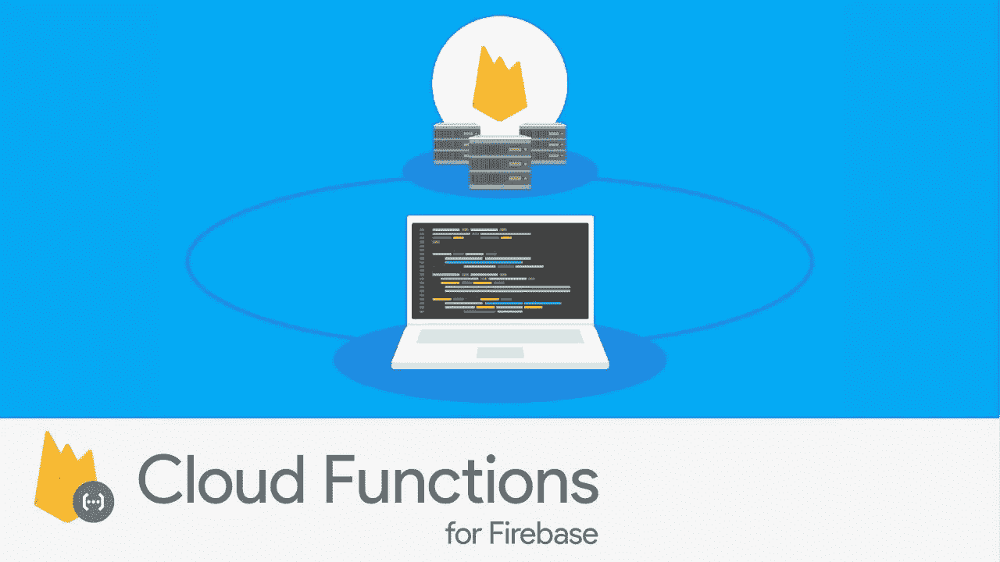

# 了解 Firebase 云功能和触发器🔥☁️ ⚡

> 原文：<https://medium.com/google-cloud/understanding-firebase-cloud-functions-and-triggers-%EF%B8%8F-85a8fe89be3c?source=collection_archive---------2----------------------->



对于 Firebase 开发人员来说，Firebase 的云功能提供了一种方式来扩展 Firebase 的行为，并通过添加服务器端代码来集成 Firebase 的功能。这也可以称为[后端即服务](https://en.wikipedia.org/wiki/Mobile_backend_as_a_service)

这扩展了 Firebase 的用途，使其不仅仅是作为应用程序的数据存储，而是能够执行需要服务器端环境的逻辑。本文提供了一些代码片段，可用于在事件发生时执行功能。

此外，我们将讨论一个最近引入的特性，[为 Firebase (cron)](https://firebase.googleblog.com/2019/04/schedule-cloud-functions-firebase-cron.html) 调度云功能。这允许开发人员安排一个函数定期执行，类似于 cron 作业。

# Firebase 云函数

Firebase 的 Firebase 云功能允许您自动运行后端代码，以响应由 Firebase 特性和 HTTPS 请求触发的事件。你的代码存储在谷歌的云中，在一个托管的环境中运行。不需要管理和扩展您自己的服务器。

谷歌云功能是谷歌的无服务器计算解决方案，用于创建事件驱动的应用程序。它是 Google 云平台团队和 Firebase 团队的联合产品。

如果你是一个开发移动应用或移动网络应用的开发者，你应该为 Firebase 使用云功能。Firebase 为移动开发者提供了一整套全面管理的以移动为中心的服务，包括分析、认证和实时数据库。云功能通过添加服务器端代码，提供了一种扩展和连接 Firebase 特性行为的方式，从而完善了产品。对于需要更全功能后端的开发者来说，Cloud Functions 提供了一个通往 Google 云平台强大功能的入口。

**函数可以用 JavaScript 或 TypeScript 编写。**

# Firebase 云函数触发器和代码片段

要开始使用 Firebase 上的云功能，您可以按照这里的说明[进行设置。如果你也想在本地测试云函数，使用这里的指南](https://firebase.google.com/docs/functions/get-started)[安装模拟器](https://firebase.google.com/docs/functions/local-emulator)

# 云 Firestore 触发器

Firebase SDK 的云函数导出一个 *functions.firestore* 对象，允许您创建与特定云 firestore 事件相关的处理程序，例如:

*   **onCreate** :第一次写入文档时触发。
*   **onUpdate** :当一张单据已经存在，并且有值发生变化时触发。
*   **onDelete** :删除有数据的单据时触发。
*   **onWrite** :触发 onCreate、onUpdate 或 onDelete 时触发。

```
// Listens for any document created in the users collection
exports.createUser = functions.firestore
    .document('users/{userId}')
    .onCreate((snap, context) => {
      // Get an object representing the document
      const newValue = snap.data();
      const name = newValue.name;
      // perform desired operations ...
    });
```

点击查看更多代码片段

# 实时数据库触发器

函数允许您在两个特定级别上处理数据库事件；您可以专门监听创建、更新或删除事件，也可以监听对路径的任何类型的更改。云函数支持实时数据库的这些事件处理程序:

*   **onWrite()** :在实时数据库中创建、更新或删除数据时触发。
*   **onCreate()** :在实时数据库中创建新数据时触发。
*   **onUpdate()** :实时数据库数据更新时触发。
*   **onDelete()** :从实时数据库中删除数据时触发。

```
// Listens for new messages added to /messages/:pushId/original and creates an
// uppercase version of the message to /messages/:pushId/uppercase
exports.makeUppercase = functions.database.ref('/messages/{pushId}/original')
    .onCreate((snapshot, context) => {
      // Grab the current value of what was written to the Realtime Database.
      const original = snapshot.val();
      console.log('Uppercasing', context.params.pushId, original);
      const uppercase = original.toUpperCase();
      // You must return a Promise when performing asynchronous tasks inside a Functions such as
      // writing to the Firebase Realtime Database.
      // Setting an "uppercase" sibling in the Realtime Database returns a Promise.
      return snapshot.ref.parent.child('uppercase').set(uppercase);
    });
```

点击查看更多代码片段

# Firebase 身份验证触发器

您可以触发云功能来响应 Firebase 用户帐户的创建和删除。

```
// Trigger a function on user creation
exports.sendWelcomeEmail = functions.auth.user().onCreate((user) => {
  // Send the email...
});
```

点击查看更多代码片段

# 火基触发器的谷歌分析

Google Analytics for Firebase 提供事件报告，帮助您了解用户如何与您的应用程序交互。使用云函数，您可以访问您记录的转换事件，并基于这些事件触发函数。

```
// triggered whenever user activity generates a conversion event.
exports.sendCouponOnPurchase = functions.analytics.event('in_app_purchase').onLog((event) => {
  // ...
});
```

点击查看更多代码片段

# Firebase Crashlytics 触发器

您可以触发一个函数来响应 Crashlytics 问题事件，包括新问题、回归问题和速度警报。

Crashlytics 触发器处理如下事件:

*   **onNew** :当你的 app 第一次遇到问题。
*   **onRegressed()** :当问题在 Crashlytics 中关闭后再次出现时
*   **onVelocityAlert()** :当给定构建中有大量会话崩溃时

```
exports.sendOnNewIssue = functions.crashlytics.issue().onNew(async (issue) => {
  // do something...
});
```

点击查看更多代码片段

# 云存储触发器

您可以触发一个功能来响应云存储中文件和文件夹的上传、更新或删除。

*   **functions . storage . object()**:监听默认存储桶上的对象变化。
*   **functions . storage . bucket(' bucket name ')。object()** :监听特定存储桶上的对象变化。

```
exports.generateThumbnail = functions.storage.object().onFinalize(async (object) => {
  // generateThumbnail code...
});
```

点击查看更多代码片段

# 远程配置触发器

您可以触发一个函数来响应 Firebase 远程配置事件，包括发布新的配置版本或回滚到旧版本。

点击查看更多代码片段

# 云发布/订阅触发器

[Google Cloud Pub/Sub](https://cloud.google.com/pubsub/docs/) 是一个全球分布式消息总线，可以根据您的需要自动扩展。您可以使用 **functions.pubsub** 创建一个处理 Google Cloud 发布/订阅事件的函数。

```
// trigger a pub/sub function
exports.helloPubSub = functions.pubsub.topic('topic-name').onPublish((message) => {
  // ...
});
```

点击查看更多代码片段

# 调度 Firebase 云功能

Firebase 还支持一种新的 Pub/Sub 函数，它构建在 Cloud Scheduler 之上，可以自动配置 Cloud Scheduler，以及一个 Pub/Sub 主题，可以调用您使用 Firebase SDK 的云函数定义的函数。

```
export scheduledFunctionCrontab =
functions.pubsub.schedule('every 3 hours').onRun((context) => {
    console.log('This will be run every 3 hours daily')
})
```

除了云功能的正常成本，该功能的成本与您手动设置底层基础架构的成本相同——有关更多信息，请查看[云调度器](https://cloud.google.com/scheduler/pricing)和[云发布订阅](https://cloud.google.com/pubsub/pricing)的完整定价信息。

# 云功能成本

云函数的定价取决于你的函数运行多长时间、被调用多少次以及你为该函数提供了多少资源。如果您的函数发出出站网络请求，还会产生额外的数据传输费用。

Cloud Functions 包含一个永久免费层，允许您免费试用该平台。请注意，即使是免费使用，谷歌云也需要一个有效的付费账户。您可以在此阅读更多关于定价的信息

# 附加资源

*   [火情云函数](https://firebase.google.com/docs/functions)
*   [谷歌云功能](https://cloud.google.com/functions)
*   [谷歌云调度器](https://cloud.google.com/scheduler)
*   [预定火情云功能](https://firebase.google.com/docs/functions/schedule-functions)
*   [示例应用的集合，展示了使用 Firebase 云功能的流行用例](https://github.com/firebase/functions-samples)

> *感谢通读！如果我错过了任何步骤，如果有些事情不太适合你，或者如果这个指南有帮助，请告诉我。*

你也可以在这里阅读我如何使用谷歌云功能和云调度程序来构建一个松弛提醒应用程序