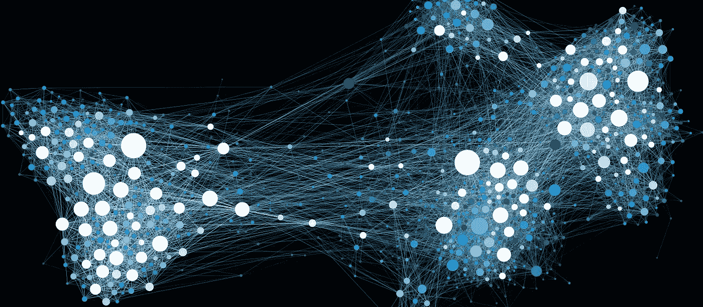
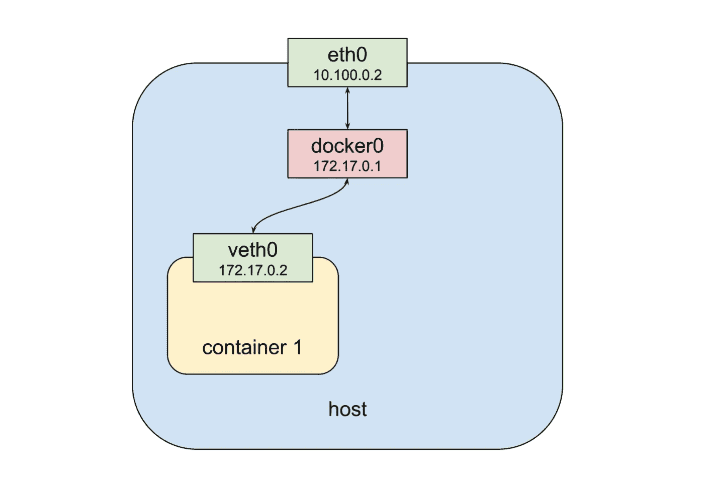
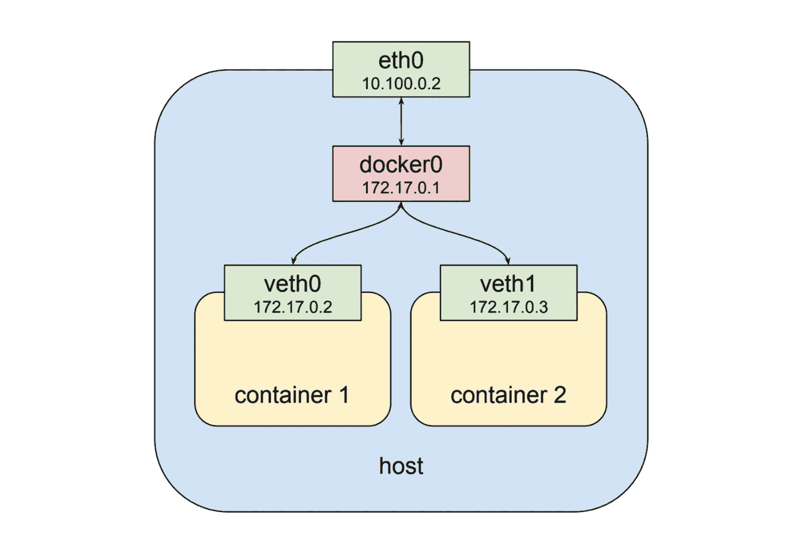
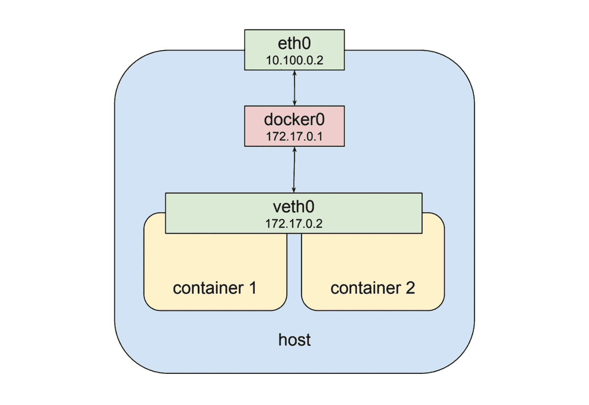
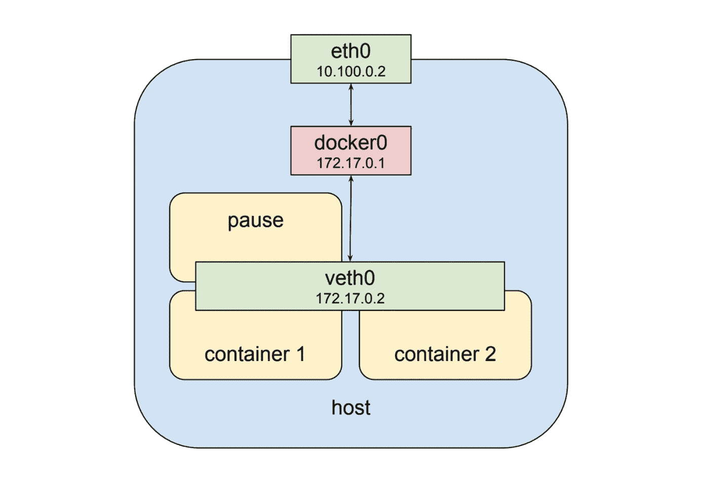
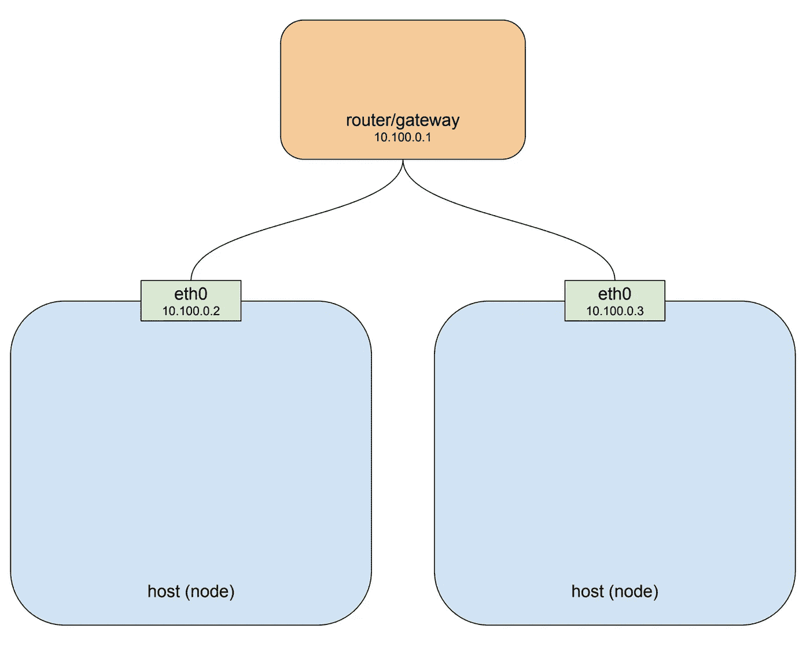
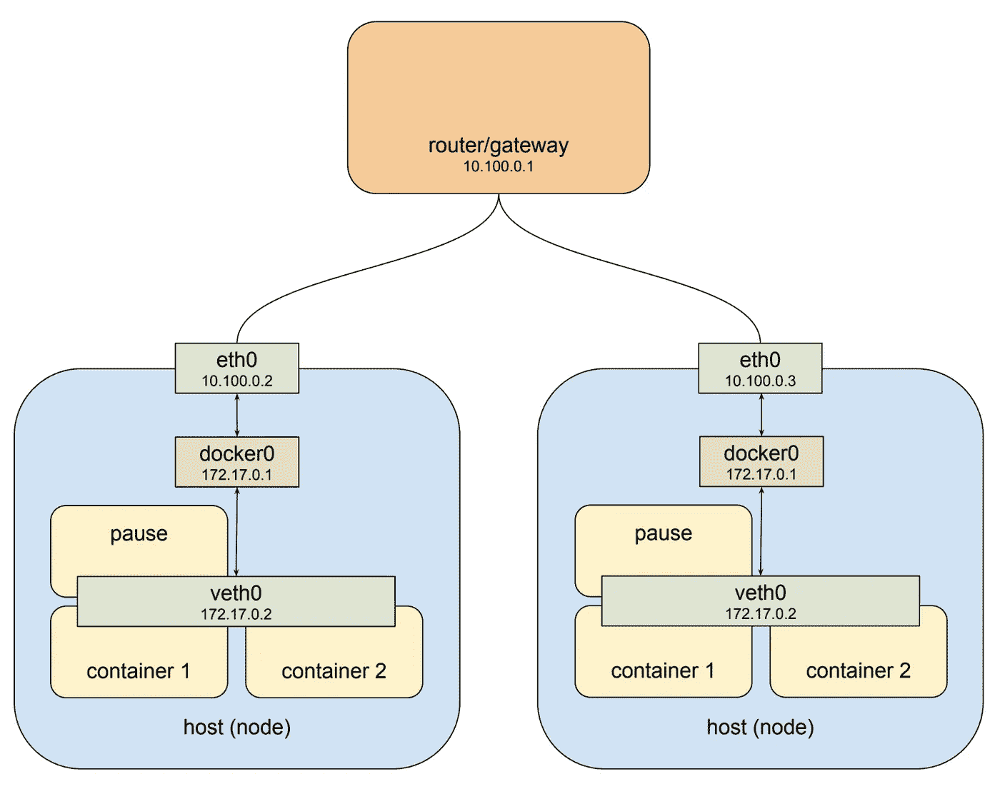
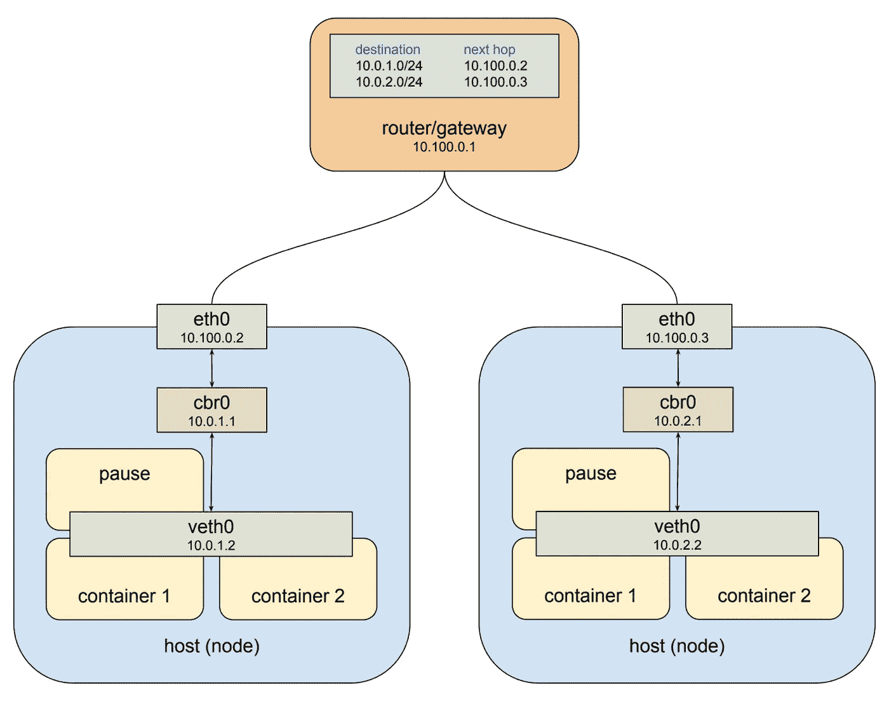

# 了解 kubernetes 网络:pods

> 原文：<https://medium.com/google-cloud/understanding-kubernetes-networking-pods-7117dd28727?source=collection_archive---------0----------------------->

这篇文章试图揭开在 kubernetes 集群中运行的几层网络的神秘面纱。Kubernetes 是一个包含许多智能设计选择的强大平台，但讨论事物交互的方式可能会令人困惑:pod 网络、服务网络、集群 IP、容器端口、主机端口、节点端口……我已经看到一些人目光呆滞。我们大多在工作中谈论这些事情，一次跨越所有层面，因为有些东西坏了，有人想修理它。如果你一次拿一块，弄清楚每一层是如何工作的，那么一切都会以一种相当优雅的方式变得有意义。

为了保持重点，我将这篇文章分成三部分。这第一部分将着眼于容器和荚。第二个[将检查服务](/@betz.mark/understanding-kubernetes-networking-services-f0cb48e4cc82)，这是允许 pod 短暂存在的抽象层。[的最后一个帖子](/@betz.mark/understanding-kubernetes-networking-ingress-1bc341c84078)将查看入口，并从集群外部获取流量。首先是一些免责声明。这篇文章并不是对容器、kubernetes 或 pods 的基本介绍。要了解更多关于容器如何工作的信息，请参见 [Docker](https://www.docker.com/) 中的[概述](https://docs.docker.com/engine/docker-overview/#the-underlying-technology)。在这里可以找到 kubernetes 的高级概述，在这里可以找到 pods 的概述。最后，基本熟悉[网络](https://www.digitalocean.com/community/tutorials/an-introduction-to-networking-terminology-interfaces-and-protocols)和 [IP 地址空间](https://www.digitalocean.com/community/tutorials/understanding-ip-addresses-subnets-and-cidr-notation-for-networking)会有所帮助。

# 分离舱

那么什么是豆荚呢？pod 由一个或多个容器组成，这些容器并置在同一台主机上，并配置为共享网络堆栈和其他资源，如卷。pod 是构建 kubernetes 应用程序的基本单元。“共享网络堆栈”实际上意味着什么？实际上，这意味着 pod 中的所有容器都可以在本地主机上互相访问。如果我有一个运行 nginx 并监听端口 80 的容器和另一个运行 scrapyd 的容器，那么第二个容器可以以 http://localhost:80 的形式连接到第一个容器。但是这到底是怎么回事呢？让我们看看在本地机器上启动 docker 容器时的典型情况:

从上到下，我们有一个物理网络接口 eth0。与之相连的是网桥 docker0，与之相连的是虚拟网络接口 veth0。请注意，docker0 和 veth0 都在同一个网络上，在本例中为 172.17.0.0/24。在这个网络上，docker0 被分配 172.17.0.1，并且是 veth0 的[默认网关](https://en.wikipedia.org/wiki/Default_gateway)，veth 0 被分配 172.17.0.2。由于启动容器时网络名称空间的配置方式，容器内部的进程只能看到 veth0，并通过 docker0 和 eth0 与外界通信。现在让我们启动第二个容器:

如上所示，第二个容器获得一个新的虚拟网络接口 veth1，连接到同一个 docker0 网桥。*这个接口被分配了 172.17.0.3，所以它与网桥和第一个容器在同一个逻辑网络上，两个容器只要能以某种方式发现对方容器的 IP 地址，就可以通过网桥进行通信。

[ *丹·尼森鲍姆指出，这种描述省略了一些细节。背景见我们的[简短讨论](/@dannissenbaum?source=post_header_lockup)。]

【* 12/15/2018:我之前的更新真的是把这个错误的下层给弄了。容器和网桥之间的连接是通过一对链接的虚拟以太网设备建立的，一个在容器网络命名空间中，另一个在根网络命名空间中。关于这个主题的概述，请参见 Kristen Jacobs 本周在西雅图 Kubecon 2018 上发表的“从零开始的集装箱网络”演讲(底部有幻灯片链接)。我真的很喜欢 Kristen 的演示，我打算在以后的容器网络上不要脸地复制它。]

[* 9/9/2019:[Ifeanyi Ubah 的这篇文章](http://ifeanyi.co/posts/linux-namespaces-part-4/)在探索 linux 网络名称空间和 veth 对方面做了大量工作]

这很好，但它不能让我们看到 kubernetes pod 的“共享网络堆栈”。幸运的是，名称空间非常灵活。Docker 可以启动一个容器，而不是为它创建一个新的虚拟网络接口，指定它[共享一个现有的接口](https://docs.docker.com/engine/reference/run/#network-settings)。在这种情况下，上面的图看起来有点不同:

现在，第二个容器看到 veth0，而不是像上一个示例那样获得自己的 veth1。这意味着:首先，两个容器都可以在 172.17.0.2 上从外部寻址，在内部，每个容器都可以访问本地主机上另一个容器打开的端口。这也意味着两个容器不能打开同一个端口，这是一个限制，但与在单个主机上运行多个进程的情况没有什么不同。这样，一组进程可以充分利用容器的解耦和隔离，同时在尽可能简单的网络环境中协作。

Kubernetes 通过为每个 pod 创建一个特殊的容器来实现这种模式，这个容器的唯一目的是为其他容器提供一个网络接口。如果您 ssh 到一个 kubernetes 集群节点，该节点上已经安排了 pods 并运行`**docker ps**`,您将看到至少有一个容器是用`**pause**`命令启动的。`**pause**`命令暂停当前进程，直到收到一个信号，所以这些容器除了休眠什么也不做，直到 kubernetes 给它们发送一个 SIGTERM。尽管缺少活动,“暂停”容器是 pod 的核心，它提供了虚拟网络接口，所有其他容器将使用该接口相互通信以及与外界通信。所以在一个假设的豆荚状物体中，最后一张图片看起来像这样:

# 豆荚网络

这一切都很酷，但一个装满可以相互交流的容器的舱并不能给我们带来一个系统。在我讨论服务的下一篇文章中，原因将变得更加清楚，kubernetes 设计的核心要求 pods 能够与其他 pods 通信，不管它们是运行在同一个本地主机上还是不同的主机上。为了了解这是如何发生的，我们需要更上一层楼，看看集群中的节点。这一部分将包含一些关于网络路由和路线的不幸的参考，一个我意识到全人类都希望避免的主题。找到一个关于 IP 路由的清晰、简短的教程是困难的，但是如果你想要一个像样的评论，维基百科关于主题的[文章并不可怕。](https://en.wikipedia.org/wiki/Routing_table)

kubernetes 集群由一个或多个节点组成。一个节点是一个主机系统，无论是物理的还是虚拟的，都有一个容器运行时及其依赖项(主要是 docker)和几个 kubernetes 系统组件，它连接到一个允许它访问集群中其他节点的网络。由两个节点组成的简单集群可能如下所示:

如果你在像 GCP 或 AWS 这样的云平台上运行你的集群，这个图很好地近似了单个项目环境的默认网络架构。为了便于说明，我在本例中使用了专用网络 10.100.0.0/24，因此路由器是 10.100.0.1，两个实例分别是 10.100.0.2 和 10.100.0.3。根据这种设置，每个实例都可以在 eth0 上相互通信。这很好，但是回想一下，我们上面看到的 pod 不在这个私有网络上:它挂在一个完全不同的网络上的桥上，这个网络是虚拟的，只存在于特定的节点上。为了使这一点更清楚，让我们把豆荚状的东西放回图片中:

左侧主机的接口 eth0 地址为 10.100.0.2，其默认网关是位于 10.100.0.1 的路由器。地址为 172.17.0.1 的网桥 docker0 连接到该接口，地址为 172.17.0.2 的接口 veth0 连接到该接口。veth0 接口是用 pause 容器创建的，由于共享的网络堆栈，它在所有三个容器中都是可见的。由于本地路由规则是在网桥创建时设置的，任何到达 eth0 的目的地址为 172.17.0.2 的数据包都将被转发到网桥，然后网桥会将它发送到 veth0。到目前为止听起来还不错。如果我们知道该主机上有一个位于 172.17.0.2 的 pod，我们可以向路由器添加规则，将该地址的下一跳设置为 10.100.0.2，它们将从那里转发到 veth0。太好了。现在让我们看看另一个主机。

右边的主机也有 eth0，地址为 10.100.0.3，使用相同的默认网关 10.100.0.1，再次连接到它的是 docker0 网桥，地址为 172.17.0.1。嗯。这将是一个问题。现在，这个地址实际上可能与主机 1 上的另一个网桥不同。我在这里做了同样的处理，因为这是一种病态的最坏情况，如果你安装了 docker 并让它做它该做的事情，它很可能会以这种方式工作。但是，即使选择的网络不同，这也凸显了更基本的问题，即一个节点通常不知道为另一个节点上的网桥分配了什么私有地址空间，我们需要知道是否要向它发送数据包，并让它们到达正确的位置。显然需要某种结构。

Kubernetes 以两种方式提供了这种结构。首先，它为每个节点上的网桥分配一个总的地址空间，然后根据网桥所在的节点，在该空间内分配网桥地址。其次，它将路由规则添加到 10.100.0.1 处的网关，告诉它应该如何路由去往每个网桥的分组，即该网桥可以通过哪个节点的 eth0 到达。这种虚拟网络接口、网桥和路由规则的组合通常被称为[覆盖网络](https://en.wikipedia.org/wiki/Overlay_network)。当谈到 kubernetes 时，我通常将这种网络称为“pod 网络”，因为它是一种覆盖网络，允许 pod 在任何节点上来回通信。这是上面这幅画，画的是 kubernetes:

值得一提的是，我已经将桥的名称从“docker0”改为“cbr0”Kubernetes 不使用标准的 docker 桥设备，事实上“cbr”是“自定义桥”的缩写。我不知道所有关于它的定制，但这是运行在 kubernetes 上的 docker 和默认安装之间的重要区别之一。另一件要注意的事情是，在这个例子中分配给网桥的地址空间是 10.0.0.0/14。这是从我们在谷歌云中的一个临时集群中提取的，这是一个真实的例子。您的集群可能会被分配一个完全不同的范围。不幸的是，目前没有办法使用`**kubectl**`实用程序来暴露这一点，但是在 GCP 上，你可以运行`**gcloud container** **clusters describe <cluster>**`命令并寻找`**clusterIpv4Cidr**`属性。

一般来说，你不需要考虑这个网络是如何运作的。当一个 pod 与另一个 pod 对话时，它通常通过服务的抽象来完成，这是一种软件定义的代理，这将是本系列下一篇文章的主题。但是 pod 网络地址会在日志中弹出，在调试时以及在某些情况下，您可能需要显式路由该网络。例如，从 kubernetes pod 发往 10.0.0.0/8 范围内任何地址的流量默认情况下都不会被 NAT，因此，如果您与该范围内的另一个专用网络上的服务进行通信，您可能需要设置规则来将数据包路由回 pod。希望这篇文章能帮助你采取正确的步骤来使这样的场景正常工作。

[更新]第 2 部分已发布:

[了解 kubernetes 网络:服务](/@betz.mark/understanding-kubernetes-networking-services-f0cb48e4cc82)