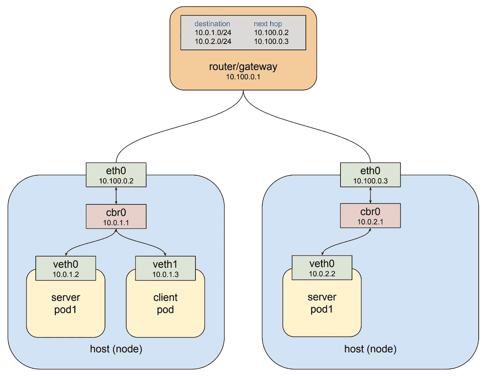
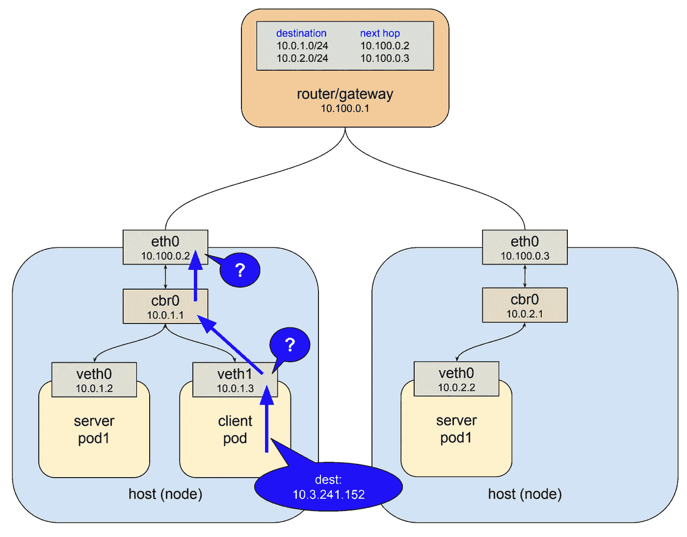
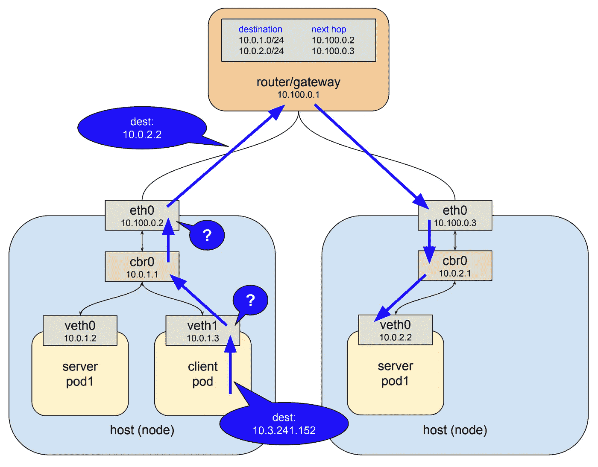
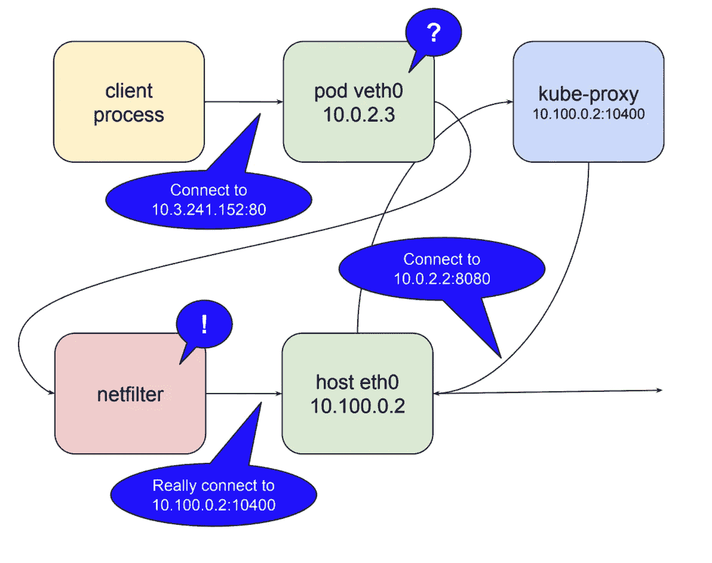
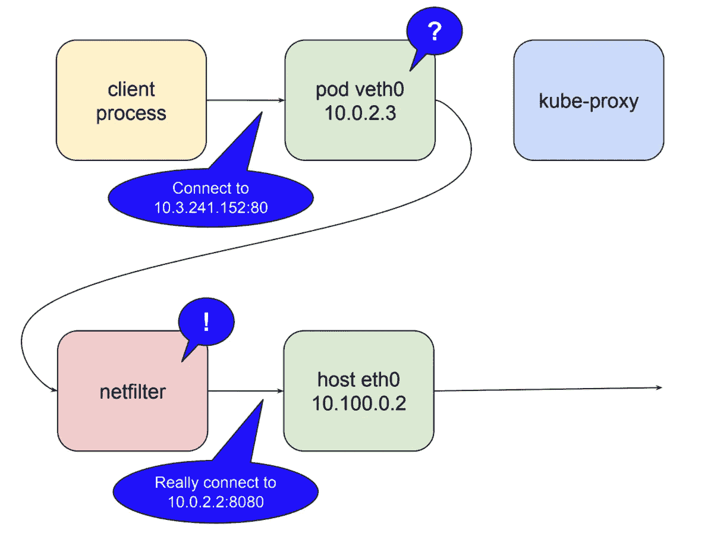

# 了解 kubernetes 网络:服务

> 原文：<https://medium.com/google-cloud/understanding-kubernetes-networking-services-f0cb48e4cc82?source=collection_archive---------0----------------------->

在本系列的[第一篇文章](/@betz.mark/understanding-kubernetes-networking-pods-7117dd28727)中，我介绍了 [kubernetes](https://kubernetes.io/) 如何结合使用虚拟网络设备和路由规则，允许在一个集群节点上运行的 pod 与在另一个集群节点上运行的 pod 进行通信，只要发送方知道接收方的 pod 网络 IP 地址。如果你还不熟悉 pods 是如何通信的，那么在继续之前值得一读。集群中的 Pod 网络是很好的东西，但是它本身不足以创建持久的系统。那是因为库伯内特的豆荚是短命的。您可以使用一个 pod IP 地址作为端点，但是不能保证下次重新创建 pod 时该地址不会改变，因为有许多原因可能会发生这种情况。

您可能已经意识到这是一个老问题，它有一个标准的解决方案:通过反向代理/负载平衡器运行流量。客户端连接到代理，代理负责维护健康服务器的列表，以便将请求转发到这些服务器。这意味着对代理的一些要求:它本身必须是耐用的和抗失败的；它必须有一个可以转发的服务器列表；而且它必须有某种方法知道特定的服务器是否健康，是否能够响应请求。kubernetes 的设计者以一种优雅的方式解决了这个问题，这种方式基于平台的基本功能来满足所有这三个需求，并且它从一种称为服务的资源类型开始。


# 服务

在第一篇文章中，我展示了一个假设的集群，其中有两个服务器单元，并描述了它们如何跨节点通信。在这里，我想以这个例子为基础来描述 kubernetes 服务如何在一组服务器单元之间实现负载平衡，从而允许客户机单元独立而持久地运行。要创建服务器单元，我们可以使用这样的[部署](https://kubernetes.io/docs/concepts/workloads/controllers/deployment/):

```
kind: Deployment
apiVersion: apps/v1
metadata:
  name: service-test
spec:
  replicas: 2
  selector:
    matchLabels:
      app: service_test_pod
  template:
    metadata:
      labels:
        app: service_test_pod
    spec:
      containers:
      - name: simple-http
        image: python:2.7
        imagePullPolicy: IfNotPresent
        command: ["/bin/bash"]
        args: ["-c", "echo \"<p>Hello from $(hostname)</p>\" > index.html; python -m SimpleHTTPServer 8080"]
        ports:
        - name: http
          containerPort: 8080
```

这个部署创建了两个非常简单的 http 服务器单元，它们在端口 8080 上响应运行它们的单元的主机名。使用`**kubectl apply**` 创建此部署后，我们可以看到 pod 正在集群中运行，我们还可以查询它们的 pod 网络地址:

```
**$ kubectl apply -f test-deployment.yaml
deployment "service-test" created****$ kubectl get pods
service-test-6ffd9ddbbf-kf4j2    1/1    Running    0    15s
service-test-6ffd9ddbbf-qs2j6    1/1    Running    0    15s****$ kubectl get pods --selector=app=service_test_pod -o jsonpath='{.items[*].status.podIP}'
10.0.1.2 10.0.2.2**
```

我们可以通过创建一个简单的客户端 pod 来发出请求，然后查看输出，从而演示 pod 网络正在运行。

```
apiVersion: v1
kind: Pod
metadata:
  name: service-test-client1
spec:
  restartPolicy: Never
  containers:
  - name: test-client1
    image: alpine
    command: ["/bin/sh"]
    args: ["-c", "echo 'GET / HTTP/1.1\r\n\r\n' | nc 10.0.2.2 8080"]
```

创建此 pod 后，命令将运行至完成，pod 将进入“完成”状态，然后可以使用`**kubectl logs**`检索输出:

```
**$ kubectl logs service-test-client1
HTTP/1.0 200 OK
<!-- blah -->****<p>Hello from service-test-6ffd9ddbbf-kf4j2</p>**
```

本例中没有显示客户机 pod 是在哪个节点上创建的，但是不管它在集群中的什么位置运行，它都能够到达服务器 pod 并获得响应，这要归功于 pod 网络。但是，如果服务器 pod 停止运行并重新启动，或者被重新安排到不同的节点，那么它的 IP 地址几乎肯定会发生变化，客户端也会崩溃。我们通过创建服务来避免这种情况。

```
kind: Service
apiVersion: v1
metadata:
  name: service-test
spec:
  selector:
    app: service_test_pod
  ports:
  - port: 80
    targetPort: http
```

一个[服务](https://kubernetes.io/docs/concepts/services-networking/service/)是一种 kubernetes 资源，它使得一个代理被配置为将请求转发给一组 pod。将接收流量的单元集由选择器决定，选择器匹配创建单元时分配给单元的标签。创建服务后，我们可以看到它已经被分配了一个 IP 地址，并将在端口 80 上接受请求。

```
**$ kubectl get service service-test
NAME           CLUSTER-IP     EXTERNAL-IP   PORT(S)   AGE
service-test   10.3.241.152   <none>        80/TCP    11s**
```

请求可以直接发送到服务 IP，但是最好使用可以解析到 IP 地址的主机名。幸运的是，kubernetes 提供了一个内部集群 DNS 来解析服务名，只要对客户机 pod 稍加修改，我们就可以使用它:

```
apiVersion: v1
kind: Pod
metadata:
  name: service-test-client2
spec:
  restartPolicy: Never
  containers:
  - name: test-client2
    image: alpine
    command: ["/bin/sh"]
    args: ["-c", "echo 'GET / HTTP/1.1\r\n\r\n' | nc service-test 80"]
```

在这个 pod 运行完成后，输出显示服务将请求转发给了其中一个服务器 pod。

```
**$ kubectl logs service-test-client2
HTTP/1.0 200 OK
<!-- blah -->****<p>Hello from service-test-6ffd9ddbbf-kf4j2</p>**
```

您可以继续运行客户机 pod，您将看到来自两个服务器 pod 的响应，每个服务器 pod 获得大约 50%的请求。如果您的目标是了解这实际上是如何工作的，那么从我们的服务被分配的 IP 地址开始是一个好地方。

# 服务网络

分配给测试服务的 IP 代表网络上的一个地址，您可能已经注意到该网络与 pod 所在的网络不同。

```
**thing        IP               network
-----        --               -------
pod1         10.0.1.2         10.0.0.0/14
pod2         10.0.2.2         10.0.0.0/14
service      10.3.241.152     10.3.240.0/20**
```

它也不同于节点所在的专用网络，这将在下面变得更清楚。在第一篇文章中，我注意到 pod 网络地址范围没有通过`**kubectl**` 公开，因此您需要使用特定于提供商的命令来检索这个集群属性。服务网络地址范围也是如此。如果你在谷歌容器引擎中运行，你可以这样做:

```
**$ gcloud container clusters describe test | grep servicesIpv4Cidr
servicesIpv4Cidr: 10.3.240.0/20**
```

这个地址空间指定的网络称为“服务网络”每个“ClusterIP”类型的服务都将在此网络上被分配一个 IP 地址。还有其他类型的服务，我将在下一篇关于 ingress 的文章中讨论其中的一些，但 ClusterIP 是默认的，它意味着“服务将被分配一个可从集群中的任何 pod 到达的 IP 地址。”您可以通过运行带有服务名的`**kubectl describe services**`命令来查看服务的类型。

```
**$ kubectl describe services service-test
Name:                   service-test
Namespace:              default
Labels:                 <none>
Selector:               app=service_test_pod
Type:                   ClusterIP
IP:                     10.3.241.152
Port:                   http    80/TCP
Endpoints:              10.0.1.2:8080,10.0.2.2:8080
Session Affinity:       None
Events:                 <none>**
```

像 pod 网络一样，服务网络是虚拟的，但是它在一些有趣的方面不同于 pod 网络。考虑 pod 网络地址范围`**10.0.0.0/14**`。如果您查看构成集群中节点的主机，列出网桥和接口，您将会看到在此网络上配置了地址的实际设备。这些是每个 pod 的虚拟以太网接口，以及将它们相互连接并与外界连接的网桥。

现在看看`**10.3.240.0/20**`的服务网络。你可以`**ifconfig**` 随心所欲，在这个网络上找不到任何配置了地址的设备。您可以在连接所有节点的网关处检查路由规则，您将不会找到该网络的任何路由。服务网络不存在，至少不是作为连接的接口。然而，正如我们在上面看到的，当我们向该网络上的 IP 发出请求时，不知何故，该请求到达了我们在 pod 网络上运行的服务器 pod。那是怎么发生的？我们跟着一包看看。

假设我们上面运行的命令在一个测试集群中创建了以下 pod:



这里我们有两个节点，连接它们的网关(也有 pod 网络的路由规则)，和三个 pod:节点 1 上的客户端 pod，节点 1 上的服务器 pod，节点 2 上的另一个服务器 pod。客户端使用 DNS 名称`**service-test**`向服务发出 http 请求。集群 DNS 系统将该名称解析为服务集群 IP `**10.3.241.152**`，客户端 pod 最终创建一个 http 请求，导致一些数据包在目的地字段中使用该 IP 发送。

IP 网络通常配置有路由，这样，当接口由于本地不存在具有该指定地址的设备而无法将数据包传送到其目的地时，它会将数据包转发到其上游网关。因此，在本例中，看到数据包的第一个接口是客户端 pod 内的虚拟以太网接口。该接口位于 pod 网络`**10.0.0.0/14**`上，并且不知道任何具有地址`**10.3.241.152**`的设备，因此它将数据包转发到其网关，即网桥 cbr0。网桥非常笨，只是来回传递流量，因此网桥将数据包发送到主机/节点以太网接口。



本例中的主机/节点以太网接口位于网络`**10.100.0.0/24**`上，它也不知道任何地址为`**10.3.241.152**`的设备，因此通常会发生的情况是，数据包会被转发到该接口的网关，即图中所示的顶级路由器。相反，实际发生的情况是，数据包在传输过程中被拦截，并被重定向到一个实时服务器。



三年前，当我第一次开始与 kubernetes 合作时，上图中发生的事情看起来非常神奇。不知何故，我的客户端能够连接到一个没有关联接口的地址，并且这些数据包在集群中的正确位置弹出。我后来知道这个秘密的答案是一个叫 kube-proxy 的软件。

# kube 代理

像 kubernetes 中的所有东西一样，服务只是一种资源，一个中央数据库中的记录，它描述了如何配置一些软件来做一些事情。事实上，一个服务会影响集群中几个组件的配置和行为，但这里最重要的一个，也是让上述奇迹发生的一个，是 kube-proxy。根据名称，你们中的许多人会对这个组件的功能有一个大致的了解，但是 kube-proxy 的一些特性使它与典型的反向代理非常不同，比如 [haproxy](http://www.haproxy.org/) 或 [linkerd](https://linkerd.io/) 。

代理的一般行为是通过两个开放的连接在客户机和服务器之间传递流量。客户端入站连接到服务端口，代理出站连接到服务器。由于所有这类代理都在用户空间中运行，这意味着每次通过代理时，包都被封送到用户空间并返回内核空间。最初，kube-proxy 只是作为这样一个用户空间代理来实现的，但是有所改变。代理需要一个接口，既用来监听客户端连接，又用来连接到后端服务器。节点上唯一可用的接口是 a)主机的以太网接口；或者 pod 网络上的虚拟以太网接口。

为什么不使用这些网络中的一个地址呢？我没有任何内部知识，但我想在项目的早期就已经很清楚，这样做会使这些网络的路由规则变得复杂，这些网络旨在满足 pod 和节点的需求，这两者都是集群中短暂的实体。服务显然需要它们自己的、稳定的、无冲突的网络地址空间，而虚拟 IP 系统是最有意义的。但是，正如我们注意到的，这个网络上没有实际的设备。您可以在路由规则、防火墙过滤器等中使用虚拟网络。，但是您不能实际监听端口或通过不存在的接口打开连接。

Kubernetes 使用 linux 内核中一个叫做 netfilter 的特性和一个叫做 iptables 的用户空间接口来解决这个问题。在这篇已经很长的文章中，没有足够的空间来详细说明这是如何工作的。如果你想了解更多，netfilter 页面是一个很好的起点。这是 tl。dr: netfilter 是一个基于规则的数据包处理引擎。它在内核空间中运行，并在其生命周期的不同点查看每个数据包。它将数据包与规则进行匹配，当找到匹配的规则时，它会采取指定的操作。它可以采取的许多行动包括将数据包重定向到另一个目的地。没错，netfilter 是内核空间代理。下面说明了 kube-proxy 作为用户空间代理运行时 netfilter 扮演的角色。



在这种模式下，kube-proxy 在本地主机接口上打开一个端口(在上面的示例中为 10400 ),以侦听对测试服务的请求，插入 netfilter 规则以将目的地为服务 IP 的数据包重新路由到其自己的端口，并将这些请求转发到端口 8080 上的 pod。这就是对`**10.3.241.152:80**`的请求如何神奇地变成对`**10.0.2.2:8080.**` 的请求鉴于 netfilter 的能力，使这一切对任何服务都起作用所需要的是 kube-proxy 打开一个端口并为该服务插入正确的 netfilter 规则，这是为了响应来自主 api 服务器的关于集群中变化的通知。

这个故事还有一个小小的转折。我在上面提到过，由于封送数据包，用户空间代理非常昂贵。在 kubernetes 1.2 中，kube-proxy 获得了在 iptables 模式下运行的能力。在这种模式下，kube-proxy 不再是集群间连接的代理，而是将检测发往服务 IP 的数据包并将其重定向到 pods 的工作委托给 netfilter，所有这些都发生在内核空间。在这种模式下，kube-proxy 的工作或多或少局限于保持 netfilter 规则同步。



作为总结，让我们将上面描述的所有内容与本文开头列出的可靠代理的要求进行比较。服务代理系统持久吗？默认情况下，kube-proxy 作为一个 systemd 单元运行，因此如果失败，它将重新启动。在谷歌容器引擎中，它作为一个由 [daemonset](https://kubernetes.io/docs/concepts/workloads/controllers/daemonset/) 控制的 pod 运行。这将是未来的默认设置，可能会出现在 1.9 版本中。作为用户空间代理，kube-proxy 仍然代表单点连接故障。当在 iptables 模式下运行时，从尝试连接的本地 pods 的角度来看，系统是高度耐用的，因为如果节点启动，则 netfilter 也启动。

服务代理是否知道可以处理请求的健康的服务器单元？如上所述，kube-proxy 监听主 api 服务器以发现集群中的变化，包括服务和端点的变化。当它接收更新时，它使用 iptables 来保持 netfilter 规则同步。当创建一个新服务并填充其端点时，kube-proxy 会收到通知并创建必要的规则。类似地，当删除服务时，它也删除规则。针对端点的健康检查由 kubelet 执行，kubelet 是在每个节点上运行的另一个组件，当发现不健康的端点时，kube let 通过 api 服务器通知 kube-proxy，并编辑 netfilter 规则以删除该端点，直到它再次变得健康。

所有这些构成了一个高度可用的集群范围的工具，用于在 pod 之间代理请求，同时允许 pod 本身随着集群需求的变化而变化。然而，这个系统也不是没有缺点。最基本的一点是，它仅适用于集群内部发起的请求，即从一个 pod 到另一个 pod 的请求。另一个是 netfilter 规则工作方式的结果:对于来自集群外部的请求，规则会模糊原始 IP。这引起了一些争论，目前正在积极考虑解决办法。当我们在本系列的最后一篇文章中讨论入口时，我将更仔细地研究这两个问题。

[更新]第 3 部分已发布:

[了解 kubernetes 网络:入口](/@betz.mark/understanding-kubernetes-networking-ingress-1bc341c84078)