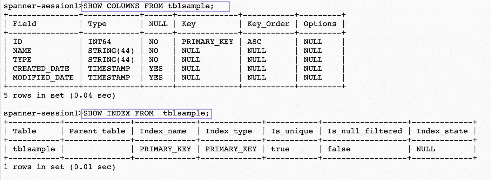
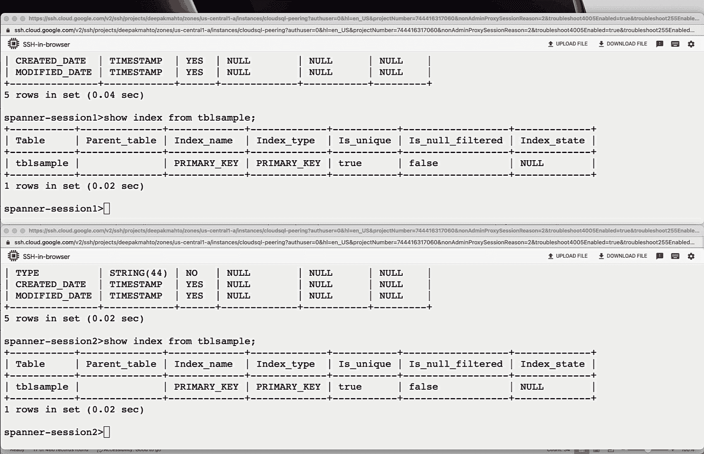
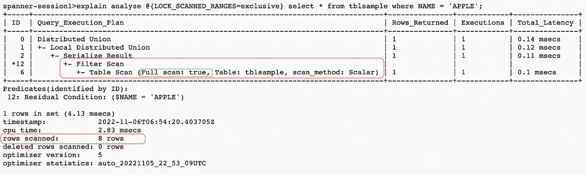
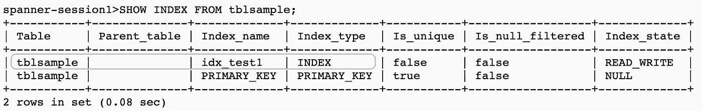
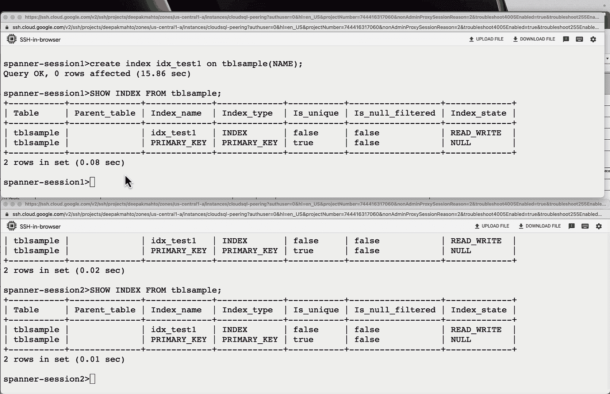
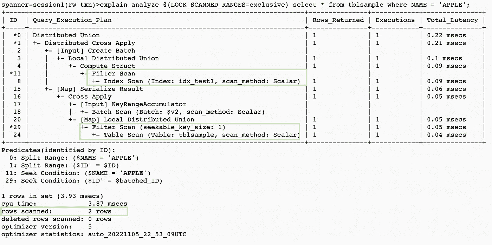

# 理解云扳手的 lock_scanned_ranges 提示

> 原文：<https://medium.com/google-cloud/understanding-lock-scanned-ranges-hint-of-cloud-spanner-5d245ecf7e9c?source=collection_archive---------3----------------------->

Google Cloud Spanner 是一个现代化的完全托管的关系数据库，在任何规模下都提供最高的可用性和一致性。由于熟悉 Ansi SQL 语言，它很容易被数据库开发人员采用，现在它也提供了 PostgreSQL 兼容的接口。

提示一直是数据库提供的核心特性之一，用来影响各种选项，如要使用的连接顺序、方法或索引。Spanner 支持许多这样的提示，在这个博客中我们将讨论关于 **LOCK_SCANNED_RANGES** 的提示。对于在事务内将锁从共享升级到独占的事务，或者观察到高写入争用和事务中止情况的事务，需要获取独占锁。

lock_scanned_ranges 提示帮助我们获取行上的排他锁，作为 select 的一部分，并在事务完成后释放。在实现 lock_scanned_ranges 之前，需要注意一些重要的事项。

让我们行动起来，更好地理解它，将我们的样本。表 tblsample 包含一些虚拟记录，并在名称过滤器上使用 lock_scanned_rows。

```
CREATE TABLE tblsample (
ID INT64 NOT NULL,
NAME STRING(44) NOT NULL,
TYPE STRING(44) NOT NULL,
CREATED_DATE TIMESTAMP,
MODIFIED_DATE TIMESTAMP
)PRIMARY KEY(ID);INSERT INTO tblsample (ID,NAME, TYPE, CREATED_DATE)
SELECT *
FROM UNNEST ([(1,'APPLE', 'FRUIT', CURRENT_TIMESTAMP),
(2,'CAR', 'VEHICLE', CURRENT_TIMESTAMP),
(3,'MANGO', 'FRUIT', CURRENT_TIMESTAMP),
(4,'BANANA', 'FRUIT', CURRENT_TIMESTAMP),
(5,'CRICKET', 'SPORTS', CURRENT_TIMESTAMP),
(6,'FOOTBALL', 'SPORTS', CURRENT_TIMESTAMP),
(7,'POTATO', 'VEGETABLE', CURRENT_TIMESTAMP),
(8,'KIWI', 'FRUIT', CURRENT_TIMESTAMP)
]);
```

我们将使用 [spanner-cli](https://github.com/cloudspannerecosystem/spanner-cli) 连接到 spanner 并执行我们的示例查询。



斯潘内尔克利

使用 lock_scanned_ranges，我们将在相关的行上实现排他锁，并阻止另一个会话对行的排他访问。

在 session1 中，我们使用只返回一行的过滤器 name = '***apple****'*的 *sql 获取排他锁。在会话 2 中，我们尝试获取锁，但使用了不同的过滤器*name = '****mango****'*，该过滤器也将只返回 1 行，但它正在等待获取锁。*



为了理解为什么会话 2 不能获得锁，我们可以查看执行计划并建立我们的观察。



基于执行计划和 lock_scanned_ranges 提示突出显示了一些关键观察结果。

> **表 tblsample 上的访问模式**是**全扫描**，因为**名称列上没有索引**
> 
> **扫描的行数(8 行)**比**返回的行数(1 行)**高
> 
> **lock_scanned_ranges** 顾名思义，就是**不是基于**返回的**行而是基于**扫描的**行。**

设计最佳访问模式以最小化扫描的行数很重要，主要是在使用 lock_scanned_ranges 提示时。扫描未获得返回的行可能会造成热锁争用，并由于扫描行上的行锁而影响伸缩。

让我们继续为示例表的 name 列创建一个辅助索引。

```
spanner-session1>create index idx_test1 on tblsample(NAME);
Query OK, 0 rows affected (15.86 sec)
```



现在，如果我们重试前面的场景，在 session1 中，我们使用只返回一行的过滤器 name = '***apple****'*使用 *sql 获取排他锁。在会话 2 中，我们尝试获取锁，但使用不同的过滤器*name = '****mango****'*将仅返回 1 行，锁将成功。*



由于有了新的索引，扫描的行将减少到仅筛选的行，如果另一个会话需要锁定其他行，它将会成功。



## 结论

对排他锁使用 lock_scanned_ranges 需要详细了解执行计划中扫描的行和底层访问模式。它应该用在具有索引访问模式的筛选器上，以最小化扫描的行数。