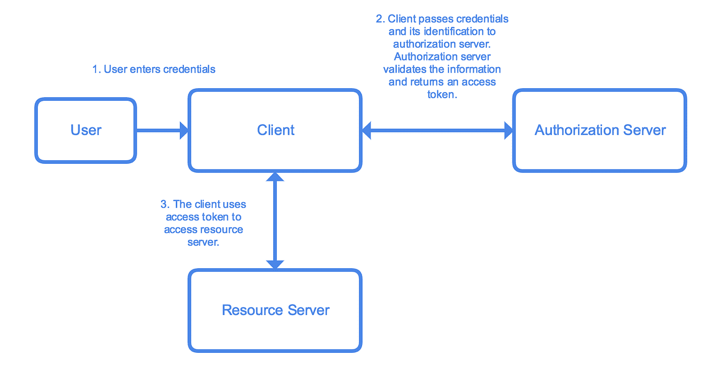
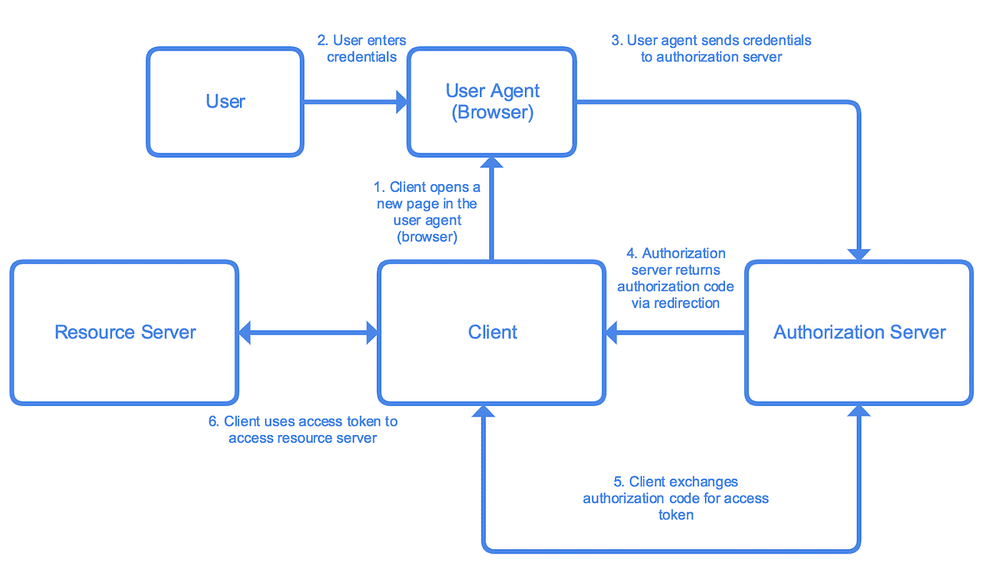
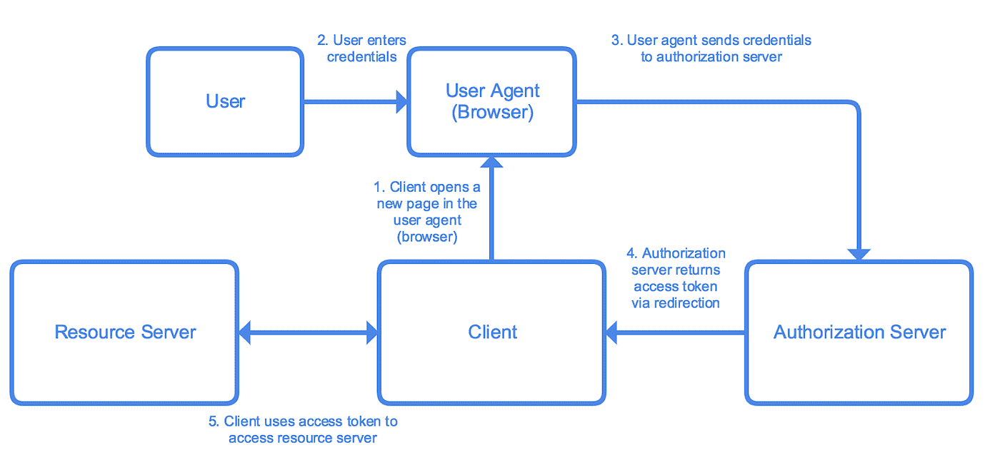
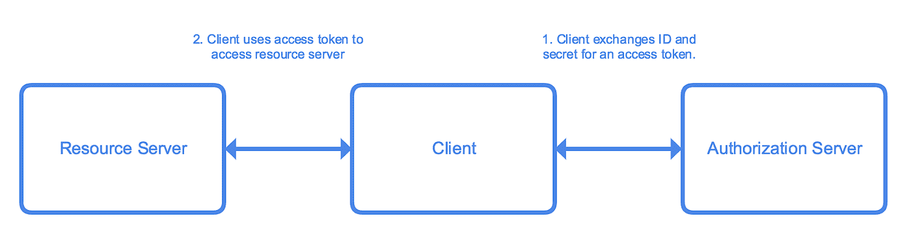

# 了解 OAuth2 并构建自己的基本授权服务器:初学者指南

> 原文：<https://medium.com/google-cloud/understanding-oauth2-and-building-a-basic-authorization-server-of-your-own-a-beginners-guide-cf7451a16f66?source=collection_archive---------0----------------------->

这本初学者指南提供了 OAuth2 的基本概述，并讨论了如何构建一个简单的 OAuth2 授权服务器。

有关在 Google 云平台上部署基本 OAuth2 认证服务的分步教程，请参见[了解 OAuth2 并将基本 OAuth2 授权服务部署到云功能的教程](/@ratrosy/understanding-oauth2-and-deploying-a-basic-oauth2-authorization-service-to-cloud-functions-812e3643f94d)。

# 背景

许多授权过程涉及用户提供的凭证，最常见的形式是用户名/密码组合。早期的网站通常通过 HTML 表单要求凭证，浏览器会将凭证发送到服务器。服务器验证信息并在 cookie 中写入一个会话值；只要会话仍标记为活动，用户就可以访问受保护的功能和资源。由于其简单性和有效性，这个过程至今仍被许多 web 应用程序和服务所使用。

尽管基于 cookie 的授权可能很受欢迎，但它有几个缺点:

*   基于 Cookie 授权通常是有状态的。服务器必须保存活动会话的记录，并在每次请求到达时检查数据库，这需要服务器端的一些开销。将授权过程与应用服务器分离也很困难。
*   Cookies 通常与域捆绑在一起。如果您的应用程序与多个域交互，可能需要额外的配置。
*   基于 Cookie 的授权不适合移动客户端。
*   基于 Cookie 的授权不能很好地适应一个产品或服务的用户想要授权第三方客户访问他们在平台上的信息的用例。

OAuth 解决了这些问题。作为一种授权框架，它使应用程序能够从各种服务中访问资源，在 web 上得到广泛应用。目前 OAuth 有两个版本的协议，OAuth 1.0 ( [RFC 5849](https://tools.ietf.org/html/rfc5849) )和 OAuth 2.0 ( [RFC 6749](https://tools.ietf.org/html/rfc6749) )。本指南重点介绍 2.0 版本。实质上，OAuth 2.0 允许任意的**客户端**(例如，第一方 iOS 应用程序或第三方 web 应用程序)通过**授权服务器**以安全、可靠和高效的方式访问**资源服务器**上用户**资源所有者**的资源。

> OAuth 2.0 不向后兼容以前的版本。关于选择 OAuth 2.0 而不是 OAuth 1.0 的优缺点仍然是一个争论的话题。

OAuth 2.0 规范定义了 4 种类型的授权流:

*   **授权码**
*   **资源所有者密码凭证**
*   **含蓄**
*   **客户凭证**

**隐式**和**客户端凭证**是通常为特殊类型的客户端保留的流。更具体地说，

至于其他客户端，根据其可信度，可以使用以下流程:

不严格地说，如果你计划**建立一个第三方** **应用和服务可以访问其资源**的平台，就按照授权代码流程走；另一方面，您可以使用资源所有者密码凭证流**为您自己的服务**构建一个客户端(一个 web/移动应用程序)。

令牌在 OAuth 2.0 中起着重要的作用。有两种类型的令牌:访问令牌和刷新令牌。任何拥有有效访问令牌的人都可以访问受保护的资源；通常它是短暂的，因此即使出现安全漏洞和访问令牌泄露，也可以快速控制损害。当访问令牌过期时，开发人员可以使用可选的刷新令牌来请求新的访问令牌，而不必要求用户再次输入他们的凭据。

# 授权流程

## 资源所有者密码凭据

资源所有者密码凭证流程有以下要求:

*   客户端必须是高度可信的，因为它直接处理用户凭据。大多数情况下，客户端应该是第一方 app。

该流程包括以下步骤:

1.  **客户端**提示**用户**输入他们的凭证(例如，用户名/密码组合)。
2.  **客户端**向**授权服务器**发送凭证及其自身标识。**授权服务器**验证信息，然后返回访问令牌和可选的刷新令牌。
3.  **客户端**使用访问令牌访问**资源服务器**上的资源。

## 授权代码

授权代码流有以下要求:

*   客户端必须能够与环境中的用户代理(浏览器)进行交互。

该流程包括以下步骤:

1.  **客户端**准备到**授权服务器**的链接，并在**用户代理**(浏览器)中为用户打开链接。该链接包括允许授权服务器识别和响应客户端的信息。
2.  用户在新页面上输入他们的凭据。
3.  凭证通过用户代理(浏览器)发送到授权服务器。
4.  **授权服务器**验证凭证，并使用授权码将用户重定向回**客户端**。
5.  客户端与**授权服务器**对话，确认其身份，并将授权码交换为访问令牌和可选的刷新令牌。
6.  **客户端**使用访问令牌访问**资源服务器**上的资源。

请注意，出于安全考虑，尽管移动应用程序客户端和 web 应用程序客户端都可以使用授权代码流，但它们在流中标识自己的方法是不同的。Web 应用客户端通常使用客户端 id 和客户端机密，**而移动应用客户端需要采用代码交换证明密钥(PKCE)技术，并利用代码质询和代码验证器。**

## 隐式凭据和客户端凭据

如前所述，隐式流是为单页 Javascript 应用程序设计的。除了涉及授权代码的部分之外，这个流程与授权代码流程非常相似。出于安全考虑，在这个流程中，客户端不再从授权服务器接收授权码；相反，在用户代理成功传输凭证后，授权服务器会将访问令牌直接返回给客户端。隐式流中不允许刷新令牌。

另一方面，客户端凭据流更接近于资源所有者密码凭据流。这个流中的客户端使用客户端 id 和机密来标识自己，并与授权服务器交换访问令牌。您也不应该在这个流中使用刷新令牌。

# JWT (JSON Web 令牌)

您可能已经意识到，尽管在 OAuth 2.0 中经常引用令牌，但是到目前为止，很少有人谈到它们的生成和使用。事实是，OAuth 2.0 框架并没有指定访问令牌和刷新令牌应该采用什么格式，而是由开发人员自己决定是否将令牌集成到他们选择的授权流中。从理论上讲，您可以使用一个永远不会过期的预定义字符串作为访问令牌，尽管它显然不是非常安全；然而在现实中，许多开发人员选择使用 [JWT (JSON Web Token)](https://tools.ietf.org/html/rfc7519) 格式。JWT 是独立的，允许服务器验证令牌而无需查询数据源。

JWT 包括三个部分:

*   描述令牌类型及其使用的哈希算法的标头
*   包含数据的有效载荷
*   用于验证令牌的签名

所有这三个部分都应该进行`Base64URL`编码，以便它们可以在查询字符串中安全地传输。

你可以在 JWT 中使用许多哈希算法，有效载荷有各种预定义的字段(也称为[注册声明名称](https://tools.ietf.org/html/rfc7519#section-4.1))。这本初学者指南使用了`RS256`(带 SHA-256 的 RSA 签名)算法，并在有效负载中指定了两个注册声明:`exp`(令牌何时过期)，以及`iss`(令牌由谁发布)。除了受支持的声明之外，您还可以在有效负载中定义自己的声明，比如令牌的范围。

每次 JWT 到达服务器时，系统首先解析 JWT，并验证是否支持报头中指定的算法；然后检查签名以确保 JWT 是有效的，最后，确认注册的声明(如果存在)是有效的。在本指南中，这意味着确保 JWT 没有过期(`exp`)，并且来自预期的来源(`iss`)。自定义声明(如范围)可以从令牌中提取并手动验证。

## 到期日期和刷新令牌

此外，开发人员可以控制访问令牌的生命周期和刷新令牌的使用。一般来说，如果您正在构建一个保护关键资源的授权服务器，那么最好远离刷新令牌，并保持访问令牌的短暂性。不过，对于不太重要的资源，启用刷新令牌并让访问令牌存在更长时间是可以的。抵制创造常青代币的诱惑；长期访问令牌确实使开发更容易，但是在安全性和便利性之间总是有一个折衷。

# 下一步是什么

本初学者指南包括详细解释每个授权流程如何工作的示例:

*   [资源所有者密码凭证](/@ratrosy/building-a-basic-authorization-server-using-resource-owner-password-credentials-flow-a666d06900fb)
*   [授权代码流程](/@ratrosy/building-a-basic-authorization-server-using-authorization-code-flow-c06866859fb1)
*   [授权码流程(PKCE)](/@ratrosy/building-a-basic-authorization-server-using-authorization-code-flow-pkce-3155e843466)
*   [隐式流](/@ratrosy/building-a-basic-authorization-server-with-implicit-flow-3f474eb2a306)
*   [客户凭证流程](/@ratrosy/building-a-basic-authorization-server-using-client-credentials-flow-db353d6debdf)

这些文档在很大程度上是相互独立的。如果您已经决定了使用哪个授权流，请随意从您选择的示例开始。为了全面了解 OAuth 2.0 的运行情况，建议从授权代码流开始。

此外，[了解 OAuth2 并构建一个具有云功能的基本 OAuth2 授权服务器](/@ratrosy/understanding-oauth2-and-deploying-a-basic-oauth2-authorization-service-to-cloud-functions-812e3643f94d)教程展示了如何使用一个无服务器解决方案， [Google Cloud Functions](https://cloud.google.com/functions/) ，将一个定制的 OAuth 2.0 授权服务部署到云上。