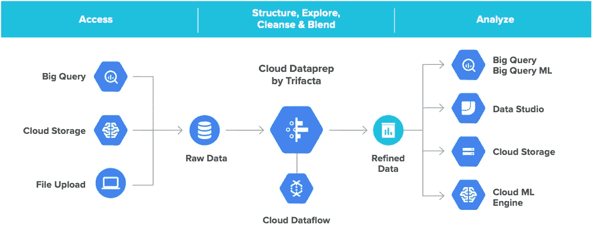
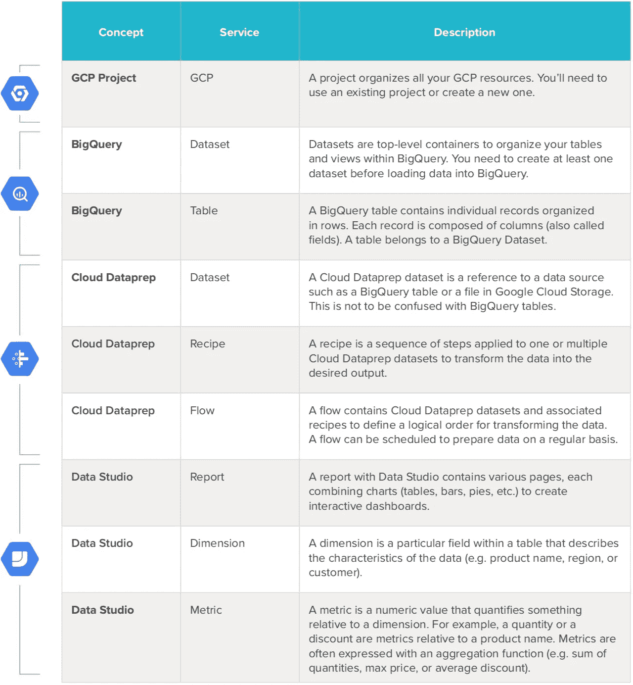
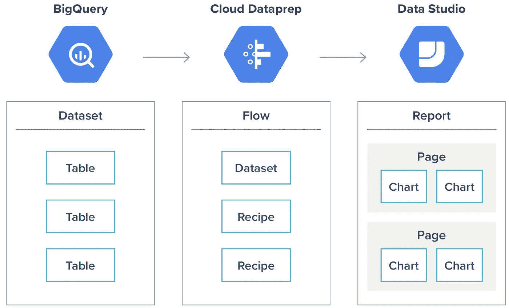

# 通过云数据准备了解 BigQuery 上的自助服务分析

> 原文：<https://medium.com/google-cloud/understanding-self-service-analytics-on-bigquery-with-cloud-dataprep-7f1ed729a42a?source=collection_archive---------1----------------------->

本文概述了我在探索 Google 云平台时学到的基本概念，以便为我自己的报告需求建立一个分析框架。我希望能够在大型数据集上快速构建临时和重复的报告，以获得必要的洞察力，从而为一些业务决策提供信息(并与团队共享)，或者为我正在开展的一些营销活动提供数据。

我对这个结果非常满意，并想在这里分享我所学到的东西，以便其他人可以更快地得到类似的结果。希望它也能对你有用。

# **什么是自助分析？**

对我来说，自助服务分析的目标是让像我这样的数据驱动型专业人士能够为他们的分析创建自己的端到端解决方案，响应他们的决策需求，并进行深入研究。自助服务意味着不需要依赖他人来完成工作，并且所使用的技术简单、强大且可扩展，足以被任何人轻松采用以快速交付成果。

# 谷歌云平台(GCP)上的自助服务分析包含哪些要素？

要建立自助服务分析实践，您需要依赖三个基本要素:数据存储、数据准备和数据可视化。

**数据存储。**您需要一个您的数据可以生存和增长的空间。这种数据存储是构建分析的基础。在 GCP，存储和检索大规模分析数据的最简单方法是 BigQuery。

**资料准备。**从数据存储层，您可以准备用于报告和仪表板的数据。您将使用 Cloud Dataprep 来清理、标准化、组合和创建存储在 BigQuery 中的各种计算和指标，以便您可以在其上设计可视化层。数据

**可视化。**可视化层以包含图形和表格的各种报告和仪表板的形式显示您的数据，以直观地呈现数据，帮助您进行数据驱动的决策流程。您将使用 Data Studio 消费 BigQuery 数据来创建您的报告和仪表板。具备这些基本要素后，您就可以实施可扩展的综合自助服务分析解决方案了。

# 了解 GCP 自助分析概念

以下是基于 GCP 构建的端到端自助服务分析解决方案的基本概念。这些概念是您需要理解和迭代自助服务分析解决方案的基础。

自助分析的 GCP 概念

以下是这些概念及其关系的可视化表示，用于在 GCP 内创建自助服务分析解决方案。

概念之间的流动

# 从理论走向实践

还是有点太理论化了？没问题！您可以按照[这份逐步指南亲身体验如何构建您的第一个端到端分析解决方案](/@bcariou/self-service-analytics-on-bigquery-live-in-30-min-stopwatch-in-hand-b106fc223652)。您将建立一个利用 BigQuery 存储和检索数据的可扩展自助服务分析解决方案；Cloud Dataprep 清理、组合和创建度量标准；和 Google Data Studio 来可视化地报告您的数据。通过更深入地探索每项 GCP 服务并重复这些原则，您将能够以自助方式解决任何分析需求。

*原载于 2019 年 7 月 24 日*[*www.trifacta.com*](https://www.trifacta.com/resource-library/getting-started-with-self-service-analytics-on-bigquery-with-cloud-dataprep/)*。*