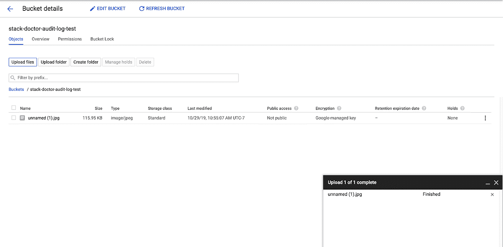
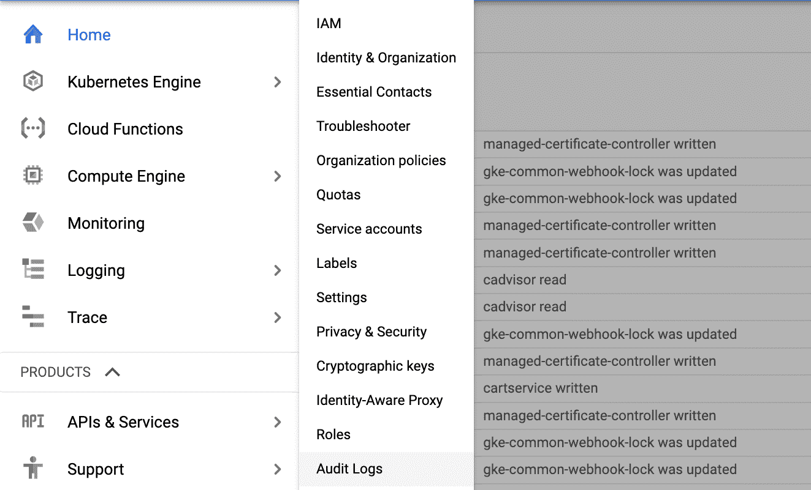
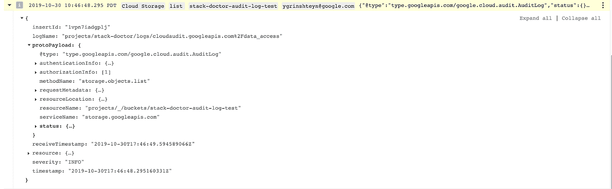

# 了解堆栈驱动程序审核日志

> 原文：<https://medium.com/google-cloud/understanding-stackdriver-audit-logs-3879473de82a?source=collection_archive---------0----------------------->

这篇文章是与 Roman Mezhibovski 合作撰写的。

在 GCP，审计日志提供了关于资源和数据如何被创建、修改和访问的不变记录。本指南旨在帮助您了解:

*   什么是“现成”记录的
*   如何打开附加审核日志记录
*   如何使用多个日志条目来形成特定事件的完整画面

我们将使用 GCS 来演示不同的日志是如何显示的。让我们开始吧！

# “现成的”审计日志记录

查看项目中已审核事件记录的第一个也是最容易的位置是在云控制台的“活动”选项卡中:


> [**注意**](https://cloud.google.com/logging/docs/audit/#view-activity) 这个视图呈现的是“简短的项目级审计日志条目”，而不是每个事件的全部细节。

我们来看一个具体的例子。首先创建一个云存储桶:


您将在控制台的“Activity”选项卡上看到反映存储桶创建的记录:


> **注意**您可以根据资源或类别过滤活动页面中的条目，以便更容易找到它们。

我们还可以在 Stackdriver 日志中找到匹配的日志条目:


这将创建一个日志条目，其 logName 设置为

```
projects/<project ID>/logs/cloudaudit.googleapis.com%2F**activity`**
```

并将 protoPayload 中的@type 字段设置为

```
type.googleapis.com/google.cloud.audit.AuditLog
```

现在，将一个文件上传到存储桶，以向其中添加一个对象:



您将看到活动页面没有任何新条目—没有您上传该文件的记录。如果您从 bucket 中删除该文件，您会发现也没有相关记录。这是怎么回事？

您将看到在[文档](https://cloud.google.com/logging/docs/audit/#top_of_page)中描述的行为。具体来说，创建资源被认为是一项管理活动——正如您所看到的，这些事件总是被记录下来。但是，将对象添加到存储桶或删除是用户驱动的操作，会修改用户数据，而不是资源本身。因此，我们需要启用额外的审计日志来创建它的记录。让我们接下来做那件事。

# 审核日志记录

您可以通过从 IAM 和 Admin 下的 Products 菜单中选择该选项来获取审核日志:



结果页面显示了您可以为 GCP 服务启用的数据访问日志:


您可以在[文档](https://cloud.google.com/logging/docs/audit/configure-data-access)中阅读更多关于配置审计日志的信息。关于审计日志，需要了解的主要内容有:

1.  有三种类型的审核日志—系统事件、管理活动和数据访问。前两个是自动为您编写的，您无法控制它们。因此，它们不会产生费用。
2.  作为管理员，您可以启用额外的数据访问审核日志，这些日志需要付费，并且会导致创建大量数据。
3.  数据访问日志有三个子类型—管理员读取、数据读取和数据写入


# 管理员读取审计日志

您可以启用的第一个日志类型是管理员读取。[文档](https://cloud.google.com/logging/docs/audit/configure-data-access)将这些日志描述为“记录读取元数据或配置信息的操作”打开管理员读取审计日志并保存配置。当您下一次刷新云控制台中的 bucket 信息时，您将在 Activity 选项卡中看到一个新条目，显示您对该资源的检索:


您还可以在日志查看器中看到相应的日志条目:


有效负载包含关于您的请求的详细信息，如您的用户名、您访问的资源以及您用来访问它的 API 和方法——在本例中是 storage.buckets.get。您还应该看到另一个包含 storage.objects.list 的条目——这是列出 bucket 中的对象的调用。注意，这个条目的日志名字段是

```
projects/<project ID>/logs/cloudaudit.googleapis.com%2F**data_access**
```

如果此时您尝试将另一个对象添加到您的存储桶或删除一个对象，您将会看到在日志查看器或活动页面中没有生成额外的条目。这是因为该活动并不修改或检索关于资源本身的数据——它只是修改该资源内的用户数据。让我们转到数据读取审计日志，看看它是如何工作的。

# 数据读取审计日志

打开数据读取审计日志。如果在控制台中刷新存储段详细信息，您将在活动页面中看到一个新条目，显示您执行了 storage.objects.list API:


您可以在日志查看器中看到相应的条目:



> **注意**条目具有相同的日志名和原始有效负载。@类型和以前一样——真正的不同是 **protoPayload.methodName** 字段，它现在显示存储。 **objects.list** ，而不是存储。 **buckets.get** 。

如果您现在使用

```
gsutil cat gs://<bucket name>/<file name>
```

您将看到该操作的新活动条目:


相应的日志条目也具有相同的日志名和@type。methodName 是“storage . objects . get”——这是对一个对象的操作，而不是对存储桶的操作，并且正在检索该对象，因此这是有意义的:


# 数据写入审计日志

最后，在审计日志配置页面中打开数据写入审计日志。现在，将另一个对象上传到您的存储桶。您应该注意到活动页面中有一个新条目:


日志查看器中有一个相应的新条目:


该条目具有相同的日志名和原始有效负载。@type 同上，protoPayload.methodName 为 storage.objects.create。

# 摘要

让我们总结一下这些操作及其生成的日志类型:


# 下一步是什么？

我希望这有助于您理解如何在 GCP 控制审计日志。请注意，您为这些示例启用的额外日志类型需要支付标准的日志记录费用，并且可能会产生额外的成本——如果担心这一点，请禁用它们。

为了简单起见，我将重点放在这些例子的 GC 上。你可以在这里阅读更多关于审计日志如何为 GCS 工作的信息，在这里查看其他支持审计日志的 GCP 服务[。](https://cloud.google.com/logging/docs/audit/services)

一旦您理解了您的审计日志选项，您就可以了解如何[导出](https://cloud.google.com/solutions/design-patterns-for-exporting-stackdriver-logging)审计日志以满足合规性或安全性，并深入研究审计日志[文档](https://cloud.google.com/logging/docs/audit)。我很感谢 Roman Mezhibovski 对这篇文章的帮助，也很感谢你的阅读！