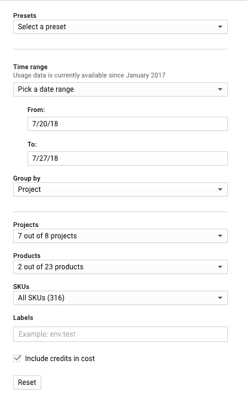
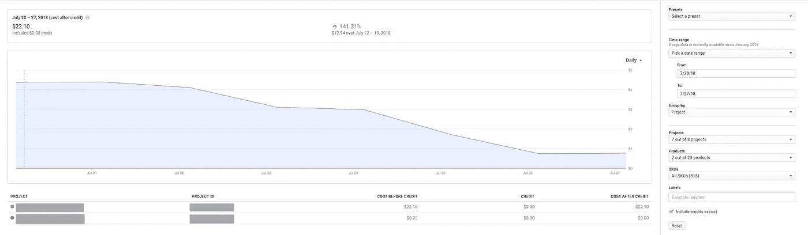
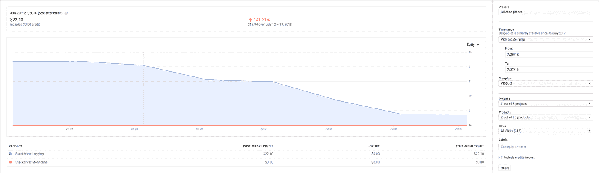
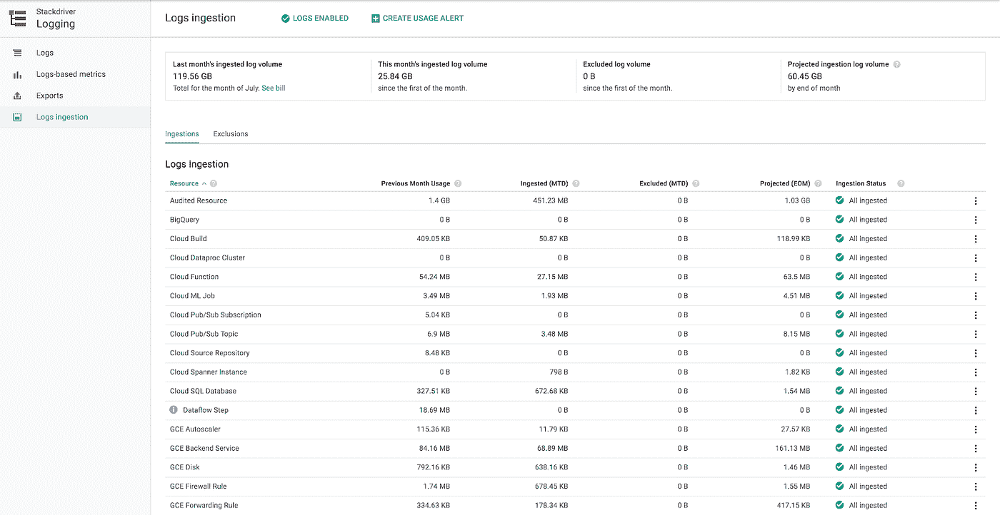
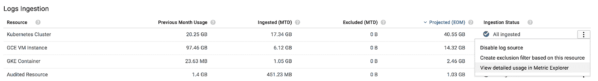
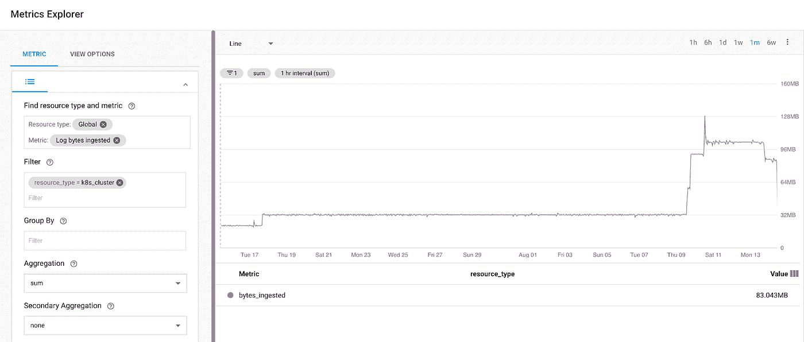
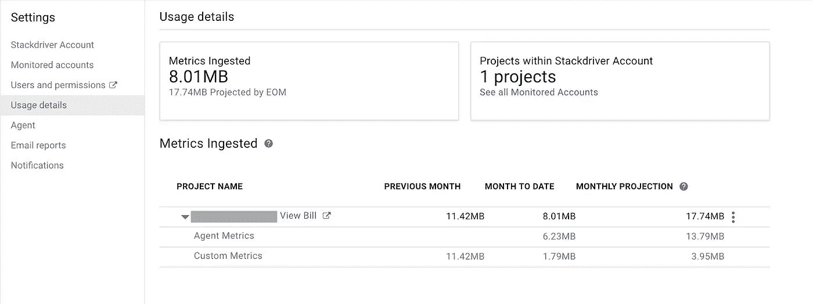
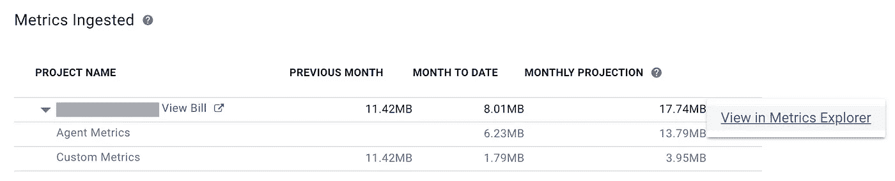
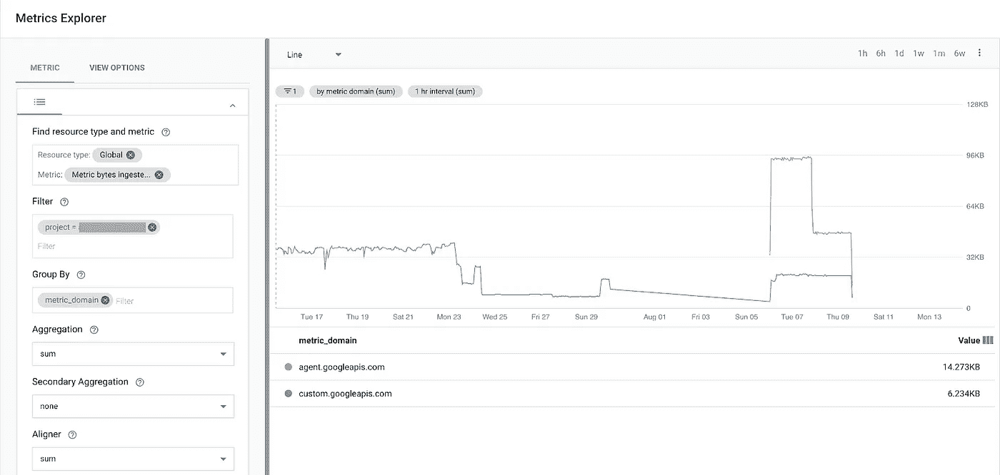

# 了解 Stackdriver 日志记录和监控使用情况

> 原文：<https://medium.com/google-cloud/understanding-stackdriver-logging-and-monitoring-usage-93a28c362c0e?source=collection_archive---------0----------------------->

Stackdriver [在 6 月宣布了](https://cloudplatform.googleblog.com/2018/03/announcing-new-Stackdriver-pricing-visibility-for-less.html)新的定价，旨在简化定价结构。转向基于使用的定价模式使 Stackdriver 与其他基于消费的云产品保持一致，从而更容易推断产品的使用成本。

我最近进行了 GCP 账单分析，以了解我的项目的当前和预期支出，并对我能够如此轻松地找到我需要的细节感到满意。虽然我的账单金额极低，但我想知道 Stackdriver 对总账单的贡献是多少。

如果你想深入研究你的 GCP 账单，了解你的 Stackdriver 支出，有许多不同的工具可以帮助你挖掘相关信息。下面是我用来分析 Stackdriver 成本的分析步骤。

# 1.了解 Stackdriver 定价

Stackdriver pricing [网站](https://cloud.google.com/stackdriver/pricing_v2#table)提供了日志记录和监控成本的细节，并为了解 Stackdriver 中的成本驱动因素提供了一个基准。有一个很棒的[图](https://cloud.google.com/logging/docs/export/#overview)叫做“日志的生命”,它也有助于说明 Stackdriver 日志的接收和输出。

# 2.GCP 票据分析

我首先查看了我的 GCP 账单账户的账单报告。GCP 控制台中的“账单”部分有一个“报告”选项卡，允许您通过在图表上查看一段时间内的费用来分析您的账单。UI 提供了一系列有用的过滤器，可以根据时间、项目、产品、SKU 和标签来缩小搜索结果的范围。

在我的例子中，我想了解 Stackdriver 电荷随时间的变化。首先，我浏览了上个月，然后找到了一个特定的星期来复习。我选择了特定周的日期范围选项，然后从项目筛选器中删除了 1 个我不想包含在总数中的项目。

我想在所有项目中看到我的 Stackdriver 费用与此计费帐户相关联，因此我选择了其余项目。最后，我选择了产品过滤器下的 Stackdriver 日志记录和 Stackdriver 监控。生成的图表按项目说明了费用。我注意到我所有的成本都来自一个特定的项目。

接下来，我想看看日志记录和监控产品之间的成本组合。我将组过滤器更改为产品，发现 Stackdriver 日志记录实际上是弥补成本的产品。

现在我已经了解了成本，我开始研究哪些项目和日志产生了日志量。

# 3.审查堆栈驱动程序日志摄取

Stackdriver Logging 提供详细的日志列表、当前日志量和预计每月日志量。这样就很容易看出哪些日志的容量最大。

此外，每个日志条目都有一个到 Stackdriver Monitoring 的深层链接，该链接显示了特定日志的容量随时间变化的图表。我为 Kubernetes 集群指标选择了“在 Metrics Explorer 中查看详细使用情况”,并在 Stackdriver Monitoring 中打开了 Metrics Explorer 仪表板。

在 Metrics Explorer 中，我查看了特定时间段内接收的日志量。

这一分析有助于回答我的问题，即哪些日志生成的数据量最大，因此对整个 GCP 账单有贡献。

# 4.查看堆栈驱动程序监控使用情况。

我的项目没有显著的 Stackdriver 监控费用，尽管我发现查看使用信息很有用。在 Stackdriver Monitoring UI 中，我从下拉列表中选择了我的项目名称，然后选择了 Account Settings 选项。然后，我选择了 Usage details，它显示了我的 Stackdriver 帐户的总体使用情况。

“摄取的指标”框包括当前摄取的总体指标量和基于当前摄取率的月末预测。通过选择项目名称，可以获取特定类型的指标及其相关量。当使用量超过每月免费接收配额(目前为 150MB)时，自定义指标和代理指标都会产生费用。

为了研究一段时间内的指标摄取量，我选择了项目旁边的下拉菜单，并选择了“在指标浏览器中查看”链接，这将打开 Stackdriver Monitoring 指标浏览器。

在 Metrics Explorer 中，我可以看到一段时间内接收的指标数量。

这一分析有助于回答我的问题，即哪些指标产生了最大的业务量，并因此对整个 GCP 法案做出了贡献。

# 结论

最近对 Stackdriver 定价的更改简化了对 GCP 法案中 Stackdriver 成本的理解。Stackdriver 日志记录和监控都提供了有用的工具来分析它们各自的使用情况。有关更多信息，请参见以下参考资料。

# 参考

*   [发布博客文章宣布新的堆栈驱动程序定价](https://cloudplatform.googleblog.com/2018/03/announcing-new-Stackdriver-pricing-visibility-for-less.html)
*   [Stackdriver 定价](https://cloud.google.com/stackdriver/pricing_v2)
*   [谷歌云计费](https://console.cloud.google.com/billing)
*   [谷歌云日志记录日志摄取](https://console.cloud.google.com/logs/usage)
*   [Stackdriver 监控账户设置](https://app.google.stackdriver.com/settings/accounts/)