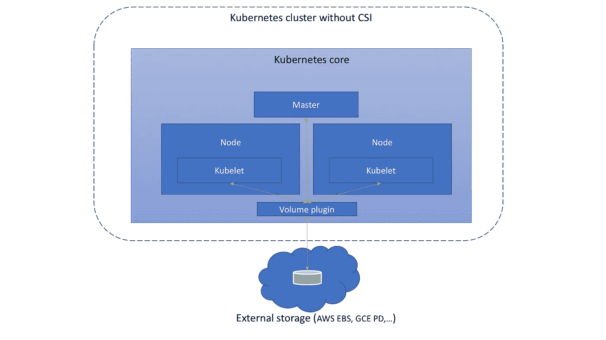

# 了解集装箱存储接口(CSI)

> 原文：<https://medium.com/google-cloud/understanding-the-container-storage-interface-csi-ddbeb966a3b?source=collection_archive---------1----------------------->

集装箱存储接口

# 介绍

容器存储接口(CSI)是一项旨在统一 Kubernetes、Mesos、Docker swarm、cloud foundry 等容器编排系统(COs)的存储接口的计划。与 Ceph、Portworx、NetApp 等存储供应商相结合。这意味着，为一家存储供应商实施单一 CSI 可以保证适用于所有 COs。

来源: [CloudNativeCon EU 2018 CSI 于婕](https://schd.ws/hosted_files/kccnceu18/fb/CloudNativeCon%20EU%202018%20CSI%20Jie%20Yu.pdf)

请注意，在本文中，我们只讨论动态预配置。预配置卷和灵活卷不在本文讨论范围之内。如果你知道我在说什么，在这里阅读更多关于他们的。此外，本文不打算深入研究 CSI 的实现细节。该文档提供了一个很好的高层次概述，是开始实施 CSI 的一个很好的先决条件。此外，示例和参考资料基于 Kubernetes COs。

在我们开始之前，我们应该知道 Kubernetes 的边车集装箱是什么。边车集装箱扩展和增强了“主”集装箱。它们与“主”容器存在于同一个容器中，与“主”容器共享存储和网络。

在撰写本文时，以下是 CSI 组件的版本状态。

# 在 CSI 之前

CSI v0.1 第一次发布是在 2017 年 12 月。当然，在 CSI 出现之前，在 COs 中提供外部存储是可能的。在 Kubernetes 的情况下，卷插件服务于容器工作负载的存储需求。

卷插件是 COs 核心的一部分，如上图所示。因此，它具有 CSI 设计文件中提到的以下缺点:

*   批量插件开发是紧密耦合的，并且依赖于 Kubernetes 版本。
*   Kubernetes 开发者/社区负责测试和维护所有批量插件，而不仅仅是测试和维护一个稳定的插件 API。
*   批量插件中的错误会导致关键的 Kubernetes 组件崩溃，而不仅仅是插件。
*   卷插件获得 kubernetes 组件(kubelet 和 kube-controller-manager)的全部权限。
*   插件开发者被迫提供插件源代码，并且不能选择只发布二进制代码。

# 了解 CSI

在引入 CSI 时，Kubernetes 团队发布了一些外部组件，它们不是核心的一部分，但可以与供应商实现的外部组件进行交互。它们通过域套接字上的 [gRPC](https://grpc.io) 相互通信。

## Kubernetes 外部组件

这完全由 Kubernetes 团队实现和维护。这些将 kubernetes 的行动扩展到了 kubernetes 之外。供应商根本不需要担心实现细节。它们由三个子组件组成。

*   driver registrar——是一个 sidecar 容器，它向 kubelet 注册 CSI 驱动程序，并将驱动程序的自定义 NodeId 添加到 Kubernetes 节点 API 对象的标签中。它通过与 CSI 驱动程序上的身份服务通信并调用 CSI GetNodeId 操作来实现这一点。
*   外部置备程序—是一个 sidecar 容器，用于监视 Kubernetes PersistentVolumeClaim 对象，并针对驱动程序端点触发 CSI CreateVolume 和 DeleteVolume 操作。
*   外部附加器—是一个 sidecar 容器，它监视 Kubernetes 卷附件对象，并针对驱动程序端点触发 CSI 控制器发布和控制器取消发布操作

## 存储供应商/第三方外部组件

这是供应商特定的实现。每个供应商都应在 gRPC 服务功能中实施各自的 API。例如 [GCE PD](https://github.com/kubernetes-sigs/gcp-compute-persistent-disk-csi-driver) 、 [Ceph](https://github.com/ceph/ceph-csi) 等的实现。它们也由三个子组件组成。

*   *CSI 身份*——主要用于识别插件服务，确保其健康，并返回插件本身的基本信息。

*   *CSI 控制器* —负责控制和管理卷，如:创建、删除、附加/分离、快照等。

*   *CSI 节点* —负责控制 kubernetes 节点中的 long volume 的动作。

# 结论

随着 CSI 的引入，COs 和存储供应商明显受益。由于其定义良好的接口，它还可以帮助开发人员和未来的 COs 轻松实现和测试 CSI。此时，如果您决定开始实施自己的 CSI，这是一个很好的起点:[如何实施 FatihArlsan 的 CSI](https://arslan.io/2018/06/21/how-to-write-a-container-storage-interface-csi-plugin/)。

# 参考

1.  CSI 规范:[https://github . com/container-storage-interface/spec/blob/master/spec . MD](https://github.com/container-storage-interface/spec/blob/master/spec.md)
2.  Kubernetes sidecar 容器:[https://kubernetes . io/blog/2015/06/the-distributed-system-toolkit-patterns/](https://kubernetes.io/blog/2015/06/the-distributed-system-toolkit-patterns/)
3.  kube con EU:[CloudNativeCon EU 2018 CSI 于婕](https://schd.ws/hosted_files/kccnceu18/fb/CloudNativeCon%20EU%202018%20CSI%20Jie%20Yu.pdf)
4.  CSI 设计文档:[https://github . com/kubernetes/community/blob/master/contributors/design-proposals/storage/container-storage-interface . MD](https://github.com/kubernetes/community/blob/master/contributors/design-proposals/storage/container-storage-interface.md#attaching-and-detaching)
5.  CSI 文件:【https://kubernetes-csi.github.io/docs/ 
6.  CSI 文档(已弃用):[https://github.com/kubernetes-csi/docs/wiki/Usage](https://github.com/kubernetes-csi/docs/wiki/Usage)