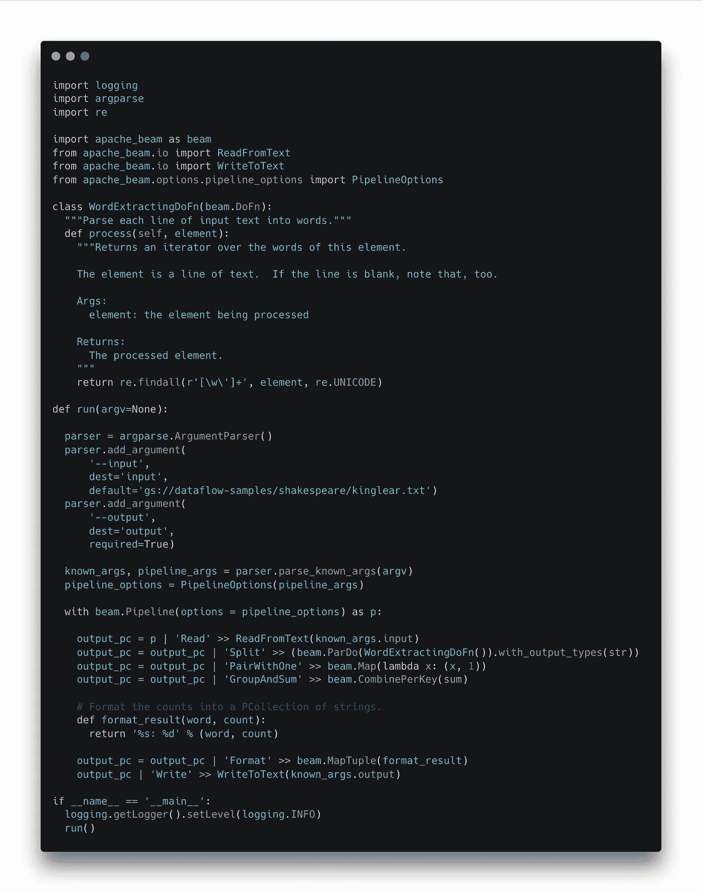

# 了解 Python 的数据流快速入门教程

> 原文：<https://medium.com/google-cloud/understanding-the-dataflow-quickstart-for-python-tutorial-e134f39564c7?source=collection_archive---------1----------------------->

## 字数统计管道的逐步解构

# 介绍

Python 教程的[数据流快速入门是在 Apache Beam 和 Dataflow 中启动和运行的一个很好的方法。然而，如果您以前没有 Apache Beam 经验，您可以执行整个教程，但仍然不知道您刚才做了什么。什么是“管道”？这个“|”管道操作符是怎么回事？什么是“帕尔多”？](https://cloud.google.com/dataflow/docs/quickstarts/create-pipeline-python)

因此，我花时间将整个 Dataflow Quickstart for Python 教程分解为基本步骤和基本原则，并对所需代码进行了逐行解释。通过理解 Python Apache Beam SDK 的基础和组成部分，您将能够自信地设计和构建自己的管道，而不仅仅是依赖于模板。

如果你想继续下去，请继续读下去。

# 初始化

从完成 Python 教程的[数据流快速入门中的“开始之前”到“本地运行管道”的步骤开始。](https://cloud.google.com/dataflow/docs/quickstarts/create-pipeline-python)

现在，从 [Apache Beam Github](https://github.com/apache/beam/blob/master/sdks/python/apache_beam/examples/wordcount.py) 下载`wordcount.py`源代码，并运行该命令以确保您可以在本地运行源代码:

```
python wordcount.py --output outputs
```

这就是我们将要开始的地方。

# 语境

这将是对`wordcount.py`代码的一次迭代探索，从基本原则开始，一路解释 Apache Beam SDK。在我们进行的过程中，一定要在每一步都运行`python wordcount.py --output outputs`，观察打印语句结果和输出文件；这将有助于巩固概念，因为它们建立在彼此的基础上。此外，每个人都有不同的能力和理解水平；你可以随意跳过需要的步骤，也可以在必要的地方用你自己的研究进行更深入的挖掘。我们走吧！

# 第一步:你好，世界

我们将从零开始:你好世界。创建并运行这段代码，确认你的理智。


# 步骤 2:创建 Apache Beam 管道

现在，导入 Beam 并在上下文管理器中创建管道:


`beam.Pipeline()`构造函数返回一个 Apache 管道对象。[来自阿帕奇波束文档](https://beam.apache.org/documentation/programming-guide/):

> *管道封装了你的整个数据处理任务，从开始到结束。这包括读取输入数据、转换数据和写入输出数据。所有的光束驱动程序必须创建一个管道。*

此外，`with`语句创建一个运行时上下文，管道在其中运行。这有助于处理错误和在出现故障时进行清理。[点击此处](https://realpython.com/python-with-statement/)了解关于`with`陈述的更多信息。

注意，如果运行这段代码，什么都不会改变；您仍然得到相同的“Hello World”输出。

# 步骤 3:处理输入参数

*注意:如果您已经熟悉 Python 的命令行参数，可以跳过这一步。*

现在，`import argparse`，将`argv=None`设置为`run()`函数中的一个参数，实例化`parser`，并添加要监听的参数。


`parse_known_args()`方法通过`argv`参数解析给文件的输入。"它返回一个包含已填充的名称空间和剩余参数字符串列表的元组." [(Python Docs)](https://docs.python.org/3/library/argparse.html) 换句话说，“名称空间”包含已知的/预期的参数(`known_args`),而`pipeline_args`列表包含传递给 Python 程序的所有其他内容。

继续运行下面的命令，根据您的兴趣进行调整，看看给定的参数如何填充`known_args`和`pipeline_args`变量。

```
python wordcount_3.py --input known1 --output known2
python wordcount_3.py --input known1 --output known2 aRandomPipelineArg1 aRandomPipelineArg2
```

# 步骤 4:生成管道选项

这一步导入`PipelineOptions`并使用它创建一个对象给射束管道。这就是 misc 选项列表从命令行进入射束管道本身的方式。


虽然在本教程中，这些管道参数对于在本地运行 Beam 管道不是必需的，但是当您想要在数据流上运行管道时，它们是相关的。

# 步骤 5:访问管道中的已知参数

现在，让我们去掉“Hello World ”,代之以我们在 Python 调用中传递的一些值。

在`parser.add_argument()`通话中，添加`dest='input'`和`dest='output'`的线路。然后在 Beam 管道中，用`print(known_args.input)`替换“Hello World”。注意，无论您为`--input`标志传递什么，它都将被附加到由`dest=''`指定的属性上。在我们的例子中，因为`dest='input'`，`input`是我们可以使用的键。因此，我们为`--input`标志传递的内容可以通过调用`known_args.input`来访问。


注意:如果您没有在`add_argument()`调用中显式设置`dest`，那么名称空间键将被设置为用作参数标志的值。在我们的例子中，它们都被称为`input`，所以这并不重要，但这是需要注意的。

请自行测试这段代码，以了解这些部分是如何交互的。

# 第六步:管道操作员

现在，我们将使用管道操作符向管道添加更多内容。继续导入`ReadFromText`和`WriteFromText`。我们将让管道简单地把它得到的任何东西作为输入写到输出，没有任何转换。


管道操作符类似于 Java 的“应用”。在 Python 世界中，它的操作类似于方法链接。来自[阿帕奇光束文件](https://beam.apache.org/documentation/programming-guide/#applying-transforms):

> *Beam SDK 中的每个转换都有一个通用的应用方法(或管道运算符|)。调用多个射束转换类似于方法链接，但是有一点小小的不同:将转换应用于输入 PCollection，将转换本身作为参数传递，操作返回输出 PCollection。*

这些文档还为管道运营商提供了一个非常有用的简单公式:

```
[Output PCollection] = [Input PCollection] | [Transform]
```

现在您可能还想知道管道和转换之间的`'<Text>' >>`是干什么用的。正如 StackOverflow 上的用户[“RF-”解释的那样](https://stackoverflow.com/questions/43796046/explain-apache-beam-python-syntax)

> *>>“允许您命名一个步骤，以便在各种 ui 中更容易地显示——在|和> >之间的字符串仅用于这些显示目的和识别该特定应用。*

所以，这只是为了展示的目的。

为了便于查看，我还在这一步中添加了日志记录。

# 步骤 7:帕尔多

现在让我们进入`beam.ParDo()`转换。


可以通过创建`beam.DoFn`的子类来创建 DoFn 对象。子类是通过将`beam.DoFn`传递给你的类定义来创建的。

我们将从 Beam 文档中的`ComputeWordLengthFn()`示例开始。这是一个简单返回每个元素长度的函数。请注意，我们在流水线中的“读”和“写”步骤之间添加了“长度”步骤。

注意，ParDo 函数中的`process`方法需要遵循特定的格式。如[阿帕奇光束文件](https://beam.apache.org/documentation/programming-guide/#applying-transforms)所述:

> *在 DoFn 子类中，您将编写一个方法流程，在其中提供实际的处理逻辑。您不需要从输入集合中手动提取元素；Beam SDKs 会为您处理这些问题。您的流程方法应该接受一个 argument 元素，即 input 元素，并返回一个 iterable 及其输出值。可以通过 yield 语句发出单个元素来实现这一点，也可以通过 iterable 语句使用 return 语句，比如 list 或 generator。*

所以你的`process`方法必须有这个签名:

```
def process(self, element):
```

继续运行这段代码，看看它是如何工作的:`python wordcount.py --output outputs`

请注意，我们在函数中有一个`print`和`input`语句用于可视性。还要注意，输出文件现在包含每行的长度，而不是文件中的单词。

# 第八步:WordExtractingDoFn()

现在我们将实现原来的`wordcount.py`文件中指定的`WordExtractingDoFn()`。

所以去掉`ComputeWordLengthFn`帕尔多变换，用`beam.ParDo(WordExtractingDoFn().with_output_types(str)`代替

注意在`WordExtractingDoFn`的函数定义中，它使用正则表达式将每个元素(每个“行”)转换成一个组成单词的列表。我添加了打印语句来显示每一行和结果列表。


添加此转换会产生如下所示的输出:

```
 KING LEAR

    DRAMATIS PERSONAE

LEAR king of Britain  (KING LEAR:)

KING OF FRANCE:

DUKE OF BURGUNDY (BURGUNDY:)

DUKE OF CORNWALL (CORNWALL:)

DUKE OF ALBANY (ALBANY:)

EARL OF KENT (KENT:)

EARL OF GLOUCESTER (GLOUCESTER:)

EDGAR son to Gloucester.

EDMUND bastard son to Gloucester.

CURAN a courtier.

Old Man tenant to Gloucester.

...
```

对此:

```
KING
LEAR
DRAMATIS
PERSONAE
LEAR
king
of
Britain
KING
LEAR
KING
OF
FRANCE
DUKE
OF
BURGUNDY
BURGUNDY
DUKE
OF
CORNWALL
CORNWALL
DUKE
OF
ALBANY
ALBANY
EARL
OF
KENT
KENT
EARL
OF
GLOUCESTER
GLOUCESTER

...
```

请注意，我还在“Split”转换步骤中添加了`with_output_types()`方法。正如在 [Stackoverflow](https://stackoverflow.com/questions/47978342/apache-beam-clarifying-an-expected-behavior-of-output-typehint-on-python-sdk) 中解释的那样:“指定的输出类型仅用于确保与后续转换的一致性。”在我们的例子中，这不会有什么不同，但是我添加它来反映`wordcount.py`文件。

# 第九步:梁。地图()

对于步骤 9，我们将利用`beam.Map()`转换；包括在新的“PairWithOne”步骤中。


`beam.Map()`方法接受一个函数，并将其应用于 PCollection 中的每个元素。在我们的例子中，我们传入一个匿名 lambda 函数，该函数返回一个与 1 配对的输入元素元组(因此步骤名为‘PairWithOne’)

虽然有其他功能可以满足这里的要求，但是选择`Map()`功能是因为，根据[文档](https://beam.apache.org/documentation/programming-guide/#applying-transforms):

> *如果您的 ParDo 执行输入元素到输出元素的一对一映射——也就是说，对于每个输入元素，它应用一个恰好产生一个输出元素的函数，您可以使用更高级别的映射转换。*

添加此转换将获得以下内容的输出:

```
KING
LEAR
DRAMATIS
PERSONAE
LEAR
king
of
Britain
KING
LEAR
KING
OF
FRANCE
DUKE
OF
BURGUNDY
BURGUNDY
DUKE
OF
CORNWALL
CORNWALL
DUKE
OF
ALBANY
ALBANY
EARL
OF
KENT
KENT
EARL
OF
GLOUCESTER
GLOUCESTER

...
```

对此:

```
('KING', 1)
('LEAR', 1)
('DRAMATIS', 1)
('PERSONAE', 1)
('LEAR', 1)
('king', 1)
('of', 1)
('Britain', 1)
('KING', 1)
('LEAR', 1)
('KING', 1)
('OF', 1)
('FRANCE', 1)
('DUKE', 1)
('OF', 1)
('BURGUNDY', 1)
('BURGUNDY', 1)
('DUKE', 1)
('OF', 1)
('CORNWALL', 1)
('CORNWALL', 1)
('DUKE', 1)
('OF', 1)
('ALBANY', 1)
('ALBANY', 1)
('EARL', 1)
('OF', 1)
('KENT', 1)
('KENT', 1)
('EARL', 1)
('OF', 1)
('GLOUCESTER', 1)
('GLOUCESTER', 1)

...
```

# 第十步:梁。CombinePerKey()

现在我们需要一个转换来计算每个单词的所有实例。为此，我们将使用`beam.CombinePerKey(sum)`转换。

创建“GroupAndSum”步骤，如下所示:


CombinePerKey 聚合“接受一个函数，该函数将一组值作为输入，并为每个键组合这些值。”( [Beam Docs](https://beam.apache.org/documentation/transforms/python/aggregation/combineperkey/) )在这种情况下，键是每个元组中的单词。因此“sum”函数将每个键的所有值相加。因为元组的所有值都是 1，这实际上与计算每个唯一的单词是一样的。

添加此转换将获取以下内容的输出:

```
('KING', 1)
('LEAR', 1)
('DRAMATIS', 1)
('PERSONAE', 1)
('LEAR', 1)
('king', 1)
('of', 1)
('Britain', 1)
('KING', 1)
('LEAR', 1)
('KING', 1)
('OF', 1)
('FRANCE', 1)
('DUKE', 1)
('OF', 1)
('BURGUNDY', 1)
('BURGUNDY', 1)
('DUKE', 1)
('OF', 1)
('CORNWALL', 1)
('CORNWALL', 1)
('DUKE', 1)
('OF', 1)
('ALBANY', 1)
('ALBANY', 1)
('EARL', 1)
('OF', 1)
('KENT', 1)
('KENT', 1)
('EARL', 1)
('OF', 1)
('GLOUCESTER', 1)
('GLOUCESTER', 1)

...
```

对此:

```
('KING', 243)
('LEAR', 236)
('DRAMATIS', 1)
('PERSONAE', 1)
('king', 65)
('of', 447)
('Britain', 2)
('OF', 15)
('FRANCE', 10)
('DUKE', 3)
('BURGUNDY', 8)
('CORNWALL', 63)
('ALBANY', 67)
('EARL', 2)
('KENT', 156)
('GLOUCESTER', 141)

...
```

# 第十一步:梁。映射元组()

我们来到流水线中的最后一个转换，`beam.MapTuple()`。

正如[文档](https://beam.apache.org/documentation/transforms/python/elementwise/map/)所观察到的:“如果您的 PCollection 由(key，value)对组成，您可以使用 MapTuple 将它们解包到不同的函数参数中。”

在我们的例子中，我们将一个定制的格式化函数`format_result`传递给 MapTuple()转换。这个`format_result`函数接受每个元素的元组的两个部分，“word”和“count”，并将它们作为重新格式化的字符串返回。

代码现在看起来像这样:



这种重新格式化转换的输出来自:

```
('KING', 243)
('LEAR', 236)
('DRAMATIS', 1)
('PERSONAE', 1)
('king', 65)
('of', 447)
('Britain', 2)
('OF', 15)
('FRANCE', 10)
('DUKE', 3)
('BURGUNDY', 8)
('CORNWALL', 63)
('ALBANY', 67)
('EARL', 2)
('KENT', 156)
('GLOUCESTER', 141)

...
```

对此:

```
KING: 243
LEAR: 236
DRAMATIS: 1
PERSONAE: 1
king: 65
of: 447
Britain: 2
OF: 15
FRANCE: 10
DUKE: 3
BURGUNDY: 8
CORNWALL: 63
ALBANY: 67
EARL: 2
KENT: 156
GLOUCESTER: 141

...
```

# 步骤 12:链接转换

我们已经到达了旅程的终点！我们将以重命名和重新格式化射束管道代码中的步骤来结束，以匹配基线`wordcount.py`文件。请注意如何将转换链接在一起，每一行都以管道操作符开始:


尽管链接的步骤看起来有些不同，但同样的`[Output PCollection] = [Input PCollection] | [Transform]`流程仍然适用，输出也是一样的。

还要注意在这一步中我如何包含了`SetupOptions`类来“保存主会话”正如最初的`wordcount.py`注释继续陈述的那样:“我们使用 save_main_session 选项，因为该工作流中的一个或多个 DoFn 依赖于全局上下文(例如，在模块级导入的模块)。”当我在我的本地机器上运行它时，它的缺失并没有引起问题，但是为了完整起见，我把它包括进来了。

就是这样！我们完了！

# 附录

为了进一步扩展你的知识和学习，这里还有两件事你可以试试:

1.  修改管道代码，在计算之前将所有单词字符串转换为小写。答案在教程第 7 步[中找到。](https://cloud.google.com/dataflow/docs/quickstarts/create-pipeline-python#modify-the-pipeline-code)
2.  尝试将您的管道部署到 Google Cloud 上的数据流运行器。[详情在此](https://cloud.google.com/dataflow/docs/quickstarts/create-pipeline-python#run-the-pipeline-on-the-dataflow-service)。

# 结论

这是一个循序渐进、反复探索的 Python 教程的数据流快速入门。我希望这种方法有助于您对 Apache Beam 的 Python SDK 如何工作有一个基本的了解。

如果我遗漏了什么或者有什么步骤需要进一步澄清，请在评论中告诉我。

保重！

# 代码许可证

本指南中的所有代码截图都包含在 [Apache 许可证 2.0 版](http://www.apache.org/licenses/LICENSE-2.0)中