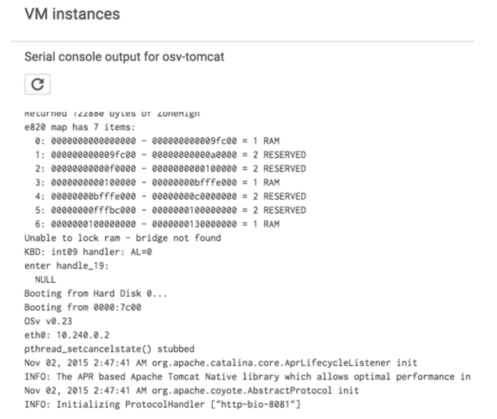

# Google 计算引擎上的单核(第 1 部分)——运行 OSv 单核 Tomcat 服务器

> 原文：<https://medium.com/google-cloud/unikernel-on-google-compute-engine-part-1-running-an-osv-unikernel-tomcat-server-45bd9816910?source=collection_archive---------3----------------------->


在 Google 计算引擎上运行 Tomcat 的 OSv 单核

这是一个关于在谷歌计算引擎上运行单内核的简短指南。这里的[是一本很好的入门书](/@darrenrush/after-docker-unikernels-and-immutable-infrastructure-93d5a91c849e#.44qbly84t)，讲述了为什么你应该关注单核。我使用了 [OSv](http://osv.io/) unikernel，因为它支持 Java，而 Java 是我选择的语言。此外，OSv 的图像构建工具[绞盘](https://github.com/cloudius-systems/capstan)，感觉类似于 Docker，所以我觉得我可以很快上手。

你可能在谷歌计算引擎指南上看到过[运行 OSv，但是说明似乎已经过时了(见](https://github.com/cloudius-systems/osv/wiki/Running-OSv-on-Google-Compute-Engine)[期](https://github.com/cloudius-systems/osv/issues/665))。目前，绞盘工具在为谷歌计算引擎构建图像时存在问题(参见[问题](https://github.com/cloudius-systems/capstan/issues/146))。因此，这次经历并不像我希望的那样简单，但我决心让它成功。

## 在 Google 计算引擎上运行 OSv Tomcat 映像

以下说明使用了 [Google Cloud SDK](https://cloud.google.com/sdk/) 命令行工具。您可以在[开发者控制台](https://console.developers.google.com) UI 中直接做同样的事情(在最后的附录中可以找到详细信息)。为了减少命令行参数的数量，首先设置默认项目和默认区域(您可以挑选一个适合您的[区域](https://cloud.google.com/compute/docs/zones?hl=en))。

```
gcloud config set core/project YOUR_PROJECT_ID
gcloud config set compute/zone us-central1-c
```

首先，在您的 Google 云平台项目中注册公共 OSv Tomcat 映像:

```
gcloud compute images create osv-v0–23-tomcat \
       --source-uri gs://osv/v0.23/osv-tomcat.gce.tar.gz
```

接下来，使用该映像创建一个虚拟机实例:

```
gcloud compute instances create osv-tomcat --image osv-v0–23-tomcat
```

很快，对吧？注意新创建的实例的外部 IP 地址。这很重要！

记住，这个单内核只运行 Tomcat，不运行其他任何东西。因此，您将无法 SSH 到它。要查看实例内部的情况，您需要查看串行端口输出:

```
gcloud compute instances get-serial-port-output osv-tomcat
```


串行端口输出示例

它开始运行了！从串行端口输出中，我们可以看到 Tomcat 实例正在监听端口 8081。默认情况下，谷歌云平台会阻止该端口的入站流量。您可以通过更新防火墙规则配置来启用该端口:

```
gcloud compute firewall-rules create allow-8081 — allow tcp:8081
```

最后，引用您创建的实例的外部 IP，并在您的浏览器中导航到 [http://EXTERNAL_IP:8081/](http://external_ip:8081/) 。您应该会看到默认的 Tomcat 页面！


您应该看到的 Tomcat 的默认主页

## 下一步是什么？

在本系列的下一部分中，我将使用 Capstan 构建一个定制的 OSv unikernel 映像，并将其部署到 Google Compute Engine 上(带有变通办法)。

## 附录—在浏览器中执行所有操作

您也可以使用开发人员控制台从浏览器做任何事情。

首先，导航到**计算引擎** > **图像**，点击**新图像**注册图像:


然后，导航到**计算引擎** > **虚拟机实例**，并点击**创建实例**(或**新实例**)使用映像创建一个新的虚拟机实例。确保点击**启动盘** > **更改**指定 OSv 启动盘镜像:


创建实例后，您还可以直接从开发人员控制台访问串行端口输出。单击虚拟机名称 osv-tomcat，然后向下滚动并单击**串行控制台输出**:



要启用端口 8081，导航到**联网** > **默认**网络，点击**添加防火墙规则**:


就是这样！