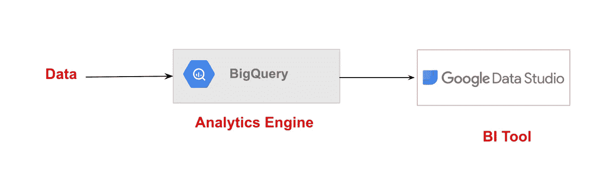
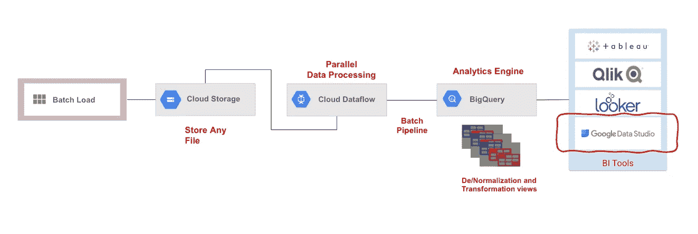
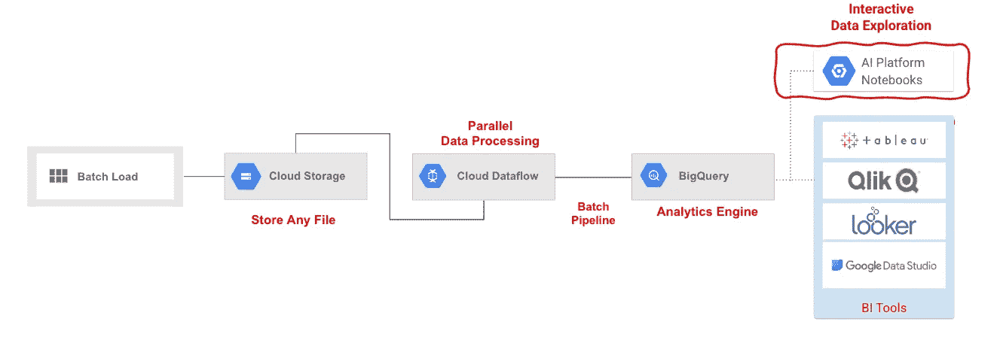
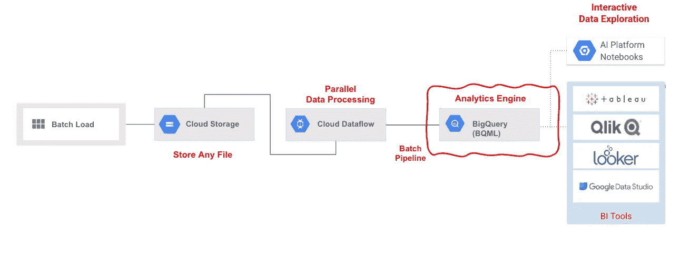
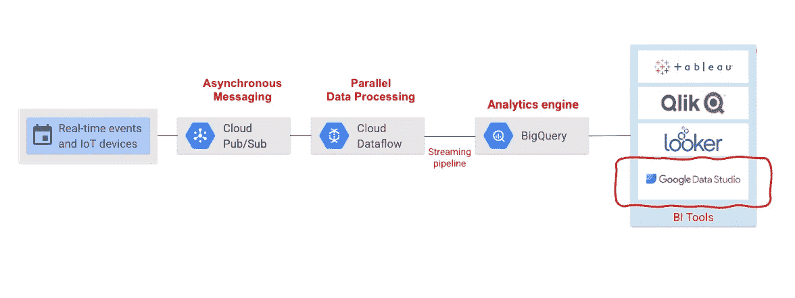
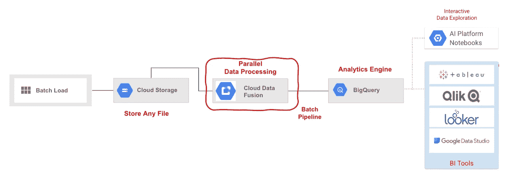
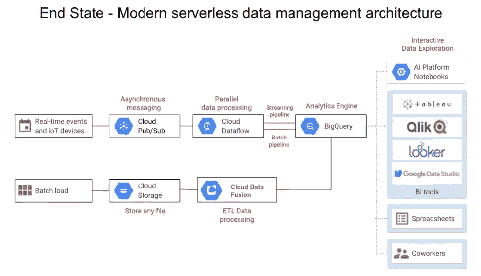

# 利用谷歌云释放数据的超能力

> 原文：<https://medium.com/google-cloud/unleashing-the-superpowers-of-data-with-google-cloud-8c48a800abb9?source=collection_archive---------1----------------------->

## 当今的客户处于其数据现代化旅程的不同阶段，他们需要建议来根据他们的工作流充分实现数据的力量。本文旨在提供一种分阶段的方法，从简单的数据分析开始，到使用 GCP 智能分析工具的复杂数据工作流、机器学习模型和数据可视化见解。该工具帮助客户加快其数据采用战略，并基于其数据工作流提取有意义的见解，以推动其业务向前发展。

> 数据是各种规模的组织的宝贵资产，利用数据力量的能力可以推动业务增长和创新。谷歌云提供了一系列产品和服务，可以帮助组织释放其数据的全部潜力。

# 概观

在谷歌云上管理和分析数据的关键工具之一是 BigQuery，这是一个完全受管理的数据仓库和分析平台。

谷歌大查询是谷歌云平台的权力中心，它可以被选为解决数据世界中所有客户挑战的一站式服务。BigQuery 是灵活、开放和智能的。它取代了 prem 上的数据仓库，并通过根据业务需求将表组织成不同的数据集来帮助创建数据集市。最重要的是，BigQuery 可以用作数据湖来加载原始数据，然后根据各自的要求对原始数据进行转换。BigQuery 允许组织使用 SQL 查询或流行的商业智能工具(如 Tableau 和 Looker)快速、经济地分析大型复杂数据集。此外，它也可以是您企业的授权经销商。有了 BigQuery，组织可以实时了解其数据，从而做出数据驱动的决策并优化其业务流程。

谷歌大查询

以下阶段描述了如何启动客户的数据之旅。

# 第 1 阶段:静态分析

将数据(csv、json、Google Drive)手动加载到 BigQuery 中，然后从 BigQuery 中查询数据，然后通过 Google Data Studio 生成强大的可视化仪表板。

第 1 阶段:静态分析

# 第 2 阶段:批处理管道数据分析

在第二阶段，您需要使用来自 Google 云存储桶的任何类型的文件(csv、json)在 Cloud Dataflow 的帮助下自动执行并行数据处理。然后，您需要将数据上传到分析引擎 BigQuery 中。通过使用 ELT 方法，通过创建特定的视图和表，根据客户的要求进行去规范化和转换。然后使用谷歌数据工作室作为可视化工具构建强大的仪表盘。您可以在 GCP 虚拟机和谷歌本地可视化工具 Looker 上有多个可视化选项，如 Tableau、Qlik。

第 2 阶段:批处理管道数据分析

# 第 3 阶段:更深入的数据探索

在这个阶段，您可以使用 AI 平台笔记本执行交互式数据探索，并快速可视化 BigQuery 中的数据。你可以通过旋转一个人工智能平台笔记本来开始这个阶段，该平台允许用户通过 Python 的强大功能更深入地探索、分析、转换和可视化他们来自 Bigquery 的数据。在这个阶段，Jupyter 笔记本与 BigQuery 无缝连接和交互。

阶段 3:更深入的数据探索

# 阶段 4:简单的 ML 洞察

这个阶段通过 BigQuery ML 创建相应的模型，从而开始进入 ML 的旅程。这有助于预测数据中的下一个值。该过程包括将类似 SQL 的查询写入 BigQuery 以创建机器学习模型，训练数据并预测与 BigQuery 中的数据相关的下一个值。

阶段 4:简单的 ML 洞察

# 阶段 5:实时处理

数据管道捕获实时或物联网数据，这些数据是在云发布/订阅的异步消息服务的帮助下获取的。由此，您需要使用数据流运行并行数据处理，然后将数据馈送给 BigQuery，并使用 Google Data Studio 生成仪表板。您可以通过另一种选择来节省 BigQuery 流插入的成本，即在 Google 数据流的帮助下使用来自 Google 云存储的微批量插入。

阶段 5:实时处理

# 阶段 6: ETL 处理

Google Cloud 上的另一个强大的数据管理工具是云数据融合，这是一个完全托管的数据集成平台，它是一个无代码 ETL 工具，使组织能够构建、编排和管理数据管道，而不管其数据源的复杂性或多样性。云数据融合使从多个来源获取、组合和转换数据变得更加容易，使组织能够获得更全面的数据视图。

阶段 6: ETL 处理

# 摘要—数据现代化之旅

通过以简单易行的方式采用上述分阶段方法，借助 Google 云原生工具，如 Google BigQuery、Google Data Studio、Dataflow、Cloud Pub/Sub、AI 平台、BigQuery ML 和 Data Fusion，启动客户的数据之旅。以下快照反映了数据现代化之旅的最后阶段。

所有上述阶段都可以针对样本数据和数据管道进行演示。这使得客户更容易更好地了解如何开始他们的数据云之旅。

感谢浏览博客，下次见！

> 如果您在这篇文章或任何 GCP 认证和实施方面需要任何进一步的帮助，您可以联系我@ [LinkedIn](https://www.linkedin.com/in/vijaykumarpj/?source=about_page-------------------------------------) !